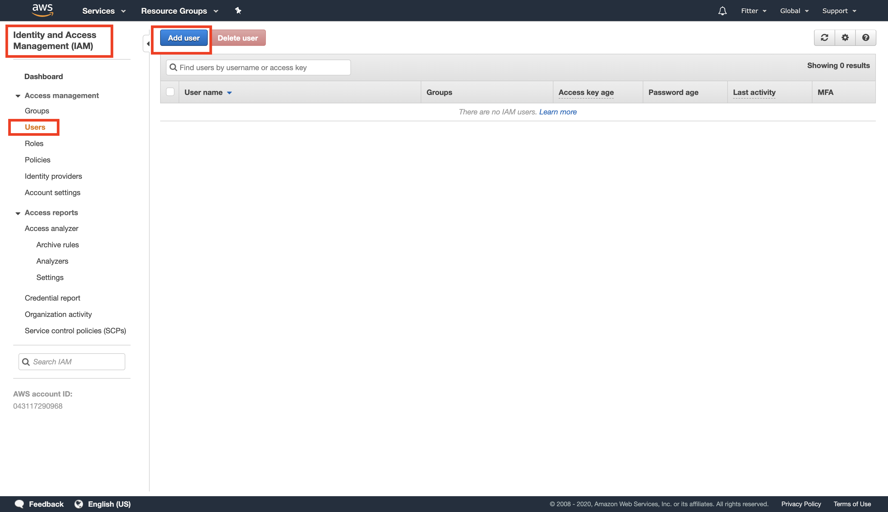
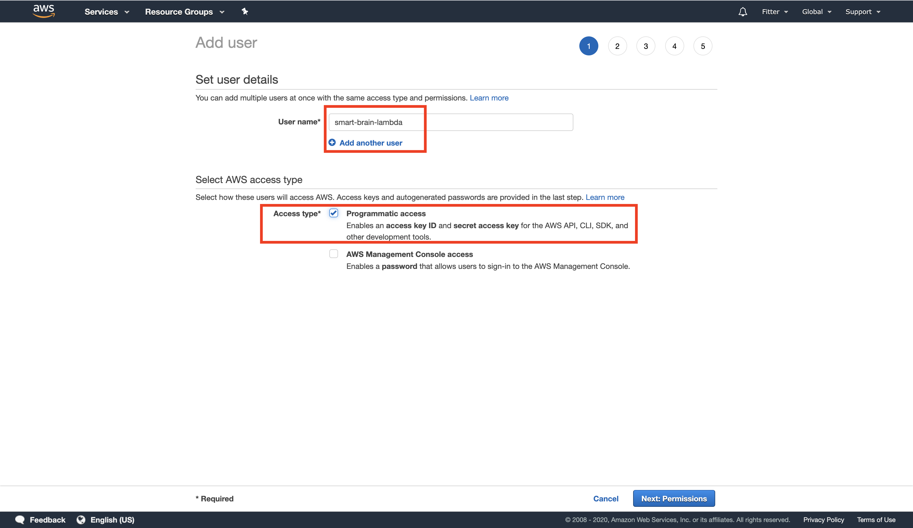
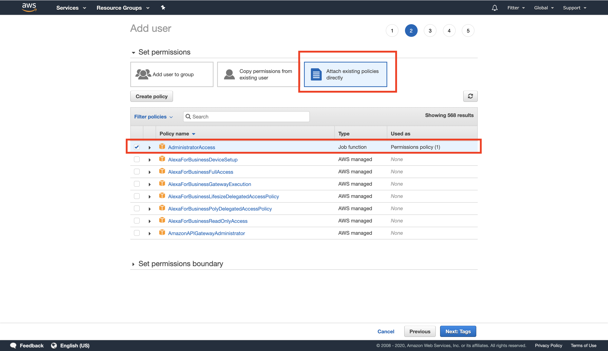
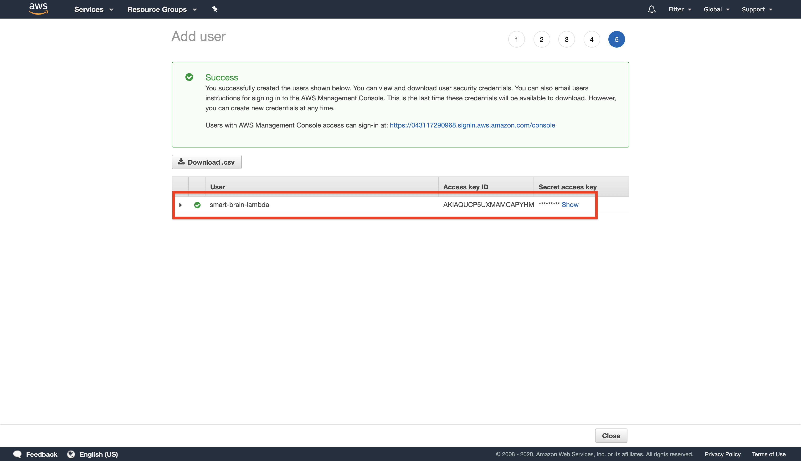
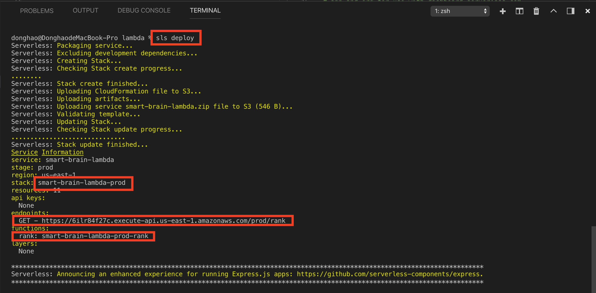
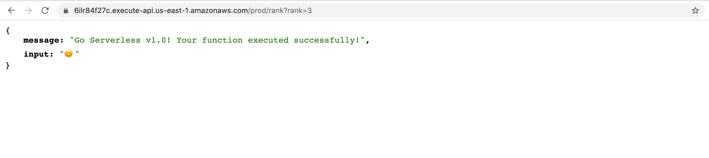
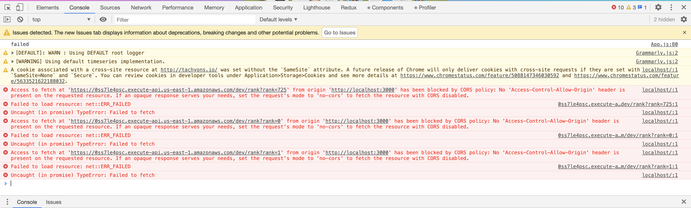

# Web development tools (Part 26)

- #### Click here: [BACK TO NAVIGASTION](https://github.com/DonghaoWu/WebDev-tools-demo/blob/master/README.md)

## `Section: AWS Lambda.`(Basic)

### `Summary`: In this documentation, we learn to add AWS lambda function in our application.

### `Check Dependencies & Tools:`

- serverless
------------------------------------------------------------

#### `本章背景: `
1. 
------------------------------------------------------------

### <span id="26.0">`Brief Contents & codes position`</span>

- #### Click here: [BACK TO NAVIGASTION](https://github.com/DonghaoWu/WebDev-tools-demo/blob/master/README.md)

- [26.1 Install dependencies.](#26.1)
- [26.2 Add new user in AWS IAM.](#26.2)
- [26.3 Setup serverless.yml.](#26.3)
- [26.4 Connect AWS with credentials in terminal.](#26.4)
- [26.5 Setup Lambda function.](#26.5)
- [26.6 Deploy the Lambda function and get the endpoint.](#26.6)
- [26.7 Apply the endpoint in front end.](#26.7)

------------------------------------------------------------

### <span id="26.1">`Step1: Install dependencies.`</span>

- #### Click here: [BACK TO CONTENT](#26.0)

1. Install dependency.

```bash
$ sudo npm install -g serverless
$ sls
$ sls create -t aws-nodejs # 在当前文件夹内生成 3 个文件, handler.js, serverless.yml, .gitignore
```

#### `Comment:`
1. 


### <span id="26.2">`Step2: Add new user in AWS IAM.`</span>

- #### Click here: [BACK TO CONTENT](#26.0)

<p align="center">

</p>

------------------------------------------------------------

<p align="center">

</p>

------------------------------------------------------------

<p align="center">

</p>

------------------------------------------------------------

<p align="center">

</p>

------------------------------------------------------------

#### `Comment:`
1. 在这个过程中，主要取得三个主要参数：

```bash
username：smart-brain-lambda
Access key：----
Secret Key：----
```

### <span id="26.3">`Step3: Setup serverless.yml.`</span>

- #### Click here: [BACK TO CONTENT](#26.0)

- __`Location: ./demo-apps/lambda/serverless.yml`__

```yml
service: smart-brain-lambda

provider:
  name: aws
  runtime: nodejs12.x

  stage: dev # or prod
  region: us-east-1

functions:
  rank:
    handler: handler.rank
    events:
      - http: # use api gateway service
          path: rank
          method: get
```

------------------------------------------------------------

#### `Comment:`
1. 要注意的是 `service 指的是 IAM Username`。

### <span id="26.4">`Step4: Connect AWS with credentials in terminal.`</span>

- #### Click here: [BACK TO CONTENT](#26.0)

```bash
$ cd <handler.js directory>
$ sls config credentials --provider aws --key <access key> --secret <secret access key> -o
```

------------------------------------------------------------

#### `Comment:`
1. 

### <span id="26.5">`Step5: Setup Lambda function.`</span>

- #### Click here:  [BACK TO CONTENT](#26.0)

- __`Location: ./demo-apps/lambda/handler.js`__

```js
'use strict';

const emojis = [
  '😄', '😃', '😀', '😊', '😉', '😍', '🔶', '🔷', '🚀'
];

module.exports.rank = async event => {
  const rank = event.queryStringParameters.rank;
  const rankEmoji = emojis[rank >= emojis.length ? emojis.length - 1 : rank];
  return {
    statusCode: 200,
    headers: {
      'Access-Control-Allow-Origin': '*'
    },
    body: JSON.stringify(
      {
        message: 'Go Serverless v1.0! Your function executed successfully!',
        input: rankEmoji,
      },
      null,
      2
    ),
  };
};
```

#### `Comment:`
1. 

### <span id="26.6">`Step6: Deploy the Lambda function and get the endpoint.`</span>

- #### Click here: [BACK TO CONTENT](#26.0)

1. Terminal commands:

```bash
$ sls deploy # deploy the lambda function

$ sls invoke --function rank # invoke the function in AWS.
$ sls invoke local --function rank # invoke the function locally.
```

2. Get the endpoint.

<p align="center">

</p>

------------------------------------------------------------

3. Visit the endpoint in browser.

<p align="center">

</p>

------------------------------------------------------------

#### `Comment:`
1. 

------------------------------------------------------------


### <span id="26.7">`Step7: Apply the endpoint in front end.`</span>

- #### Click here: [BACK TO CONTENT](#26.0)

- __`Location: ./demo-apps/frontend-smart-brain-AWS/src/components/Rank/Rank.js`__

```jsx
import React from 'react';

class Rank extends React.Component {
  constructor() {
    super();
    this.state = {
      emoji: '',
    }
  }

  componentDidMount() {
    this.generateEmoji(this.props.entries);
  }

  componentDidUpdate(prevProps, prevState) {
    if (prevProps.entries === this.props.entries && prevProps.name === this.props.name) {
      return null;
    }
    this.generateEmoji(this.props.entries)
  }

  generateEmoji = (entries) => {
    fetch(`https://6ilr84f27c.execute-api.us-east-1.amazonaws.com/prod/rank?rank=${entries}`)
      .then(res => res.json())
      .then(data => {
        return this.setState({ emoji: data.input })
      })
  }

  render() {
    return (
      <div>
        <div className='white f3'>
          {`${this.props.name}, your current entry count is...`}
        </div>
        <div className='white f1'>
          {this.props.entries}
        </div>
        <div className='white f1'>
          {this.state.emoji}
        </div>
      </div>
    )
  }
}

export default Rank;
```

#### `Comment:`
1. Get errors when using an invalid endpoint.

<p align="center">

</p>

------------------------------------------------------------

2. Get it done.

<p align="center">

</p>

------------------------------------------------------------

- 本章用到的全部资料：

- #### Click here: [BACK TO CONTENT](#26.0)
- #### Click here: [BACK TO NAVIGASTION](https://github.com/DonghaoWu/WebDev-tools-demo/blob/master/README.md)