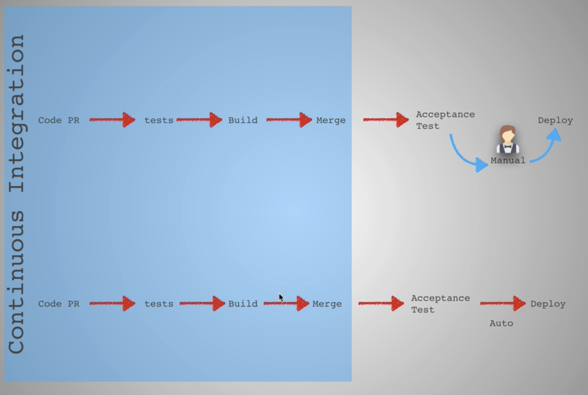
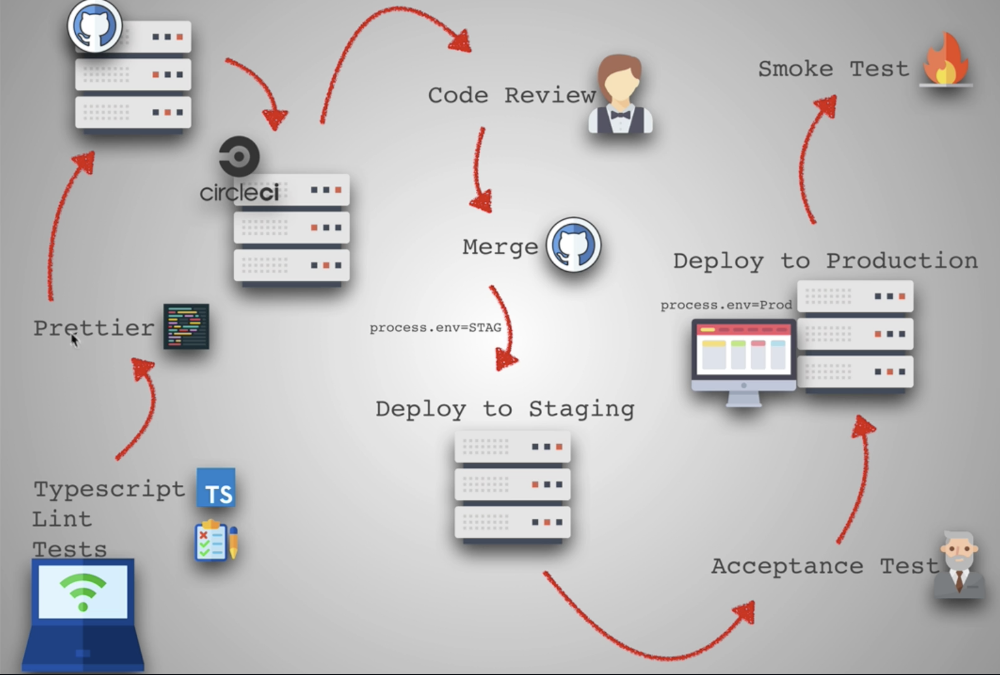
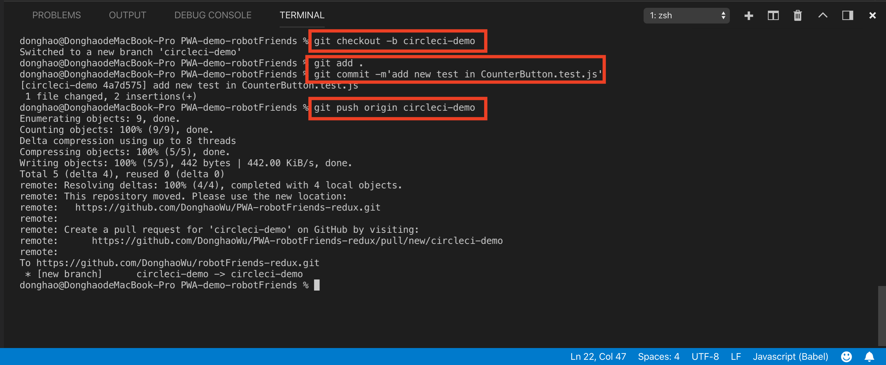
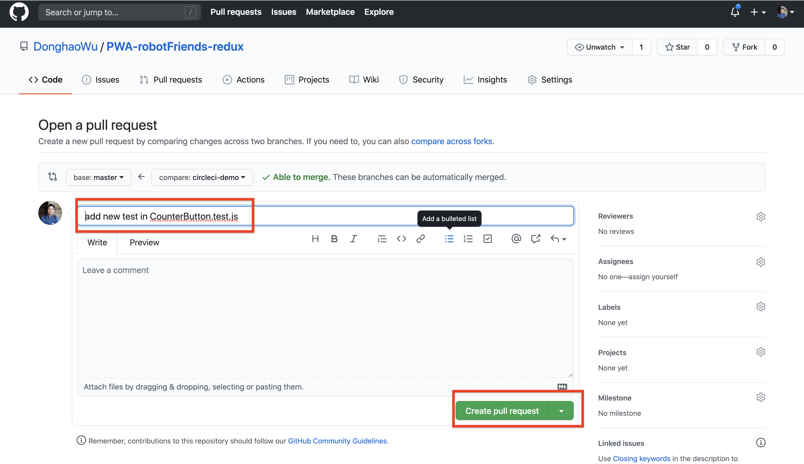
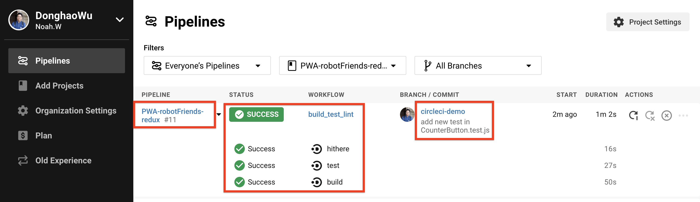
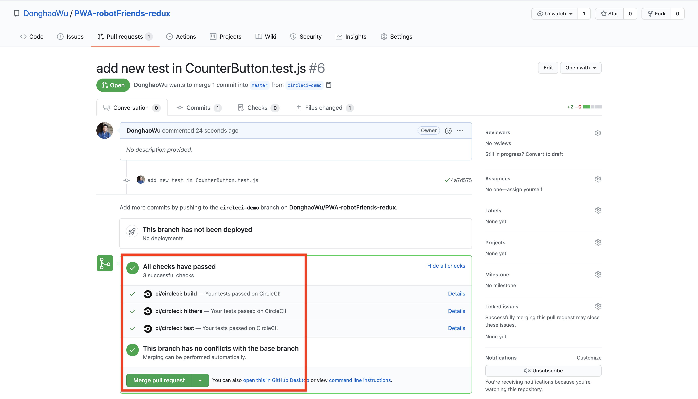

# Web development tools (Part 28)

- #### Click here: [BACK TO NAVIGASTION](https://github.com/DonghaoWu/WebDev-tools-demo/blob/master/README.md)

## `Section: CI/CD`(Basic)

### `Summary`: In this documentation, we learn CI/CD.

### `Check Dependencies & Tools:`

- prettier

------------------------------------------------------------

#### `本章背景：`

- Continuous Intergreation & Continuous Deliver.

- 本章用到的全部资料：
    - [Top 8 Continuous Integration Tools](https://code-maze.com/top-8-continuous-integration-tools/)

- circleCI 在组员使用 pull request 时才会用到。

- Prettier will work when we make a commit.

<p align="center">

</p>

------------------------------------------------------------

<p align="center">

</p>

------------------------------------------------------------

### <span id="28.0">`Brief Contents & codes position`</span>

- #### Click here: [BACK TO NAVIGASTION](https://github.com/DonghaoWu/WebDev-tools-demo/blob/master/README.md)

- [28.1 circleCI.](#28.1)
- [28.2 Prettier.](#28.2)

------------------------------------------------------------

### <span id="28.1">`Step1: circleCI.`</span>

- #### Click here: [BACK TO CONTENT](#28.0)

  1. Create a new folder in root directory, name `.circleci`.

  2. Create a yml file in the folder, name `config.yml`.

```yml
version : 2
jobs:
    build:
        docker:
            - image: circleci/node:12.18.2
        steps:
            - checkout
            - run: echo "npm installing"
            - run: npm install
            - run: CI=true npm run build
    test:
        docker:
            - image: circleci/node:12.18.2
        steps:
            - checkout
            - run: echo "testing stuff"
            - run: npm install
            - run: npm test
    hithere:
        docker:
            - image: circleci/node:12.18.2
        steps:
            - checkout
            - run: echo "hello!!!"
workflows:
    version: 2
    build_test_lint:
        jobs:
            - build
            - hithere
            - test:
                requires:
                    - hithere
```

3. Signin circleci with github account.

4. Set up project and leave the default one.

5. Create a new branch and make a pull request.

```bash
$ git checkout -b circleci
$ git add .
$ git commit -m'add yml file'
$ git push origin circleci
```

<p align="center">

</p>

------------------------------------------------------------

6. Make a pull request in Github.

<p align="center">

</p>

------------------------------------------------------------

7. Check the processes in circleci.

<p align="center">

</p>

------------------------------------------------------------

8. Merge.
<p align="center">

</p>

------------------------------------------------------------

#### `Comment:`
1. 

### <span id="28.2">`Step2: Prettier.`</span>

- #### Click here: [BACK TO CONTENT](#28.0)

    1. Install.
    ```bash
    $ npm i compression
    ```

#### `Comment:`
1. 

- #### Click here: [BACK TO CONTENT](#28.0)
- #### Click here: [BACK TO NAVIGASTION](https://github.com/DonghaoWu/WebDev-tools-demo/blob/master/README.md)