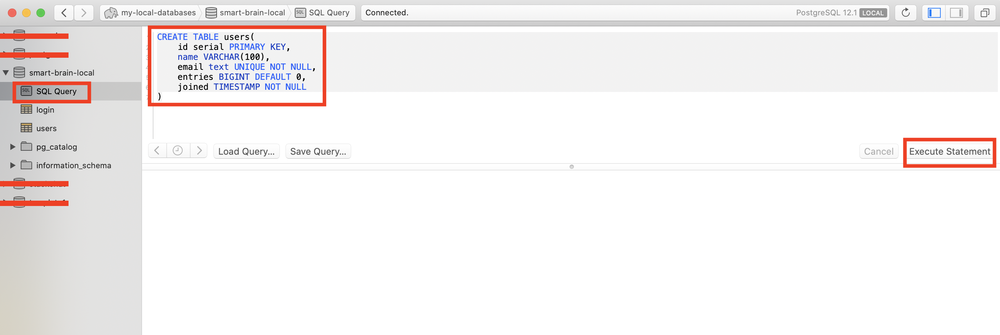
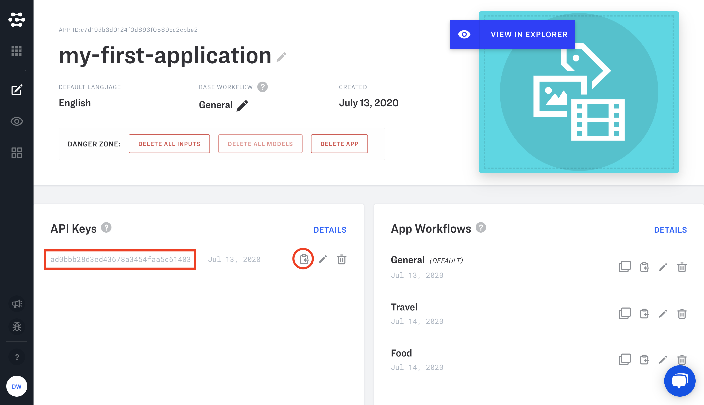
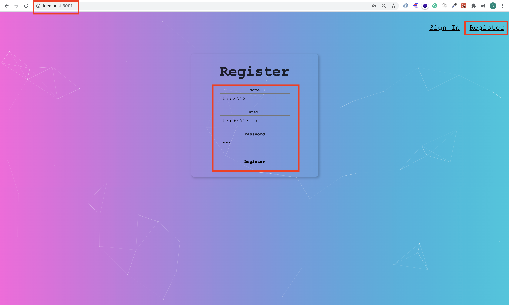
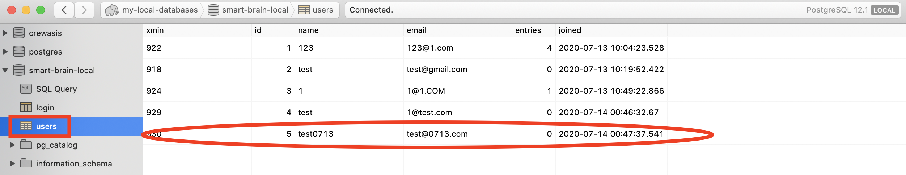
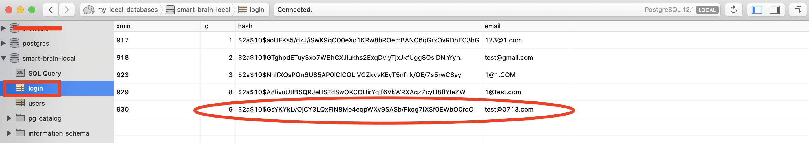
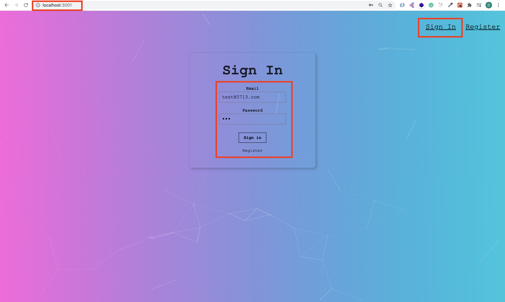

# Web development tools (Part 20)

- #### Click here: [BACK TO NAVIGASTION](https://github.com/DonghaoWu/WebDev-tools-demo/blob/master/README.md)

## `Section: Code analysis.` (Basic)

### `Summary`: In this documentation, we learn to how to do code analysis to a new application.

### `Check Dependencies & Tools:`

- dotenv

------------------------------------------------------------

#### `本章背景：`
- 本章使用的 demo app 分两个，一个是前端 app，一个是后端 app。

------------------------------------------------------------

### <span id="20.0">`Brief Contents & codes position`</span>

- #### Click here: [BACK TO NAVIGASTION](https://github.com/DonghaoWu/WebDev-tools-demo/blob/master/README.md)

- [20.1 Check documentations and install dependencies.](#20.1)
- [20.2 Setup database server, create database and table.](#20.2)
- [20.3 Setup API key and .env file.](#20.3)
- [20.4 Backend application.](#20.4)
- [20.5 Frontend application.](#20.5)


------------------------------------------------------------

### <span id="20.1">`Step1: Check documentations and install dependencies.`</span>

- #### Click here: [BACK TO CONTENT](#20.0)

1. Frontend documentation:

    __`Location:./demo-apps/frontend-smart-brain/README.md`__

    ```md
    # SmartBrain - v2
    Final project for Udemy course

    1. Clone this repo
    2. Run `npm install`
    3. Run `npm start`
    ```

2. Frontend package.json:

    __`Location:./demo-apps/frontend-smart-brain/package.json`__

    ```json
    {
        "name": "facerecognitionbrain",
        "version": "0.1.0",
        "private": true,
        "dependencies": {
            "react": "^16.2.0",
            "react-dom": "^16.2.0",
            "react-particles-js": "^2.1.0",
            "react-scripts": "^3.4.1",
            "react-tilt": "^0.1.4",
            "tachyons": "^4.9.0"
        },
        "scripts": {
            "start": "react-scripts start",
            "build": "react-scripts build",
            "test": "react-scripts test --env=jsdom",
            "eject": "react-scripts eject"
        },
        "browserslist": {
            "production": [
            ">0.2%",
            "not dead",
            "not op_mini all"
            ],
            "development": [
            "last 1 chrome version",
            "last 1 firefox version",
            "last 1 safari version"
            ]
        }
    }
    ```

3. Backend documentation:

    __`Location:./demo-apps/backend-smart-brain-api/README.md`__

    ```md
    # SmartBrain-api - v2
    Final project for Udemy course

    1. Clone this repo
    2. Run `npm install`
    3. Run `npm start`
    4. You must add your own API key in the `controllers/image.js` file to connect to Clarifai API.

    You can grab Clarifai API key [here](https://www.clarifai.com/)

    ** Make sure you use postgreSQL instead of mySQL for this code base.
    ```

4. Backend package.json:

    __`Location:./demo-apps/backend-smart-brain-api/package.json`__

    ```json
    {
        "name": "node",
        "version": "1.0.0",
        "main": "script.js",
        "scripts": {
            "start": "nodemon server.js"
        },
        "keywords": [],
        "author": "",
        "license": "ISC",
        "dependencies": {
            "bcrypt-nodejs": "0.0.3",
            "body-parser": "^1.18.2",
            "clarifai": "^2.5.0",
            "cors": "^2.8.4",
            "dotenv": "^8.2.0",
            "express": "^4.16.2",
            "knex": "^0.19.5",
            "pg": "^7.4.0"
        },
        "devDependencies": {
            "nodemon": "^1.12.7"
        },
        "description": ""
    }
    ```

5. Install depenencies.

    ```bash
    $ npm update
    $ npm i
    $ npm audit fix
    ```

#### `Comment:`
1. 


### <span id="20.2">`Step2: Setup database server, create database and table.`</span>

- #### Click here: [BACK TO CONTENT](#20.0)

1. Install postgreSQL:
    - [MAC postgreSQL installation](https://postgresapp.com/)

2. Create a new database in postgreSQL:

    ```bash
    $ createdb 'smart-brain-local'
    ```

3. Install a GUI to connect and manage database.

    - [Postico](https://eggerapps.at/postico/)

4. Create two new tables in the database.

    ```sql
    CREATE TABLE users(
        id serial PRIMARY KEY,
        name VARCHAR(100),
        email text UNIQUE NOT NULL,
        entries BIGINT DEFAULT 0,
        joined TIMESTAMP NOT NULL
    )
    ```

    ```sql
    CREATE TABLE login(
        id serial PRIMARY KEY,
        hash VARCHAR(100) NOT NULL,
        email text UNIQUE NOT NULL
    )
    ```

<p align="center">

</p>

------------------------------------------------------------

5. Connect backend application and the new database.

    __`Location:./demo-apps/backend-smart-brain-api/server.js`__

    ```js
    const db = knex({
        client: 'pg',
        connection: {
            host: 127.0.0.1,
            user: <Your postgreSQL username>,
            password: '',
            database: 'smart-brain-local'
        }
    });
    ```

#### `Comment:`
1. 

### <span id="20.3">`Step3: Setup API key and .env file.`</span>

- #### Click here: [BACK TO CONTENT](#20.0)

1. Register a new account in [clarifai.com](https://www.clarifai.com/).

2. Copy your API key.

<p align="center">

</p>

------------------------------------------------------------

3. Install dotenv dependency in backend application.

    ```bash
    $ npm i dotenv
    ```

4. Apply the dependency in the first line of the file.

    __`Location:./demo-apps/backend-smart-brain-api/server.js`__

    ```js
    require('dotenv').config();
    ```

5. Create a new file in root directory, name it `.env`, then put all private data here.

    __`Location:./demo-apps/backend-smart-brain-api/.env`__

    ```js
    API_KEY=adva892310230192y2jhbsdh

    DB_HOST=10.10.10.1
    DB_USER=TEST
    DB_NAME=my-database
    DB_CLIENT=pg
    ```

6. Replace the variables.

    __`Location:./demo-apps/backend-smart-brain-api/server.js`__

    ```js
    const db = knex({
    client: process.env.DB_CLIENT,
        connection: {
            host: process.env.DB_HOST,
            user: process.env.DB_USER,
            password: '',
            database: process.env.DB_NAME
        }
    });
    ```

    __`Location:./demo-apps/backend-smart-brain-api/controllers/image.js`__

    ```js
    const Clarifai = require('clarifai');

    //You must add your own API key here from Clarifai.

    const app = new Clarifai.App({
        apiKey: process.env.API_KEY
    });
    ```

7. Add code in `.gitignore`.

    __`Location:./demo-apps/backend-smart-brain-api/.gitignore`__

    ```js
    /node_modules

    *.env
    ```

8. Run both frontend app and backend app.
    ```bash
    $ npm start
    ```

9. Check the `register` and `signin` feature.

<p align="center">

</p>

------------------------------------------------------------

<p align="center">

</p>

------------------------------------------------------------

<p align="center">

</p>

------------------------------------------------------------

<p align="center">

</p>

------------------------------------------------------------

#### `Comment:`
1. :star: 这里需要提一下 register 函数是跟两个 table 都有互动的。

### <span id="20.4">`Step4: Back end application.`</span>

- #### Click here: [BACK TO CONTENT](#20.0)

1. 

#### `Comment:`
1. 

### <span id="20.5">`Step5: Front end application.`</span>

- #### Click here: [BACK TO CONTENT](#20.0)

1. 

#### `Comment:`
1. 


- #### Click here: [BACK TO CONTENT](#20.0)
- #### Click here: [BACK TO NAVIGASTION](https://github.com/DonghaoWu/WebDev-tools-demo/blob/master/README.md)