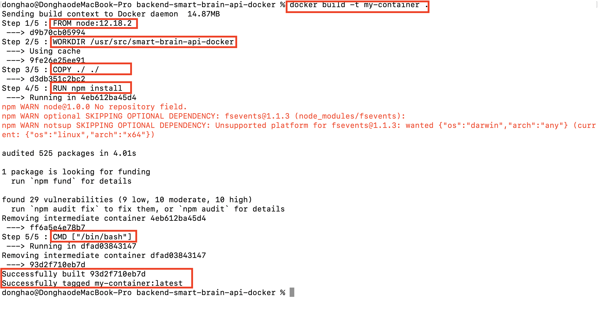
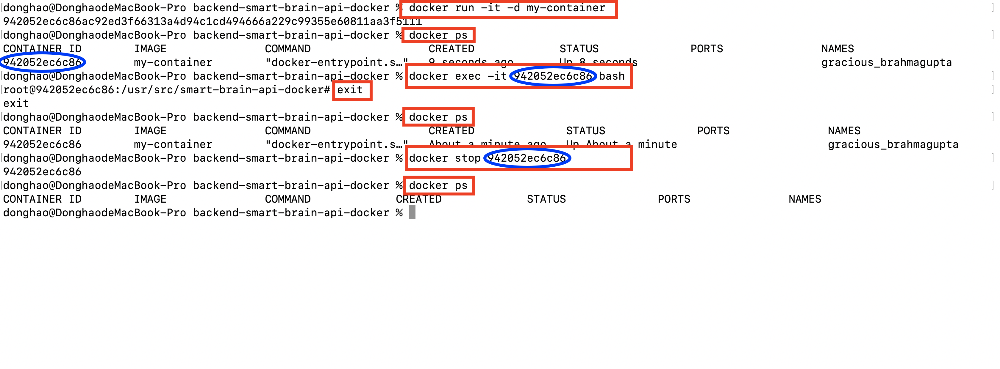
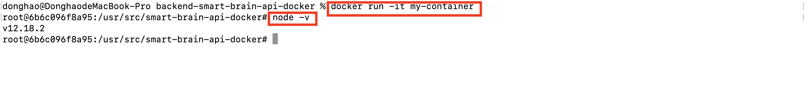
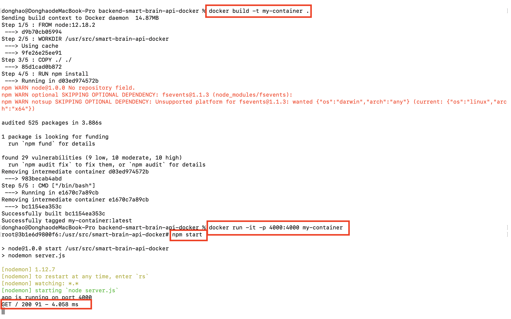
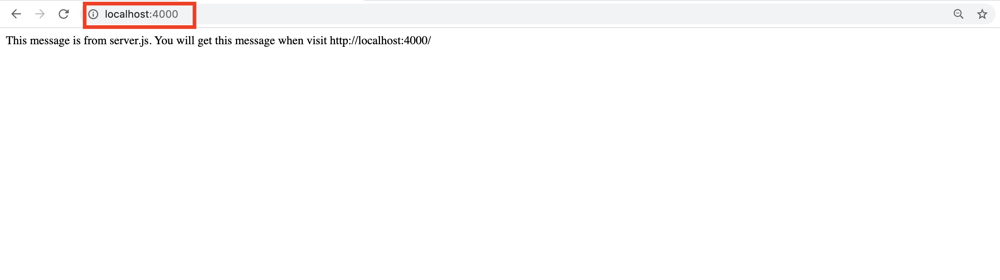

# Web development tools (Part 22)

- #### Click here: [BACK TO NAVIGASTION](https://github.com/DonghaoWu/WebDev-tools-demo/blob/master/README.md)

## `Section: Docker.`(Basic)

### `Summary`: In this documentation, we learn to dockerize the back end application.

### `Check Dependencies & Tools:`

- 
------------------------------------------------------------

#### `本章背景: `
1. 本章里面会提到两种文件，文件有 Dockerfile 和 docker-compose.yml，其中 Dockerfile 是用来生成单独 container service 的，docker-compose 是用来生成多个 container services 的。而且 docker-compose 文件还可以调用特定位置的 Dockerfile 来生成 container service。

2. 本章里面会提到两种命令，一种是 docker 命令，另外一种是 docker-compose 命令。
------------------------------------------------------------

### <span id="22.0">`Brief Contents & codes position`</span>

- #### Click here: [BACK TO NAVIGASTION](https://github.com/DonghaoWu/WebDev-tools-demo/blob/master/README.md)

- [22.1 Docker Installation.](#22.1)
- [22.2 Dockerfile.](#22.2)
- [22.3 Docker commands.](#22.3)
- [22.4 docker-compose.yml file.](#22.4)
- [22.5 docker-compose commands.](#22.5)
- [22.6 Add new servie to docker-compose.](#22.6)
- [22.7 All needed files.](#22.7)

------------------------------------------------------------

### <span id="22.1">`Step1: Docker Installation.`</span>

- #### Click here: [BACK TO CONTENT](#22.0)

1. [Docker download website](https://www.docker.com/products/docker-desktop)

#### `Comment:`
1. 


### <span id="22.2">`Step2: Dockerfile.`</span>

- #### Click here: [BACK TO CONTENT](#22.0)

1. Create a Dockerfile in application root directory.

- __`Location: ./demo-apps/backend-smart-brain-api-docker/Dockerfile`__

```Dockerfile
# environment
FROM node:12.18.2

# 路径，设定复制的文件夹粘贴位置，在每一个 container，都会有预设的文件架构，在这里把源代码文件放到 /usr/src 下面一个自命名为 smart-brain-api 的文件夹之下。
WORKDIR /usr/src/smart-brain-api-docker

# 复制动作，注意，第一个 ‘./’代表范围，第二个 ‘./’选择范围内所有文件。
COPY ./ ./

# 复制好之后执行的动作
RUN npm install

# 猜测是运行进入命令之后执行的命令，每个 dockerfile 只有一条 CMD 命令。
CMD ["/bin/bash"]
```

#### `Comment:`
1. 以下逐条分析命令：
    - `FROM node:12.18.2` --> 生成一个 node 环境，并标注版本号。
    - `WORKDIR /usr/src/smart-brain-api-docker` --> 在将要生成的 container 里面命名选择一个路径作为工作文件夹，这里要说的是，因为这个 Dockerfile 是主要的 Dockerfile，它这里设置的路径，将要包涵目前 app 文件夹内所有的文件。
    - `COPY ./ ./` --> 复制指定文件到第二步的路径中，第一个 `./` 指的是文件范围，跟这个 Dockerfile 同层的文件（也就是 backend-smart-api-docker 中所有文件），第二个 `./` 指的是位置，这里指选择所有文件。
    - `RUN npm install` --> 这里指的是建立环境之后执行的命令，可以有多条。
    - `CMD ["/bin/bash"]` --> 完成配置之后进入 bash terminal，这里指的是 CMD 命令，只能有一条。

### <span id="22.3">`Step3: Docker commands.`</span>

- #### Click here: [BACK TO CONTENT](#22.0)

1. 常见命令，备注：:star:所有命令都是在 Dockerfile 所在层位置的。

    - `docker build -t <container-name> .`: 生成一个镜像，按照本层存在的 dockerfile 里面的配置下载需要的软件和配置环境。

    - `docker run -it <container-name>`: 进入目标 container ，__注意命令中 -it 不能缺少__，这个除了进入之外同时在运行 docker container。

    - `node -v`:在 container 内查看当前 node 的版本。

    - `exit`: 退出当前 container 的 terminal ，但不停止 container 的运作。

    - `docker run -it -d <container-name>`: 这个命令使 container 后台运行，但不进入 container。

    - `docker ps`: 查看当前正在运行的 container 数据。

    - `docker exec -it <containerID> bash`: 前提：目标 container 在后台运行中，输入此命令可进入那个 container 的命令行。

    - `docker stop <containerID> `: 停止指定的正在运作的 container。

    - `docker run -it -p 4000:4000 my-container`: port binding，主要是设置在本地访问 4000 端口时会转接到 container 的 4000 端口，这样就可以在本地 browser 中访问正在运行的 docker container application。

------------------------------------------------------------

#### `Comment:`
1. 演示截图：

```bash
$ docker build -t my-container .
```

<p align="center">

</p>

------------------------------------------------------------

```bash
$ docker run -it -d my-container
$ docker ps
$ docker exec -it <containerID> bash
$ exit
$ docker ps
$ docker stop <containerID>
$ docker ps
```
<p align="center">

</p>

------------------------------------------------------------
```bash
$ docker run -it my-container
$ node -v
```
<p align="center">

</p>

------------------------------------------------------------
```bash
$ docker build -t my-container .
$ docker run -it -p 4000:4000 my-container
root@3b1e6d9800f6:/usr/src/smart-brain-api-docker# npm start
```

<p align="center">

</p>

------------------------------------------------------------

<p align="center">

</p>

------------------------------------------------------------

### <span id="22.4">`Step4: docker-compose.yml file.`</span>

- #### Click here: [BACK TO CONTENT](#22.0)

1. 

#### `Comment:`
1. `git fetch`: 不会更改任何文件。
2. `git merge origin/master`: 有可能产生 Merge conflict。

### <span id="22.5">`Step5: 常见场景.`</span>

- #### Click here: [BACK TO CONTENT](#22.0)

1. A 和 B 一起在一个 project，A 负责一个分支 feature-A， B 负责一个分支 feature-B，A 和 B 都从 github 下载原始文件：

```bash
$ git clone <http...>
```

2. B 创建分支并转换到分支 feature-B，并开始对文件进行修改：

```bash
$ git branch feature-B
$ git checkout feature-B
```

3. A 发现 project 的一些原始设置需要修正并加入一些 dependency，同时也对一些原始文件进行修改，于是生成新分支 ‘change-config’

```bash
$ git branch change-config
$ git checkout change-config
```

4. A 修改完之后把分支上传到 github

```bash
$ git push origin change-config
```

5. 在 github 上申请 pull request 并通知 B 审核，B 和 A 商量审核过后没问题就 approve，把新分支合并到 master。这个步骤全部在 github 上面操作。 __也就是说，现在更新了 master，一切都按现在的 master 为基准进行开发。__

6. A更新本地 master， 然后删除分支 change-config，并开始在 feature-A 上的工作。

```bash
$ git checkout master
$ git fetch
$ git merge origin/master

$ git branch -d change-config

$ git branch feature-A
$ git checkout feature-A
```

7. B 现在需要下载最新的 master 跟本地 master 合并：

```bash
$ git checkout master
$ git fetch
$ git merge origin/master
```

8. 现在针对正在开发的 feature-B， B 有两个选择，一个是删除之前在建的分支 feature-B，重新以最新的本地 master 为基础创建新的 feature-B，这个做法是不可取的，因为很难全部记住之前旧 feature-B 上的修改，其次如果是一个多人经常修改的 github master，这会需要重复这个动作很多次。

:star::star::star:所以我们会选择另外一个选项， __`用更新之后的 master 合并现有的 feature-B`__ :

```bash
$ git checkout feature-B
$ git merge master
```

:key::key::key: 请注意，这是一个 merge 过程，有可能产生 merge conflict 的情况，当然也可能没有，主要取决于 B 在 feature-B 分支上有没有修改跟 A 在 change-config 分支上同一个文件。如果有 merge conflict，参考上面的 step3 情况处理。


#### `Comment:`
1. 这个属于多人协作 project 常见情况，每个人都在自己的 feature 上运作，但同时 master 在经常更新。‘
2. 出现 merge conflict 的时候如果出现差别，第一要进行沟通，然后取舍。而减少 merge conflict 的尝试有几种：

    - :star: 第7点的第一种尝试，有效但很低效且容易遗漏出错。
    - :star: 每个人尽量在自己划定的文件范围内修改，尽量少修改共有范围文件，或者共有范围文件的修改由特定人员负责，并进行协调和通知。
    - :star: 防止多人多次对共有文件的修改。

3. 其实 master 更新是常事，遇到 merge conflict 也是常事，这就是为什么程序员需要沟通协调的原因，处理 merge conflict 应该是一个必要技能。

------------------------------------------------------------

### <span id="22.6">`Step6: 后续补充更新.`</span>

- #### Click here: [BACK TO CONTENT](#22.0)

#### `Comment:`

------------------------------------------------------------

- #### Click here: [BACK TO CONTENT](#22.0)
- #### Click here: [BACK TO NAVIGASTION](https://github.com/DonghaoWu/WebDev-tools-demo/blob/master/README.md)