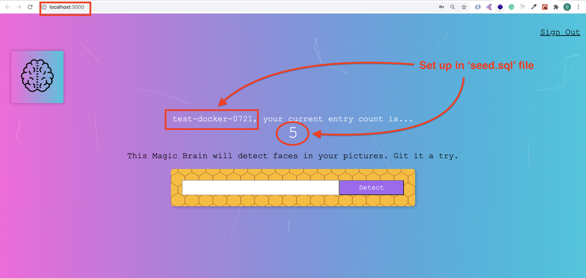

# Web development tools (Part 22)

- #### Click here: [BACK TO NAVIGASTION](https://github.com/DonghaoWu/WebDev-tools-demo/blob/master/README.md)

## `Section: Docker.`(Basic)

### `Summary`: In this documentation, we learn to dockerize the back end application.

### `Check Dependencies & Tools:`

- 
------------------------------------------------------------

#### `本章背景: `
1. 本章里面会提到两种文件，文件有 Dockerfile 和 docker-compose.yml，其中 Dockerfile 是用来生成单独 container service 的，docker-compose 是用来生成多个 container services 的。而且 docker-compose 文件还可以调用特定位置的 Dockerfile 来生成 container service。

2. 本章里面会提到两种命令，一种是 docker 命令，另外一种是 docker-compose 命令。

3. 使用 Docker 必须要注意的事情：

    1. :star: 每一次修改源代码，Dockerfile 或者 docker-compose.yml 之后都要重新执行 `build` 命令。
    2. :star: 一个文件夹对应一个 container_name，如果修改了源代码文件夹名字，那么 container_name 也必须修改才能运行，同时推荐也修改 work directory。
    3. :star: docker-compose 中的 working directory 的设置必须跟主 Dockerfile (__`Location: ./demo-apps/backend-smart-brain-api-docker/Dockerfile`__)里面的一致。

    4. :star: 推荐 docker-compose 命令组合：
        ```bash
        $ docker-compose up --build
        $ docker-compose down
        ```

    5. :star: docker-compose.yml 里面的 database 环境变量名称设置必须要跟 application 里面获得变量的变量名称一样。

    6. :star: SQL 文件的编写和检查需要特别严谨，需要注意`空格标点还有拼写`。

    7. :star: docker 的设置很讲究接口设置。
------------------------------------------------------------

### <span id="22.0">`Brief Contents & codes position`</span>

- #### Click here: [BACK TO NAVIGASTION](https://github.com/DonghaoWu/WebDev-tools-demo/blob/master/README.md)

- [22.1 Docker Installation.](#22.1)
- [22.2 Dockerfile.](#22.2)
- [22.3 Docker commands.](#22.3)
- [22.4 docker-compose.yml file.](#22.4)
- [22.5 docker-compose commands.](#22.5)
- [22.6 Add postgres code in docker-compose.yml file.](#22.6)
- [22.7 Add postgres Dockerfile and sql files.](#22.7)
- [22.8 Other needed files.](#22.8)
- [22.9 Run the application.](#22.9)

------------------------------------------------------------

### <span id="22.1">`Step1: Docker Installation.`</span>

- #### Click here: [BACK TO CONTENT](#22.0)

1. [Docker download website](https://www.docker.com/products/docker-desktop)

#### `Comment:`
1. 


### <span id="22.2">`Step2: Dockerfile.`</span>

- #### Click here: [BACK TO CONTENT](#22.0)

1. Create a Dockerfile in application root directory.

- __`Location: ./demo-apps/backend-smart-brain-api-docker/Dockerfile`__

```Dockerfile
# environment
FROM node:12.18.2

# 路径，设定复制的文件夹粘贴位置，在每一个 container，都会有预设的文件架构，在这里把源代码文件放到 /usr/src 下面一个自命名为 smart-brain-api 的文件夹之下。
WORKDIR /usr/src/smart-brain-api-docker

# 复制动作，注意，第一个 ‘./’代表范围，第二个 ‘./’选择范围内所有文件。
COPY ./ ./

# 复制好之后执行的动作
RUN npm install

# 猜测是运行进入命令之后执行的命令，每个 dockerfile 只有一条 CMD 命令。
CMD ["/bin/bash"]
```

#### `Comment:`
1. Dockerfile 命令代码分析：
    - __`FROM node:12.18.2`__ --> 生成一个 node 环境，并标注版本号。
    - __`WORKDIR /usr/src/smart-brain-api-docker`__ --> 在将要生成的 container 里面命名选择一个路径作为工作文件夹，这里要说的是，因为这个 Dockerfile 是主要的 Dockerfile，它这里设置的路径，将要用来存放目前 application 文件夹内所有的文件。
    - __`COPY ./ ./`__ --> 复制指定文件到第二步的路径中，第一个 `./` 指的是文件范围，跟这个 Dockerfile 同层的文件（也就是 backend-smart-api-docker 中所有文件），第二个 `./` 指的是位置，这里指选择所有文件。
    - __`RUN npm install`__ --> 这里指的是建立环境之后执行的命令，可以有多条。
    - __`CMD ["/bin/bash"]`__ --> 完成配置之后进入 bash terminal，这里指的是 CMD 命令，只能有一条。

### <span id="22.3">`Step3: Docker commands.`</span>

- #### Click here: [BACK TO CONTENT](#22.0)

1. 常见命令，备注：:star:所有命令都是在 Dockerfile 所在层位置的。

    - __`docker build -t <container-name> .`__: 生成一个镜像，按照本层存在的 dockerfile 里面的配置下载需要的软件和配置环境。

    - __`docker run -it <container-name>`__: 进入目标 container ，__注意命令中 -it 不能缺少__，这个除了进入之外同时在运行 docker container。

    - __`node -v`__:在 container 内查看当前 node 的版本。

    - __`exit`__: 退出当前 container 的 terminal ，但不停止 container 的运作。

    - __`docker run -it -d <container-name>`__: 这个命令使 container 后台运行，但不进入 container。

    - __`docker ps`__: 查看当前正在运行的 container 数据。

    - __`docker exec -it <containerID> bash`__: 前提：目标 container 在后台运行中，输入此命令可进入那个 container 的命令行。

    - __`docker stop <containerID>`__: 停止指定的正在运作的 container。

    - __`docker run -it -p 4000:4000 my-container`__: port binding，主要是设置在本地访问 4000 端口时会转接到 container 的 4000 端口，这样就可以在本地 browser 中访问正在运行的 docker container application。

------------------------------------------------------------

#### `Comment:`
1. 演示截图：

```bash
$ docker build -t my-container .
```

<p align="center">

</p>

------------------------------------------------------------

```bash
$ docker run -it -d my-container
$ docker ps
$ docker exec -it <containerID> bash
$ exit
$ docker ps
$ docker stop <containerID>
$ docker ps
```
<p align="center">

</p>

------------------------------------------------------------
```bash
$ docker run -it my-container
$ node -v
```
<p align="center">

</p>

------------------------------------------------------------
```bash
$ docker build -t my-container .
$ docker run -it -p 4000:4000 my-container
root@3b1e6d9800f6:/usr/src/smart-brain-api-docker# npm start
```

<p align="center">

</p>

------------------------------------------------------------

<p align="center">

</p>

------------------------------------------------------------

### <span id="22.4">`Step4: docker-compose.yml file.`</span>

- #### Click here: [BACK TO CONTENT](#22.0)

- :star:这里要先有个预先认识，docker-compose 相当于多个 Dockerfile 的合集，可以在这里创建多个 service，也可以引用其他位置的 Dockerfile 创建 service。

1. Create a Dockerfile in application root directory.

- __`Location: ./demo-apps/backend-smart-brain-api-docker/docker-compose.yml`__

```yml
version: '3.8'

services:
  # Backend API
  smart-brain-api:
    container_name: backend-docker
    # image: node:12.18.2 这个在已经有 image 的情况下可以省略
    build: ./
    command: npm start
    working_dir: /usr/src/smart-brain-api-docker
    links:
      - postgres
    ports:
      - "4000:4000"
    volumes:
      - ./:/usr/src/smart-brain-api-docker
```

#### `Comment:`
1. docker-compose.yml 命令代码分析：
    - __`version: '3.8'`__ --> docker-compose 的版本号，可以在这里查询:[docker-compose version](https://docs.docker.com/compose/compose-file/)

    - __`smart-brain-api:`__ --> 服务名字。

    - __`container_name: backend-docker`__ --> container 名字，:star:注意这里一个源文件夹名字对应一个 container_name，修改了源文件夹名字就必须修改新的 container_name。

    - __`build: ./`__ --> 调用同文件层中的 Dockerfile 并运行 build 命令，这里要说明的是，如果有 Dockerfile 建立 image 了，就不需要使用代码 `image: node:12.18.2`。

    - __`command: npm start`__ --> 在执行完 build 中所有指令，包括 npm install 之后，执行 npm start。

    - __`working_dir: /usr/src/smart-brain-api-docker`__ --> working directory，这里的设置必须跟主 Dockerfile (__`Location: ./demo-apps/backend-smart-brain-api-docker/Dockerfile`__)里面的一致。

    - __`links: - postgres`__ --> 关联服务，:star:现在可以省略不用了。

    - __`ports:- "4000:4000"`__ --> container 与外界的对接接口设定。

    - __`volumes: - ./:/usr/src/smart-brain-api-docker`__ --> 允许在本地修改源代码，使 container 做出同步改变，例如可以使用 nodemon 监测。:star:注意参数文件夹位置要准确。

### <span id="22.5">`Step5: docker-compose commands.`</span>

- #### Click here: [BACK TO CONTENT](#22.0)

1. 参考资料：[点击这里 -- docker-compose cli](https://docs.docker.com/compose/reference/overview/)

2. 常见命令，备注：:star:所有命令都是在 docker-compose.yml 所在层位置的。

    - __`docker-compose run <serviecesName>`__: 运行一个 service。

    - __`docker-compose build`__: Build or rebuild services。

    - __`docker-compose down`__:Stop and remove containers, networks, images, and volumes。

    - __`docker-compose up`__: Create and start containers。

    - __`docker-compose up --build`__: 先执行 build 命令，然后执行 up 命令。

#### `Comment:`
1. 推荐组合：

```bash
$ docker-compose up --build
$ docker-compose down
```

2. 其他组合，用来后台运行，并进入 bash terminal。

```bash
$ docker-compose up -d
$ docker-compose exec <container_name> bash
```

------------------------------------------------------------

### <span id="22.6">`Step6: Add postgres code in docker-compose.yml file.`</span>

- #### Click here: [BACK TO CONTENT](#22.0)

1. :star: 要注意的是执行这个命令的时候如果 local postgres 已经连接了 port 5432，用 postico 不能用已定义的 USER 和 PASSWORD 登录，因为这个时候 5432 端口是为 local database 服务，只能查询 local database 上面的数据。需要关掉 local database 服务之后 5432 才会空出来，再运行 down 和 build 命令，就可以通过访问 5432 端口接触 container 里面的数据库，当然不一定是 5432 端口，也可以修改对接端口。 

2. postgres 的数据库虽然都在本地，但它使用的是端口化访问的形式，每个 postgres database 的默认端口是 5432，也就是说本地和 container 里面生成的 database 都是默认使用 5432 接口才能访问的，如果本地的 database 已经占用 5432，解决方法有两个，一是停止本地 database 运作，二是在 docker-compose.yml 中的 ports 设置中改变本地参数，如改为：

```diff
-    ports:
-      - "5432:5432"

+    ports:
+      - "5431:5432"
```

- 当然改变本地端口的话，front-end 中的设置也要相应改变，:star:综上所述推荐第一种方法。

3. Add postgres service in docker-compose.yml file

- __`Location: ./demo-apps/backend-smart-brain-api-docker/docker-compose.yml`__

```yml
version: '3.8'

services:
  # Backend API service
  smart-brain-api:
    container_name: backend-docker
    build: ./
    command: npm start
    working_dir: /usr/src/smart-brain-api-docker
    environment:
      POSTGRES_HOST: postgres
      POSTGRES_USER: sally
      POSTGRES_PASSWORD: secret
      POSTGRES_DB: smart-brain-docker
    links:
      - postgres
    ports:
      - "4000:4000"
    volumes:
      - ./:/usr/src/smart-brain-api-docker

  # Postgres service
  postgres:
    environment:
      POSTGRES_HOST: postgres
      POSTGRES_USER: sally
      POSTGRES_PASSWORD: secret
      POSTGRES_DB: smart-brain-docker
    build: ./postgres
    ports:
      - "5432:5432"
```

4. Change code in server.js

- __`Location: ./demo-apps/backend-smart-brain-api-docker/server.js`__

```js
const db = knex({
  client: process.env.POSTGRES_CLIENT,
  connection: {
    host: process.env.POSTGRES_HOST,
    user: process.env.POSTGRES_USER,
    password: process.env.POSTGRES_PASSWORD,
    database: process.env.POSTGRES_DB
  }
});
```

#### `Comment:`
1. docker-compose.yml 命令代码分析：
    - __`environment`__ --> 设定环境变量，当设定好这些变量之后，container 里面的 application 就可以通过 process.env 来获得这些全局变量。

    - __`build: ./postgres`__ --> 调用同层文件夹 postgre 下面的 Dockerfile 来 build service。:star: 这里同样有了 build 就不用 image 关键词。

    - __`ports:- "5432:5432"`__ --> container database 的对外接口设定。

### <span id="22.7">`Step7: Add postgres Dockerfile and sql files.`</span>

- #### Click here: [BACK TO CONTENT](#22.0)

1. Add new folder.
- __`Location: ./demo-apps/backend-smart-brain-api-docker/postgres`__

2. Add files in the new folder.

- __`Location: ./demo-apps/backend-smart-brain-api-docker/postgres/Dockerfile`__

```dockerfile
FROM postgres:12.1

ADD /tables/ /docker-entrypoint-initdb.d/tables/
ADD /seed/ /docker-entrypoint-initdb.d/seed/
ADD deploy_schemas.sql /docker-entrypoint-initdb.d/
```

- __`Location: ./demo-apps/backend-smart-brain-api-docker/postgres/deploy_schemas.sql`__

```sql
-- Deploy fresh database tables

-- table files,'/i' means execute.
\i '/docker-entrypoint-initdb.d/tables/users.sql'
\i '/docker-entrypoint-initdb.d/tables/login.sql'

-- seed files
\i '/docker-entrypoint-initdb.d/seed/seed.sql'
```

- __`Location: ./demo-apps/backend-smart-brain-api-docker/postgres/tables/users.sql`__

```sql
BEGIN TRANSACTION;

CREATE TABLE users (
    id serial PRIMARY KEY,
    name VARCHAR(100),
    email text UNIQUE NOT NULL,
    entries BIGINT DEFAULT 0,
    joined TIMESTAMP NOT NULL
);

COMMIT;
```

- __`Location: ./demo-apps/backend-smart-brain-api-docker/postgres/tables/login.sql`__

```sql
BEGIN TRANSACTION;

CREATE TABLE login (
    id serial PRIMARY KEY,
    hash VARCHAR(100) NOT NULL,
    email text UNIQUE NOT NULL
);

COMMIT;
```

- __`Location: ./demo-apps/backend-smart-brain-api-docker/postgres/seed/seed.sql`__

```sql
BEGIN TRANSACTION;

-- email: test@0721.com, password:123
INSERT INTO users (name, email, entries, joined ) values ('test-docker-0721', 'test@0721.com', 5, '2020-07-21');
INSERT INTO login (hash, email ) values ('$2a$10$KqWcUNkhvZXYQcxcbSxhCeyTFA.s0/fHR2xXhsi58//jmWvPqGA8W', 'test@0721.com');

COMMIT;
```


#### `Comment:`
1. file structure:

<p align="center">

</p>

------------------------------------------------------------

2. 查询 postgres 版本：

```bash
$ psql --version
```

3. 关于使用 sql script 建立 table 的参考内容： [点击这里 -- 创建 sql](http://joshualande.com/create-tables-sql)

4. seed.sql 中的 hash 是使用 bcrypt-nodejs 库生成，使用的密码是字符串 '123',实际登录时直接输入 123 即可，代码为：

```js
const bcrypt = require('bcrypt-nodejs');
const hash = bcrypt.hashSync(`123`);

bcrypt.hash("123", null, null, function(err, hash) {
    // Store hash in your password DB.
    console.log(hash);
});

// Load hash from your password DB.
bcrypt.compare("123", hash, function(err, res) {
    console.log(res)
});
```

5. 关于 postgres 的 Dockerfile 的配置问题：
    - /docker-entrypoint-initdb.d 文件夹是在 documentation 找到的，这个文件夹下面的 sql 文件都是自动执行的初始化文件，我们把 `deploy-schemas.sql` 放在这文件夹在建造 container 时就会自动执行，我们换其他名字，比如说 `init.sql` 也会执行这个文件，这些都是在 docker documentation 中找到的。

### <span id="22.8">`Step8: Other needed files.`</span>

- #### Click here: [BACK TO CONTENT](#22.0)

- __`Location: ./demo-apps/backend-smart-brain-api-docker/docker-compose.yml`__

```yml
version: '3.8'

services:

  # Backend API
  smart-brain-api:
    container_name: backend-docker
    build: ./
    command: npm start
    working_dir: /usr/src/smart-brain-api-docker
    environment:
      POSTGRES_HOST: postgres
      POSTGRES_USER: sally
      POSTGRES_PASSWORD: secret
      POSTGRES_DB: smart-brain-docker
    ports:
      - "4000:4000"
    volumes:
      - ./:/usr/src/smart-brain-api-docker

  # Postgres
  postgres:
    environment:
      POSTGRES_HOST: postgres
      POSTGRES_USER: sally
      POSTGRES_PASSWORD: secret
      POSTGRES_DB: smart-brain-docker
    build: ./postgres
    ports:
      - "5432:5432"
```

- __`Location: ./demo-apps/backend-smart-brain-api-docker/Dockerfile`__

```dockerfile
FROM node:12.18.2

WORKDIR /usr/src/smart-brain-api-docker

COPY ./ ./

RUN npm install

CMD ["/bin/bash"]
```

- __`Location: ./demo-apps/backend-smart-brain-api-docker/server.js`__

```js
require('dotenv').config();
const express = require('express');
const bodyParser = require('body-parser');
const bcrypt = require('bcrypt-nodejs');
const cors = require('cors');
const knex = require('knex');
const morgan = require('morgan');

const register = require('./controllers/register');
const signin = require('./controllers/signin');
const profile = require('./controllers/profile');
const image = require('./controllers/image');

const db = knex({
  client: process.env.POSTGRES_CLIENT,
  connection: {
    host: process.env.POSTGRES_HOST,
    user: process.env.POSTGRES_USER,
    password: process.env.POSTGRES_PASSWORD,
    database: process.env.POSTGRES_DB
  }
});

const app = express();

app.use(morgan('tiny'));
app.use(cors());
app.use(bodyParser.json());

app.get('/', (req, res) => { res.send(`This message is from server.js. You will get this message when visit http://localhost:4000/`) })
app.post('/signin', signin.handleSignin(db, bcrypt))
app.post('/register', (req, res) => { register.handleRegister(req, res, db, bcrypt) })
app.get('/profile/:id', (req, res) => { profile.handleProfileGet(req, res, db) })
app.put('/image', (req, res) => { image.handleImage(req, res, db) })
app.post('/imageurl', (req, res) => { image.handleApiCall(req, res) })

app.listen(4000, () => {
  console.log('app is running on port 4000');
})
```

### <span id="22.9">`Step9: Run the application.`</span>

- #### Click here: [BACK TO CONTENT](#22.0)

1. 运行命令：
```bash
$ docker-compose down
$ docker-compose up --build
```

2. 执行命令
<p align="center">

</p>

------------------------------------------------------------

<p align="center">

</p>

------------------------------------------------------------

<p align="center">

</p>

------------------------------------------------------------

3. 打开 front-end，使用 `email: test@0721.com, password:123`登录。

<p align="center">

</p>

------------------------------------------------------------

<p align="center">

</p>

------------------------------------------------------------

- 本章用到的全部资料：

    1. [Docker download website](https://www.docker.com/products/docker-desktop)

    2. [docker-compose version](https://docs.docker.com/compose/compose-file/)

    3. [docker-compose cli](https://docs.docker.com/compose/reference/overview/)

    4. [创建 sql](http://joshualande.com/create-tables-sql)

- #### Click here: [BACK TO CONTENT](#22.0)
- #### Click here: [BACK TO NAVIGASTION](https://github.com/DonghaoWu/WebDev-tools-demo/blob/master/README.md)