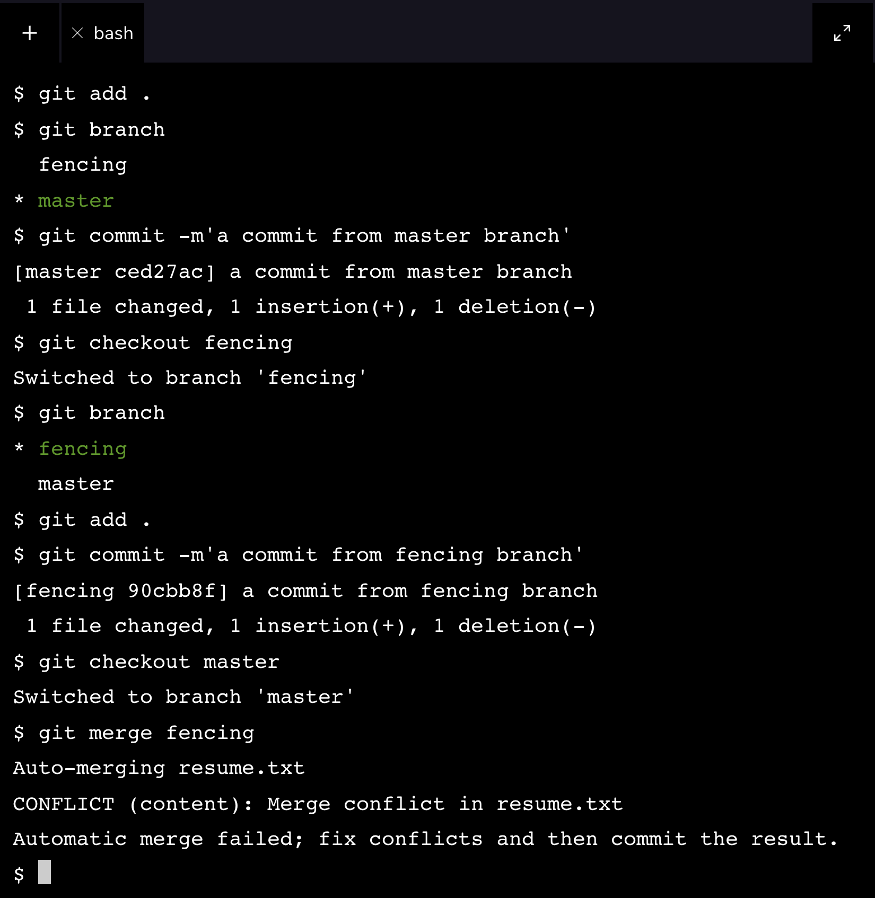
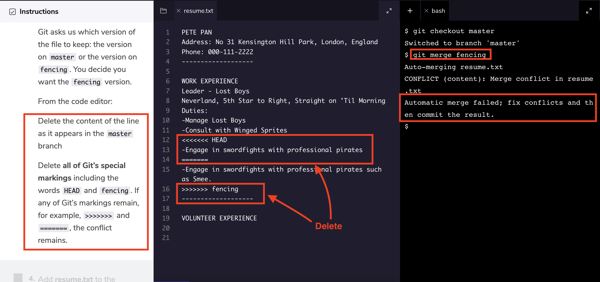

# Web development tools (Part 21)

- #### Click here: [BACK TO NAVIGASTION](https://github.com/DonghaoWu/WebDev-tools-demo/blob/master/README.md)

## `Section: Git commands.`

### `Summary`: In this documentation, we learn Git commands.

### `Check Dependencies & Tools:`

- 
------------------------------------------------------------

#### `本章背景: `
- 本章主要讲的是 Git 的常见使用命令，会分多个部分来讲述，分别是本地操作，版本操作，分支操作，还有合作模式，同时还会补充一些常见场景。

- 参考资料：[常见 git 命令](https://www.ruanyifeng.com/blog/2015/12/git-cheat-sheet.html)。
------------------------------------------------------------

### <span id="21.0">`Brief Contents & codes position`</span>

- #### Click here: [BACK TO NAVIGASTION](https://github.com/DonghaoWu/WebDev-tools-demo/blob/master/README.md)

- [21.1 本地常见操作命令.](#21.1)
- [21.2 版本追溯命令.](#21.2)
- [21.3 分支操作命令.](#21.3)
- [21.4 合作模式.](#21.4)
- [21.5 常见场景.](#21.5)
- [21.6 后续补充更新.](#21.6)

------------------------------------------------------------

### <span id="21.1">`Step1: 本地常见操作命令.`</span>

- #### Click here: [BACK TO CONTENT](#21.0)

1. 常见命令: 

- `git init`: 将本地文件夹 git 化，这样就可以在 terminal 上面操作 git command。（英）creates a new Git repository.

- `git statu`s: 查看目前文件夹下面有多少个文件修改了，有多少个文件上架了（stage），就是查看所有文件的 git 状态。（英）inspects the contents of the working directory and staging area.

- `git add`: 把对应的文件上架。（英）adds files from the working directory to the staging area.

- `git diff`: 查看目前文件跟已经上架的文件有哪些修改的地方。（英） shows the difference between the working directory and the staging area.

- `git commit`: 确认把上架的文件作为一整条修改记录保存。（英） permanently stores file changes from the staging area in the repository.

- `git log`: 显示所有之前的修改记录。（英） shows a list of all previous commits.

#### `Comment:`
```diff
+ git add .  ---> 把所有的文件上架。
```


### <span id="21.2">`Step2: 版本追溯命令.`</span>

- #### Click here: [BACK TO CONTENT](#21.0)

1. 常见命令: 

- `git show HEAD`: 显示最新一个 commit 记录的信息。（英）The output of this command will display everything the git log command displays for the HEAD commit, plus all the file changes that were committed.

- `git checkout HEAD filename`: 使你目前的文件返回到最新一个 commit 时的样子。（英）will restore the file in your working directory to look exactly as it did when you last made a commit. `It will discard changes to the working directory, restoring the files to the way they look in the HEAD commit.`

- `git reset HEAD filename`: 这个命令使已经上架的文件下架，但不会修改文件内容。This command resets the file in the staging area to be the same as the HEAD commit. It does not discard file changes from the working directory, it just removes them from the staging area.

- `git reset commit_SHA`: 使文件返回到指定的一个 commit 记录。（英）This command works by using the first 7 characters of the SHA of a previous commit. For example, if the SHA of the previous commit is 5d692065cf51a2f50ea8e7b19b5a7ae512f633ba, use:`git reset 5d69206`.


#### `Comment:`
1. `git checkout HEAD filename` 是会__改变__目前文件内容的，清除在目标文件上面的修改。
2. `git reset HEAD filename` __不会改变__目前的文件内容，只是把已经上架的文件下架。
3. 在这里要注意的是，reset 命令是会更改 git 的 HEAD 位置的，但不会修改目前文件内容。
4. :star::star::star:小场景：想要取消目前的修改并返回到某一 commit，且使所有内容返回到跟那个 commit 相同时，使用: 

```bash
$ git reset commit_SHA
$ git checkout HEAD filename
```

### <span id="21.3">`Step3: 分支操作命令.`</span>

- #### Click here: [BACK TO CONTENT](#21.0)

1. 常见命令: 

- `git branch`: 查看目前有哪些分支，还有目前所在分支。

- `git branch branch_name`: 生成指定名字的新分支。

- `git checkout branch_name`:转换当前分支到指定分支。

- `git merge branch_name`: 把当前的分支跟目标分支合并。例如：git merge skills 的作用就是把当前的分支跟目标分支 `skills` 合并。

- `git branch -d branch_name`: 删除指定分支。

- `git branch -D branch_name`: 强制删除指定分支。

------------------------------------------------------------

#### `Comment:`
1. :star::star::star:小场景：想要把目标分支例如 skills 跟 master 分支合并:
```bash
$ git chenckout master
$ git merge skills
``` 

2. Merge conflic: 这个是常见的场景，简单来说就是从分支 A 分离出来的 分支 B，当分支 B 进行修改之后想要返回合并分支 A 时，发现作为原始分支的 A 也对相同文件进行了修改，就会出现 Merge conflic，如下图：

<p align="center">

</p>

------------------------------------------------------------

- 处理方法参考下图：

<p align="center">

</p>

------------------------------------------------------------


### <span id="21.4">`Step4: 合作模式.`</span>

- #### Click here: [BACK TO CONTENT](#21.0)

1. 常见命令：

- `git clone`: 从目标复制一份到本地。（英）Creates a local copy of a remote.

- `git remote -v`: 查看原份文件地址。（英）Lists a Git project’s remotes.

- `git fetch`: 把原分文件的更新带到本地，但不更改本地文件，也不会执行合并命令，下载的更新储存在本地一个地方。（英）This command will not merge changes from the remote into your local repository. It brings those changes onto what’s called a remote branch. Learn more about how this works below.

- `git merge origin/master`: 把 `git fetch` 获得的更新资料合并到本地。（英）Merges origin/master into your local branch.

- `git push origin <branch_name>`: 把当前的本地分支上传到原分文件地址，这样在原分地址就可以看到一个新的分支。（英）Pushes a local branch to the origin remote.

#### `Comment:`
1. `git fetch`: 不会更改任何文件。
2. `git merge origin/master`: 有可能产生 Merge conflict。

### <span id="21.5">`Step5: 常见场景.`</span>

- #### Click here: [BACK TO CONTENT](#21.0)

1. A 和 B 一起在一个 project，A 负责一个分支 feature-A 负责一个分支 feature-B，A 和 B 都从 github 下载原始文件：

```bash
$ git clone <http...>
```

2. B 创建分支并转换到分支 feature-B，并开始对文件进行修改：

```bash
$ git branch feature-B
$ git checkout feature-B
```

3. A 发现 project 的一些原始设置需要修正并加入一些 dependency，同时也对一些原始文件进行修改，于是生成新分支 ‘change-config’

```bash
$ git branch change-config
$ git checkout change-config
```

4. A 修改完之后把分支上传到 github

```bash
$ git push origin change-config
```

5. 在 github 上申请 pull request 并通知 B 审核，B 和 A 商量审核过后没问题就 approve，把新分支合并到 master。这个步骤全部在 github 上面操作。__也就是说，现在更新了 master，一切都按现在的 master 为基准进行开发。__

6. A 删除分支 change-config

```bash
$ git checkout master
$ git branch -d change-config
```

7. B 现在需要下载最新的 master 跟本地 master 合并：

```bash
$ git checkout master
$ git fetch
$ git merge origin/master
```

8. 现在针对正在开发的 feature-B， B 有两个选择，一个是删除之前在建的分支 feature-B，重新以最新的本地 master 为基础创建新的 feature-B，这个做法是不可取的，因为很难全部记住之前旧 feature-B 上的修改，其次如果是一个多人经常修改的 github master，这会需要重复这个动作很多次。

- :star::star::star:所以我们会选择另外一个选项，`__用更新之后的 master 合并现有的 feature-B__`:

```bash
$ git checkout feature-B
$ git merge master
```

:key::key::key: 请注意，这是一个 merge 过程，有可能产生 merge conflict 的情况，当然也可能没有，主要取决于 B 在 feature-B 分支上有没有修改跟 A 在 change-config 分支上同一个文件。如果有 merge conflict，参考上面的 step3 情况处理。


#### `Comment:`
1. 这个属于多人协作 project 常见情况，每个人都在自己的 feature 上运作，但同时 master 在经常更新。‘
2. 出现 merge conflict 的时候如果出现差别，第一要进行沟通，然后取舍。而减少 merge conflict 的尝试有几种：
    - 第7点的错误方法，有效但很低效且容易遗漏出错。
    - 每个人尽量在自己划定的文件范围内修改，尽量少修改共有范围文件，或者共有范围文件的修改由特定人员负责，并进行协调和通知。
3. 其实 master 进场更新是常事，遇到 merge conflict 也是常事，这就是为什么程序员需要沟通协调的原因，处理 merge conflict 的取舍应该是一个必要技能。

------------------------------------------------------------

### <span id="21.6">`Step6: 后续补充更新.`</span>

- #### Click here: [BACK TO CONTENT](#21.0)

#### `Comment:`

------------------------------------------------------------

- #### Click here: [BACK TO CONTENT](#21.0)
- #### Click here: [BACK TO NAVIGASTION](https://github.com/DonghaoWu/WebDev-tools-demo/blob/master/README.md)