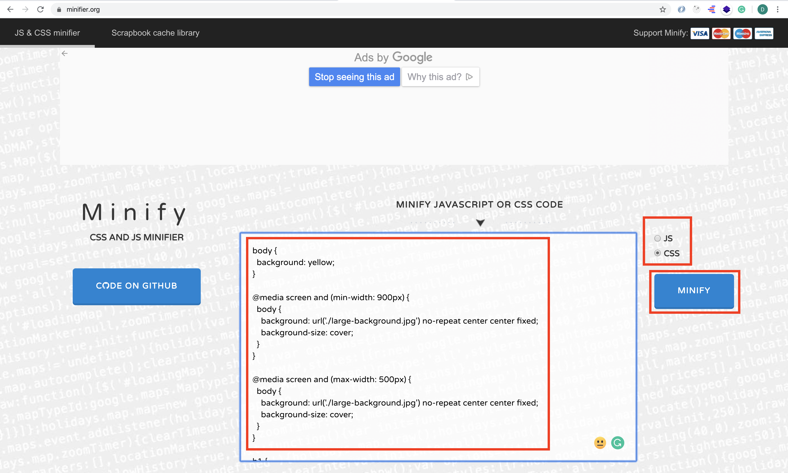
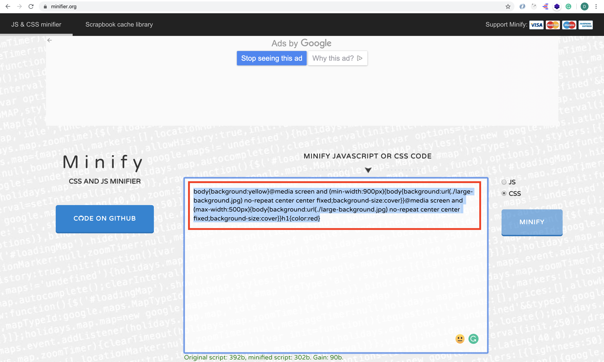
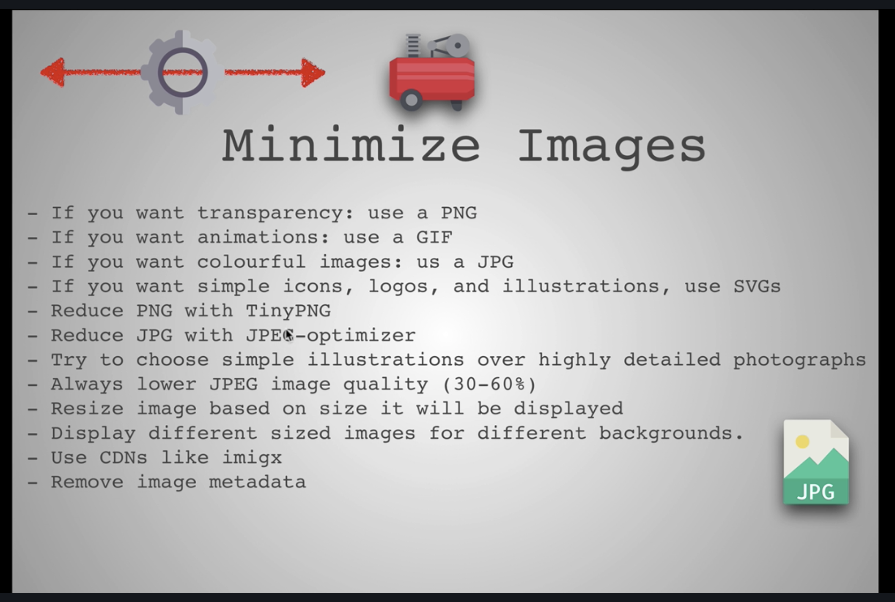
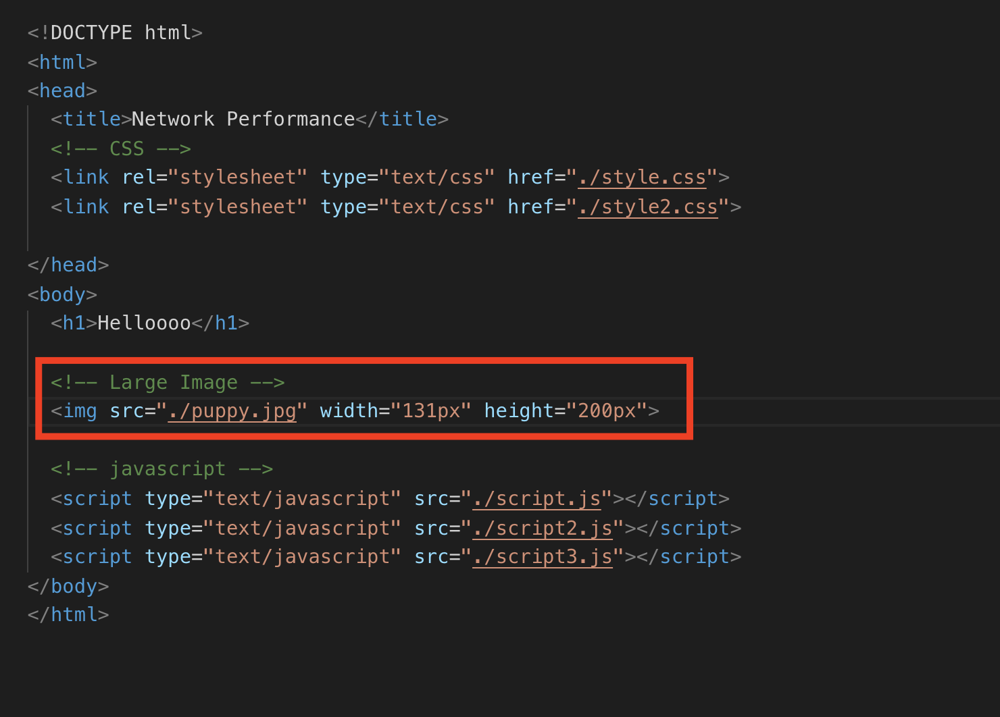
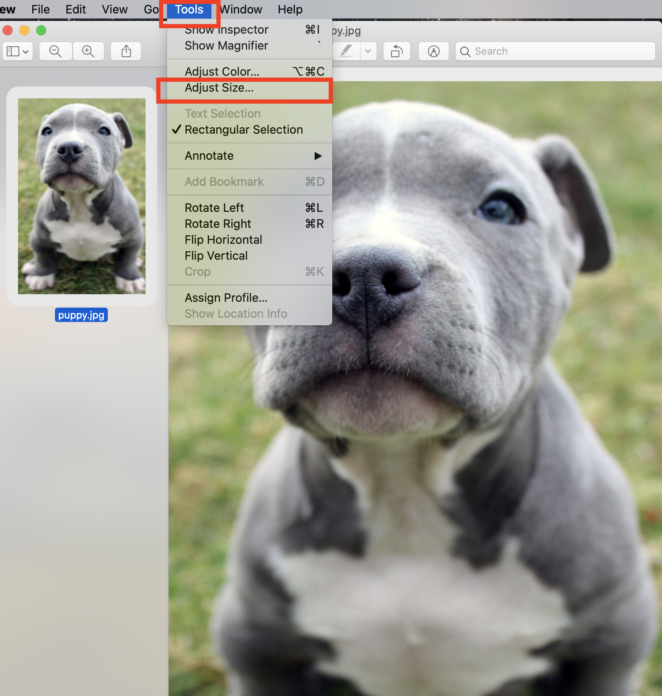
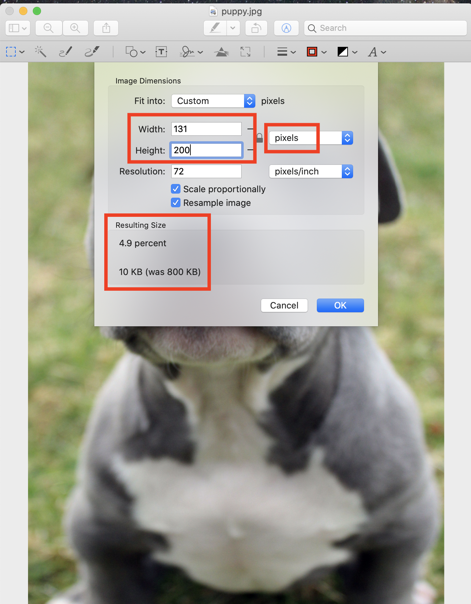
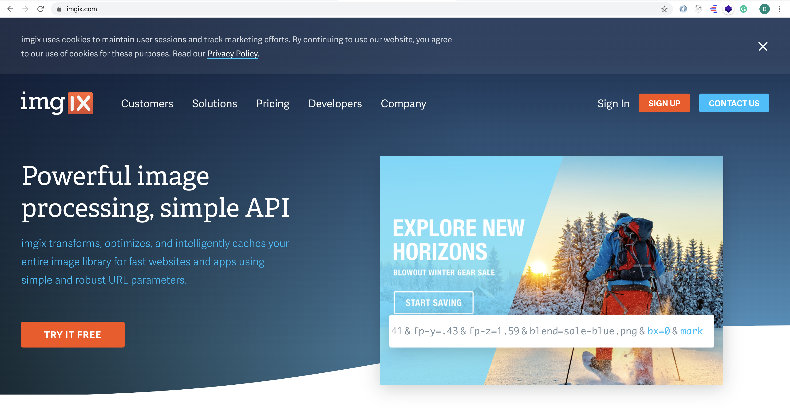

# Web development tools (Part 2)

## `Section: Performance`(Performance-Part1.1)

### `Summary`: In this documentation, we improve website performance in some simple ways.

### `Check Dependencies:`

- None

### `本章背景：`
- 本章是第一部分第一小节，第一小节目的在于优化代码和文件的大小达到缩减传输文件总量大小从而提升速度，第二小节的目的在于根据 `Rendering path` 改善传输中的文件优先级和先后顺序达到提升用户浏览加载体验。

- 本小节包括的内容有：代码压缩工具，不同图片的使用法则，使用 `media query` 根据浏览器/平板电脑/手机的大小而分配对应大小和像素的图片，还有合并文件和删除重复无效代码。


### `Brief Contents & codes position`
- 1.1 Minimize text.
- 1.2 Minimize images.
- 1.3 Media queries.
- 1.4 Less trips.
- 1.5 Content-delivery api.

### `Step1: Minimize text`

A. Tool: [Minify.js](https://www.minifier.org/)

<p align="center">

</p>

-------------------------------------------------------------

<p align="center">

</p>

#### `Comment:`
1. 

### `Step2: Minimize images.`

<p align="center">

</p>

-------------------------------------------------------------

__`Location: ./example1.1/index.html`__

<p align="center">

</p>

-------------------------------------------------------------
<p align="center">

</p>

-------------------------------------------------------------

<p align="center">

</p>

-------------------------------------------------------------

#### `Comment:`
1.  - JPG: photos,complex and useful colors
    - SVG: logo, 但可放大缩小而不影响清晰度
    - PNG: logo
    - Gif: 小动图

- free tools: 1. JPEG-optimizer website
            2. TinyPNG

- Always lower jpeg quality 30-60%


### `Step3. Media queries.`

__`Location: ./example1.1/style.css`__

```css
body {
  background: yellow;
}

@media screen and (min-width: 900px) {
  body {
    background: url('./large-background.jpg') no-repeat center center fixed;
    background-size: cover;
  }
}

@media screen and (max-width: 500px) {
  body {
    background: url('./large-background.jpg') no-repeat center center fixed;
    background-size: cover;
  }
}

h1 {
  color: red;
}
```

#### `Comment:`
1. 这样做的好处就是可以根据不同的客户端的大小：电脑/平板/手机，设定传输对应大小跟像素的图片，以达到提升速度却不影响体验的目的。

### `Step4. Less trips.`

__`Location: ./example1.1/index.html`__

```html
<!DOCTYPE html>
<html>
<head>
  <title>Network Performance</title>
  <!-- CSS -->
  <link rel="stylesheet" type="text/css" href="./style.css">

</head>
<body>
  <h1>Helloooo</h1>

  <!-- Large Image -->
  

  <!-- javascript -->
  <script type="text/javascript" src="./script.js"></script>
</body>
</html>
```

#### `Comment:`
1. Previous code:

```html
<!-- #1 Minimize all text -->
<!-- #2 Minimize images -->
<!-- #3 Media Queries -->
<!-- #4 Minimize # of files -->


<!DOCTYPE html>
<html>
<head>
  <title>Network Performance</title>
  <!-- CSS -->
  <link rel="stylesheet" type="text/css" href="./style.css">
  <link rel="stylesheet" type="text/css" href="./style2.css">

</head>
<body>
  <h1>Helloooo</h1>

  <!-- Large Image -->
  

  <!-- javascript -->
  <script type="text/javascript" src="./script.js"></script>
  <script type="text/javascript" src="./script2.js"></script>
  <script type="text/javascript" src="./script3.js"></script>
</body>
</html>
```

2. 取消了 style2.css, script2.js, script3.js 的连接，把 script2.js, script3.js 的内容合并到 script.js 中。

3. 效果对比：

- Before.

<p align="center">

</p>

-------------------------------------------------------------

- After.

<p align="center">

</p>

### `Step5. Content-delivery api.`

A. Tool: [imgix](https://www.imgix.com/)

<p align="center">

</p>

### `Step6 Concept questions.`

#### `A. `

- 


