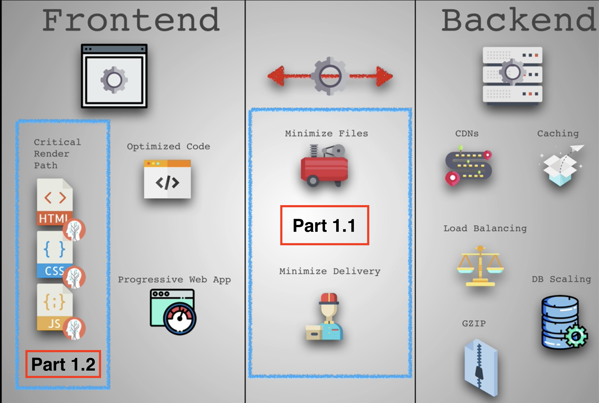
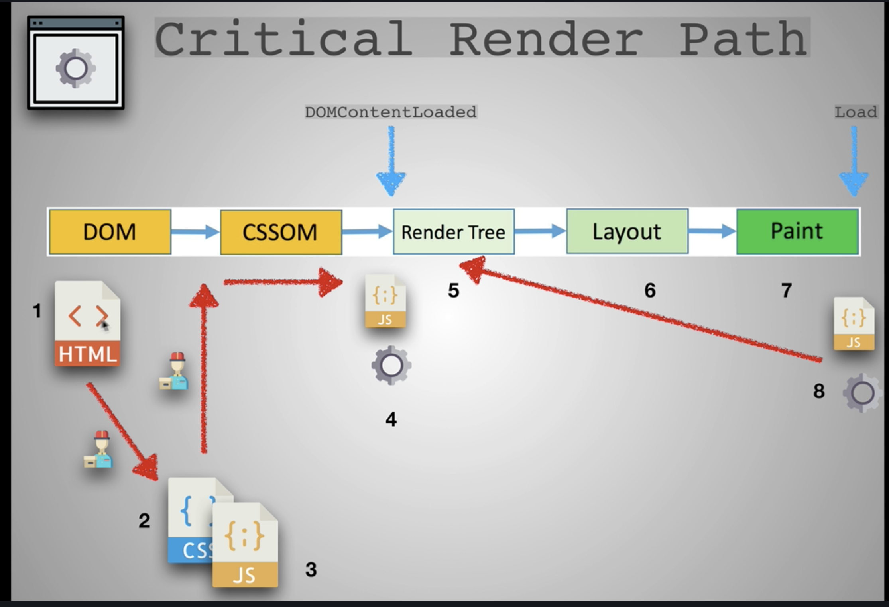
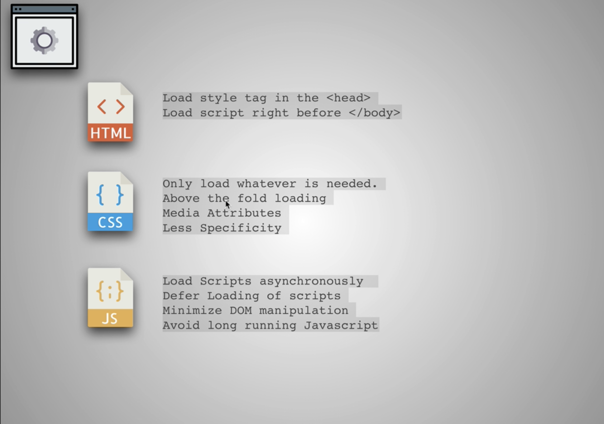

# Web development tools (Part 3)

## `Section: Performance`(Performance-Part1.2)

### `Summary`: In this documentation, we improve website performance by analycing the critical render path.

### `Check Dependencies:`

- None

------------------------------------------------------------

#### `本章背景：`
- 本章是第一部分第一小节，第一小节目的在于优化代码和文件的大小达到缩减传输文件总量大小从而提升速度，第二小节的目的在于根据 `Rendering path` 改善传输中的文件优先级和先后顺序达到提升用户浏览加载体验。

- 本小节包括的内容有：分析 `critical render path`，然后从 html file，css file，还有 js file 三大类文件的位置和代码进行优化。

<p align="center">

</p>

------------------------------------------------------------

### `Brief Contents & codes position`
- 3.1 Optimize html file.
- 3.2 Optimize css file.
- 3.3 Optimize js file.
- 3.4 Tools to check website performance.

<p align="center">

</p>

<p align="center">

</p>

------------------------------------------------------------

### `Step1: Optimize html file`

A. 正常相对静态的网页的优化规则是使用`普通型`或者`defer型`，如果使用`普通型`则把 js 文件放在最后，css 文件放在前面；如果使用`defer型`，则 js 文件的位置不需要讲究。

B. 当然这种情况只对于相对静态的网页而言，相对动态一点的需要马上执行 js 文件的话就可以考虑`普通型`或者`async型`。

__`Location: ./example1.2/index.html`__

```html
<!DOCTYPE html>
<html lang="en-us">
<head>
	<!--  App Title  -->
	<title>Keiko Corp</title>
	<!--  App Description  -->
	<meta charset="utf-8">
	<meta name="viewport" content="width=device-width, initial-scale=1.0, minimum-scale=1.0" />

  <link rel="stylesheet" type="text/css" href="css/bootstrap.css"/>
  <link rel="stylesheet" type="text/css" href="css/owl.transitions.css"/>
  <link rel="stylesheet" type="text/css" href="css/owl.carousel.css"/>
  <link rel="stylesheet" type="text/css" href="css/animate.css"/>
  <link rel="stylesheet" type="text/css" href="css/main.css"/>
  
</head>
<body>

	<!--  Header Section  -->
	<header>
		<div class="container">
			<div class="logo pull-left animated wow fadeInLeft">
				
			</div>


			<nav class="pull-left">
				<ul class="list-unstyled">
					<li class="animated wow fadeInLeft" data-wow-delay="0s"><a href="#about">About</a></li>
					<li class="animated wow fadeInLeft" data-wow-delay=".1s"><a href="#app_features">Features</a></li>
					<li class="animated wow fadeInLeft" data-wow-delay=".2s"><a href="#testimonials">Testimonials</a></li>
				</ul>
			</nav>

			<div class="social pull-right">
				<ul class="list-unstyled">
					<li class="animated wow fadeInRight" data-wow-delay=".2s"><a href="#"></a></li>
					<li class="animated wow fadeInRight" data-wow-delay=".1s"><a href="#"></a></li>
					<li class="animated wow fadeInRight" data-wow-delay="0s"><a href="#"></a></li>
				</ul>
			</div>

			<span class="burger_icon">menu</span>
		</div>
	</header>
	<!--  End Header Section  -->


	<!--  Hero Section  -->
	<section class="hero" id="hero">
		<div class="container">
			<div class="caption">
				<h1 class="text-uppercase  animated wow fadeInLeft">Creators of Robofriends and SmartBrain</h1>
				<p class="enhance text-lowercase  animated wow fadeInLeft">Developers of the future, building for today</p>

				<a href="https://github.com/aneagoie/robofriends" class="app_store_btn text-uppercase animated wow fadeInLeft">
					<i class="android_icon"></i>
					<span>Robofriends</span>
				</a>

				<a href="https://github.com/aneagoie/smart-brain" class="app_store_btn text-uppercase animated wow fadeInLeft">
					<i class="iphone_icon"></i>
					<span>SmartBrain</span>
				</a>
			</div>
		</div>
	</section>
	<!--  End Hero Section  -->


	<!--  Featured On Section  -->
	<section class="featured_on">
		<div class="container">
			<ul class="list-unstyled text-center clearfix">
				<li class="col-xs-6 col-sm-6 col-md-3 animated wow fadeInDown">
					
				</li>
				<li class="col-xs-6 col-sm-6 col-md-3 animated wow fadeInDown" data-wow-delay=".2s">
					
				</li>
				<li class="col-xs-6 col-sm-6 col-md-3 animated wow fadeInDown" data-wow-delay=".3s">
					
				</li>
				<li class="col-xs-6 col-sm-6 col-md-3 animated wow fadeInDown" data-wow-delay=".4s">
					
				</li>
			</ul>
		</div>
	</section>
	<!--  End Featured On Section  -->


	<!--  About Section  -->
	<section class="about" id="about">
		<div class="container">
			<div class="row">
				<div class="col-md-6 text-center animated wow fadeInLeft">
					<div class="iphone">
						
					</div>
				</div>
				<div class="col-md-6 animated wow fadeInRight">
					<div class="features_list">
						<h1 class="text-uppercase">The Greatest Products Ever Created</h1>
						<p>Seuismod ligula ipsum vulputate tellus quisque dictum tortor at purus faucibus tincidunt, pellentesque habitant morbi tristique senectus et netus et malesuada fames ac turpis egestas. </p>
						<ul class="list-unstyled">
							<li class="camera_icon">
								<span>Euismod ligula ipsum vulputate tellus.</span>
							</li>
							<li class="video_icon">
								<span>Morbi non efficitur nibh sit amet est eros.</span>
							</li>
							<li class="eye_icon">
								<span>Fusce faucibus ante liberonec luctus egestas.</span>
							</li>
							<li class="pic_icon">
								<span>Quisque pretium malesuada ornare.</span>
							</li>
							<li class="loc_icon">
								<span>Cras interdum vestibulum dolor.</span>
							</li>
						</ul>

						<a href="#" class="app_store_btn text-uppercase" id="play_video" data-video="https://www.youtube.com/watch?v=sCX_YMPuJGA?autoplay=1&showinfo=0">
							<i class="play_icon"></i>
							<span>About Video</span>
						</a>
						<a href="#hero" class="app_link">Get the app</a>
					</div>
				</div>
			</div>
		</div>

		<div class="about_video show_video">
			<a href="" class="close_video"></a>
		</div>
	</section>
	<!--  End About Section  -->


	<!--  App Features Section  -->
	<section class="app_features" id="app_features">
		<div class="container">

			<div class="row text-center">
				<div class="col-sm-4 col-md-4 details animated wow fadeInDown" data-wow-delay="0s">
					
					<h1 class="text-uppercase">malesuada fames turpis.</h1>
					<p class="text-lowercase">vel ultrices mauris libero id diam. Vivamus tellus sagittis facilisis nisi quis mollis risus quisque ultrices elit.</p>
				</div>
				<div class="col-sm-4 col-md-4 details animated wow fadeInDown" data-wow-delay=".1s">
					
					<h1 class="text-uppercase">malesuada fames turpis.</h1>
					<p class="text-lowercase">vel ultrices mauris libero id diam. Vivamus tellus sagittis facilisis nisi quis mollis risus quisque ultrices elit.</p>
				</div>
				<div class="col-sm-4 col-md-4 details animated wow fadeInDown" data-wow-delay=".2s">
					
					<h1 class="text-uppercase">malesuada fames turpis.</h1>
					<p class="text-lowercase">vel ultrices mauris libero id diam. Vivamus tellus sagittis facilisis nisi quis mollis risus quisque ultrices elit.</p>
				</div>
			</div>
			<div class="row text-center">
				<div class="col-sm-4 col-md-4 details animated wow fadeInDown" data-wow-delay="0s">
					
					<h1 class="text-uppercase">malesuada fames turpis.</h1>
					<p class="text-lowercase">vel ultrices mauris libero id diam. Vivamus tellus sagittis facilisis nisi quis mollis risus quisque ultrices elit.</p>
				</div>
				<div class="col-sm-4 col-md-4 details animated wow fadeInDown" data-wow-delay=".1s">
					
					<h1 class="text-uppercase">malesuada fames turpis.</h1>
					<p class="text-lowercase">vel ultrices mauris libero id diam. Vivamus tellus sagittis facilisis nisi quis mollis risus quisque ultrices elit.</p>
				</div>
				<div class="col-sm-4 col-md-4 details animated wow fadeInDown" data-wow-delay=".2s">
					
					<h1 class="text-uppercase">malesuada fames turpis.</h1>
					<p class="text-lowercase">vel ultrices mauris libero id diam. Vivamus tellus sagittis facilisis nisi quis mollis risus quisque ultrices elit.</p>
				</div>
			</div>

		</div>
	</section>
	<!--  And App Features Section  -->


	<!--  Testimonials Section  -->
	<section class="testimonials animated wow fadeIn" id="testimonials" data-wow-duration="2s">
		<div class="container">
			<div class="testimonials_list">

				<ul class="list-unstyled text-center slides clearfix" id="tslider">
					<li>
						<blockquote>
							<p>Integer pharetra tellus varius, dictum erat vel, maximus tellus. Sed vitae auctor ipsum. Aliquam luctus erat nec pulvinar vehicula donec congue tortor eget sem condimentum, ut tempor massa porttitor. Praesent tincidunt mi orci  in sollicitudin mi dapibus dapibus pellentesque habitant morbi tristique senectus et malesuada fames turpis egestas.</p>
							<span class="author text-uppercase">John Doe</span>
							<span class="job">Full Stack developer</span>

						</blockquote>
					</li>

					<li>
						<blockquote>
							<p>Integer pharetra tellus varius, dictum erat vel, maximus tellus. Sed vitae auctor ipsum. Aliquam luctus erat nec pulvinar vehicula donec congue tortor eget sem condimentum, ut tempor massa porttitor. Praesent tincidunt mi orci  in sollicitudin mi dapibus dapibus pellentesque habitant morbi tristique senectus et malesuada fames turpis egestas.</p>
							<span class="author text-uppercase">Alex Fredy</span>
							<span class="job">Javascript developer</span>

						</blockquote>
					</li>

					<li>
						<blockquote>
							<p>Integer pharetra tellus varius, dictum erat vel, maximus tellus. Sed vitae auctor ipsum. Aliquam luctus erat nec pulvinar vehicula donec congue tortor eget sem condimentum, ut tempor massa porttitor. Praesent tincidunt mi orci  in sollicitudin mi dapibus dapibus pellentesque habitant morbi tristique senectus et malesuada fames turpis egestas.</p>
							<span class="author text-uppercase">Sara Aliba</span>
							<span class="job">Web Designer</span>

						</blockquote>
					</li>
				</ul>
				<div id="slider_nav">
					<div id="prev_arrow"></div>
					<div id="next_arrow"></div>
				</div>
			</div>
		</div>
	</section>
	<!--  End Testimonials Section  -->


	<!--  Email Subscription Section  -->
	<section class="sub_box">
		<p class="cta_text animated wow fadeInDown">We're hiring. Join Our company!</p>
		<form action="#" metohd="post" class="animated wow fadeIn" data-wow-duration="2s" id="submit_form">
			<input type="email" id="mc-email" placeholder="Enter your email"/>
			<button type="submit" id="mc_submit">
				<i class="icon"></i>
			</button>
		</form>
		<div class="message" id="error_msg">Please Enter A Valid Email.</div>
		<div class="message" id="success_msg">Thank You For Your Subscription.</div>
	</section>
	<!--  End Email Subscription Section  -->


	<!--  Footer Section  -->
	<footer>
		<ul class="list-unstyled list-inline app_platform">
			<li class="animated wow fadeInDown" data-wow-delay="0s">
				<a href=""></a>
			</li>
			<li class="animated wow fadeInDown" data-wow-delay=".1s">
				<a href=""></a>
			</li>
			<li class="animated wow fadeInDown" data-wow-delay=".2s">
				<a href=""></a>
			</li>
		</ul>
		<p class="copyright animated wow fadeIn" data-wow-duration="2s"> <strong>Pixelhint</strong>
	</footer>
	<!--  End Footer Section  -->


  <script type="text/javascript" src="js/jquery.js"></script>
  <script type="text/javascript" src="js/ajaxchimp.js"></script>

  <script type="text/javascript" src="js/owl.carousel.min.js"></script>
  <script type="text/javascript" src="js/wow.js"></script>
  <script type="text/javascript" src="js/parallax.js"></script>
  <script type="text/javascript" src="js/nicescroll.js"></script>
  <script type="text/javascript" src="js/main.js"></script>
  <script type="text/javascript" src="js/scrollTo.js"></script>
  
</body>
</html>
```

#### `Comment:`
1. Load style tag in the <head>.
2. Load script right before </body>.

### `Step2: Optimize css file.`

1. Above the fold loading. (把次要的 css 文件放在后台下载执行)。
__`Location: ./example1.2/index.html`__

```html
<body>
  <!-- ... -->

	<script type="text/javascript">
		const loadStyleSheet = src => {
			if (document.createStyleSheet) {
				document.createStyleSheet(src);
			} else {
				const stylesheet = document.createElement('link');
				stylesheet.href = src;
				stylesheet.type = 'text/css';
				stylesheet.rel = 'stylesheet';
				document.getElementsByTagName('head')[0].appendChild(stylesheet);
			}
		}
		window.onload = function () {
			console.log('window done');
			loadStyleSheet('./css/styleTest.css');
		}
  </script>
  
</body>
```

2. Media Attributes. (加载的 css 文件根据浏览器大小进行针对下载)。

```html
<head>
  <link rel="stylesheet" href="./css/styleTest2.css" media="only screen and (min-width:500px)">
<head>
```

#### `Comment:`
1. Only load whatever is needed, check each css file. (减少加载无用的语句和文件)
2. Above the fold loading.（重要的首要页面先加载，次要的指定后台加载。）
3. Media Attributes.
4. Less Specificity. （尽量缩减 css 选择器的层数，同时如果 css 内容不多可以考虑使用 `html internal css 或者 inline css`）。

----------------------------------------------------------------------------

<p align="center">

</p>

----------------------------------------------------------------------------


### `Step3: Optimize js file.`

#### `Comment:`
1. 

### `Step4: Tools to check website performance.`

#### `Comment:`
1.

### `Step5. .`


### `Step6 Concept questions.`

#### `A. What is critical render path?`

- Check this post. [Understanding the critical rendering path, rendering pages in 1 second](https://medium.com/@luisvieira_gmr/understanding-the-critical-rendering-path-rendering-pages-in-1-second-735c6e45b47a)

- Build DOM tree from html file
  - When this process is finished the browser will have the full content of the page, but to be able to render the browser has to wait for the CSS Object Model, also known as CSSOM event, which will tell the browser how the elements should look like when rendered.

- Build CSSOM from css file
  - CSS is one of the most important elements of the critical rendering path, because the browser blocks page rendering until it receives and processes all the css files in your page, CSS is render blocking.

- The Render Tree
  - This stage is where the browser `combines the DOM and CSSOM`, this process outputs a final render tree, which contains both the content and the style information of all the visible content on the screen.

- Layout
  - This stage is where the browser calculates the size and position of each visible element on the page, every time an update to the render tree is made, or the size of the viewport changes, the browser has to run layout again.

- Paint
  - When we get to the paint stage, the browser has to pick up the layout result, and paint the pixels to the screen, beware in this stage that not all styles have the same paint times, also combinations of styles can have a greater paint time than the sum of their parts. For an instance mixing a border-radius with a box-shadow, can triple the paint time of an element instead of using just one of the latter.

------------------------------------------------------------

#### `B. How does the browser rendering engine work?`

In order to render content the browser has to go through a series of steps:
1. Document Object Model(DOM)
2. CSS object model(CSSOM)
3. Render Tree
4. Layout
5. Paint.

------------------------------------------------------------

#### `C. Dealing with Javascript.`

- Javascript is a powerful tool that can manipulate both the DOM and CSSOM, so to execute Javascript, the browser has to wait for the DOM, then it has to download and parse all the CSS files, get to the CSSOM event and only then finally execute Javascript.

- When the parser finds a script tag it blocks DOM construction, then waits for the browser to get the file and for the javascript engine to parse the script, this is why Javascript is parser blocking.

------------------------------------------------------------

#### `D. 个人理解`
  1. 浏览器的运作是这样的，收到 html 文件之后，就从上往下读取代码，这个过程叫做 parsing ，目的是为了建立 DOM。
  2. 在 parsing 过程中，如果遇到了 css 文件，parsing 会被打断，DOM 的建立也会停止。这时会进行下载和读取对应 css 文件的代码，目的是为了建立 CSSOM。
  3. 由上可见，html parsing 跟 css 的读取是共用一个线程的，所以也会有人把它们放在一起讨论。
  4. 关于 js 文件的下载，就相对不一样。首先相同的是 js 文件跟 css 文件一样，会打断所有关于 DOM 和 CSSOM 的过程，而且 js 因为是动态互动属性，所以现在会把它的下载和执行过程分多种情况讨论，下面讨论一些常见情况：

    - 如果网页是静态为主，那么应该把 js 文件放在最后，等对应的 DOM 和 CSSOM 建立完成后再下载并执行 js 文件。

    - 对于上一种情况，也可以考虑使用`defer`型，`defer`型可以开出一条或多条新进程同步下载 js 文件而不打断整体进程，当下载完毕时不马上执行，在其他同步脚本执行后，DOMContentLoaded 事件前依次执行。`具有顺序性。`

    - 如果相关的 js 文件是需要马上对已建立的 DOM 进行改动的，可以使用普通型或者 `async`型，`async`型可以开出一条或多条新进程同步下载 js 文件而不打断整体进程，当下载完毕时马上执行，这时会打断原有的整体进程。但需要注意的是如果有多个`async`连续进行的话，执行时的顺序是无法分先后的，甚至是随机的。`不具有顺序性。`

    - 如果相关的 js 文件是不需要马上对已建立的 DOM 进行改动的，可以考虑使用`defer`型。

  5. 综上所述，js 文件里面的3种类型，主要是看当前页面加载的需要，有些是偏向先加载头部的就先执行 js 文件，如果页面不复杂的话可以最后加载 js 文件，而`async`和`defer`型都可以实现异步并行下载，但最大的区别是`async`马上执行且多个无确定顺序，`defer`最后执行且多个可确定顺序。3种类型都是根据实际需要无分好坏，在实际情况中 js 文件对 DOM 的操作可以是多次且有可能是马上的，还有先后的，所以根据实际情况结合3种类型一同出现也不奇怪。

  6. 为了帮助理解可以看下面的流程图对比：

  - 普通型：马上打断主进程进行下载并执行 js 文件
  - async 型：不打断主进行下载 js 文件，完成下载后打断主进程，执行 js 文件，如果是多个文件执行则是异步执行，不保证顺序。
  - defer 型：不打断主进程进行下载 js 文件，完成下载后执行，主进程完成后按顺序执行。

<p align="center">

</p>


