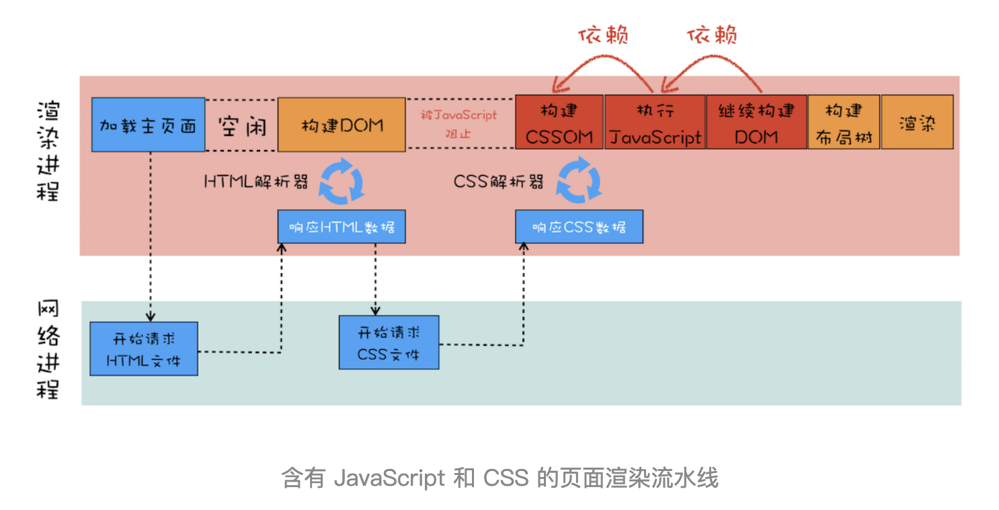

# Web development tools (Part 3)

- #### Click here: [BACK TO NAVIGASTION](https://github.com/DonghaoWu/WebDev-tools-demo/blob/master/README.md)

## `Section: Performance`(Performance-Part1.2)

### `Key Word: Critical render path, css and script position, browser behaviors`

### `Summary`: In this documentation, we improve website performance by analycing the critical render path.

### `Check Dependencies & Tools:`

- None

------------------------------------------------------------

#### `本章背景：`
- 参考资料：[谷歌文档（原始文档，有基础但细节不够）-- 基础](https://developers.google.com/web/fundamentals/performance/critical-rendering-path/adding-interactivity-with-javascript)

- 参考资料：[HTML5 parser（英文文档，对原理较深入） -- 进阶](https://www.html5rocks.com/en/tutorials/internals/howbrowserswork/#The_main_flow)

- 参考资料：[掘金网站（比较易懂，但关键流程不清晰） -- 进阶](https://juejin.im/post/5c1dde33f265da61776bf49a)

- 参考资料：[Github 博客（对渲染流水线有详细讲述） -- 必看推荐](https://blog.poetries.top/browser-working-principle/guide/)

- 本章分两部分，主要针对文件传输的中间环节，分别是：
    1. 优化代码并减少传输文件数量和文件大小 
    2. 调整文件传输中的优先级提升用户体验：`The Critical Rendering path` :white_check_mark:

<p align="center">

</p>

------------------------------------------------------------

### <span id="3.0">`Brief Contents & codes position`</span>

- #### Click here: [BACK TO NAVIGASTION](https://github.com/DonghaoWu/WebDev-tools-demo/blob/master/README.md)

- [3.1 Optimize file position in HTML file..](#3.1)
- [3.2 Optimize css file.](#3.2)
- [3.3 Optimize js file.](#3.3)
- [3.4 Tools to check website performance.](#3.4)

<p align="center">

</p>

<p align="center">

</p>

------------------------------------------------------------

### <span id="3.1">`Step1: Optimize file position in HTML file.`</span>

- #### Click here: [BACK TO CONTENT](#3.0)

  1. 正常相对静态的网页的优化规则是使用`普通型`或者`defer型`，如果使用`普通型`则把 js 文件放在最后，css 文件放在前面；如果使用`defer型`，则 js 文件的位置不需要讲究。

  2. 当然这种情况只对于相对静态的网页而言，相对动态一点的需要马上执行 js 文件的话就可以考虑`普通型`或者`async型`。

    __`Location: ./demo-apps/transimission-performance2/index.html`__

  ```html
  <!DOCTYPE html>
  <html lang="en-us">
    <head>
      <!--  App Title  -->
      <title>Keiko Corp</title>
      <!--  App Description  -->
      <meta charset="utf-8">
      <meta name="viewport" content="width=device-width, initial-scale=1.0, minimum-scale=1.0" />

      <link rel="stylesheet" type="text/css" href="css/bootstrap.css"/>
      <link rel="stylesheet" type="text/css" href="css/owl.transitions.css"/>
      <link rel="stylesheet" type="text/css" href="css/owl.carousel.css"/>
      <link rel="stylesheet" type="text/css" href="css/animate.css"/>
      <link rel="stylesheet" type="text/css" href="css/main.css"/>
      
    </head>
    <body>

      <!--  Header Section  -->
      <header>
        <div class="container">
          <div class="logo pull-left animated wow fadeInLeft">
            
          </div>


          <nav class="pull-left">
            <ul class="list-unstyled">
              <li class="animated wow fadeInLeft" data-wow-delay="0s"><a href="#about">About</a></li>
              <li class="animated wow fadeInLeft" data-wow-delay=".1s"><a href="#app_features">Features</a></li>
              <li class="animated wow fadeInLeft" data-wow-delay=".2s"><a href="#testimonials">Testimonials</a></li>
            </ul>
          </nav>

          <div class="social pull-right">
            <ul class="list-unstyled">
              <li class="animated wow fadeInRight" data-wow-delay=".2s"><a href="#"></a></li>
              <li class="animated wow fadeInRight" data-wow-delay=".1s"><a href="#"></a></li>
              <li class="animated wow fadeInRight" data-wow-delay="0s"><a href="#"></a></li>
            </ul>
          </div>

          <span class="burger_icon">menu</span>
        </div>
      </header>
      <!--  End Header Section  -->


      <!--  Hero Section  -->
      <section class="hero" id="hero">
        <div class="container">
          <div class="caption">
            <h1 class="text-uppercase  animated wow fadeInLeft">Creators of Robofriends and SmartBrain</h1>
            <p class="enhance text-lowercase  animated wow fadeInLeft">Developers of the future, building for today</p>

            <a href="https://github.com/aneagoie/robofriends" class="app_store_btn text-uppercase animated wow fadeInLeft">
              <i class="android_icon"></i>
              <span>Robofriends</span>
            </a>

            <a href="https://github.com/aneagoie/smart-brain" class="app_store_btn text-uppercase animated wow fadeInLeft">
              <i class="iphone_icon"></i>
              <span>SmartBrain</span>
            </a>
          </div>
        </div>
      </section>
      <!--  End Hero Section  -->


      <!--  Featured On Section  -->
      <section class="featured_on">
        <div class="container">
          <ul class="list-unstyled text-center clearfix">
            <li class="col-xs-6 col-sm-6 col-md-3 animated wow fadeInDown">
              
            </li>
            <li class="col-xs-6 col-sm-6 col-md-3 animated wow fadeInDown" data-wow-delay=".2s">
              
            </li>
            <li class="col-xs-6 col-sm-6 col-md-3 animated wow fadeInDown" data-wow-delay=".3s">
              
            </li>
            <li class="col-xs-6 col-sm-6 col-md-3 animated wow fadeInDown" data-wow-delay=".4s">
              
            </li>
          </ul>
        </div>
      </section>
      <!--  End Featured On Section  -->


      <!--  About Section  -->
      <section class="about" id="about">
        <div class="container">
          <div class="row">
            <div class="col-md-6 text-center animated wow fadeInLeft">
              <div class="iphone">
                
              </div>
            </div>
            <div class="col-md-6 animated wow fadeInRight">
              <div class="features_list">
                <h1 class="text-uppercase">The Greatest Products Ever Created</h1>
                <p>Seuismod ligula ipsum vulputate tellus quisque dictum tortor at purus faucibus tincidunt, pellentesque habitant morbi tristique senectus et netus et malesuada fames ac turpis egestas. </p>
                <ul class="list-unstyled">
                  <li class="camera_icon">
                    <span>Euismod ligula ipsum vulputate tellus.</span>
                  </li>
                  <li class="video_icon">
                    <span>Morbi non efficitur nibh sit amet est eros.</span>
                  </li>
                  <li class="eye_icon">
                    <span>Fusce faucibus ante liberonec luctus egestas.</span>
                  </li>
                  <li class="pic_icon">
                    <span>Quisque pretium malesuada ornare.</span>
                  </li>
                  <li class="loc_icon">
                    <span>Cras interdum vestibulum dolor.</span>
                  </li>
                </ul>

                <a href="#" class="app_store_btn text-uppercase" id="play_video" data-video="https://www.youtube.com/watch?v=sCX_YMPuJGA?autoplay=1&showinfo=0">
                  <i class="play_icon"></i>
                  <span>About Video</span>
                </a>
                <a href="#hero" class="app_link">Get the app</a>
              </div>
            </div>
          </div>
        </div>

        <div class="about_video show_video">
          <a href="" class="close_video"></a>
        </div>
      </section>
      <!--  End About Section  -->


      <!--  App Features Section  -->
      <section class="app_features" id="app_features">
        <div class="container">

          <div class="row text-center">
            <div class="col-sm-4 col-md-4 details animated wow fadeInDown" data-wow-delay="0s">
              
              <h1 class="text-uppercase">malesuada fames turpis.</h1>
              <p class="text-lowercase">vel ultrices mauris libero id diam. Vivamus tellus sagittis facilisis nisi quis mollis risus quisque ultrices elit.</p>
            </div>
            <div class="col-sm-4 col-md-4 details animated wow fadeInDown" data-wow-delay=".1s">
              
              <h1 class="text-uppercase">malesuada fames turpis.</h1>
              <p class="text-lowercase">vel ultrices mauris libero id diam. Vivamus tellus sagittis facilisis nisi quis mollis risus quisque ultrices elit.</p>
            </div>
            <div class="col-sm-4 col-md-4 details animated wow fadeInDown" data-wow-delay=".2s">
              
              <h1 class="text-uppercase">malesuada fames turpis.</h1>
              <p class="text-lowercase">vel ultrices mauris libero id diam. Vivamus tellus sagittis facilisis nisi quis mollis risus quisque ultrices elit.</p>
            </div>
          </div>
          <div class="row text-center">
            <div class="col-sm-4 col-md-4 details animated wow fadeInDown" data-wow-delay="0s">
              
              <h1 class="text-uppercase">malesuada fames turpis.</h1>
              <p class="text-lowercase">vel ultrices mauris libero id diam. Vivamus tellus sagittis facilisis nisi quis mollis risus quisque ultrices elit.</p>
            </div>
            <div class="col-sm-4 col-md-4 details animated wow fadeInDown" data-wow-delay=".1s">
              
              <h1 class="text-uppercase">malesuada fames turpis.</h1>
              <p class="text-lowercase">vel ultrices mauris libero id diam. Vivamus tellus sagittis facilisis nisi quis mollis risus quisque ultrices elit.</p>
            </div>
            <div class="col-sm-4 col-md-4 details animated wow fadeInDown" data-wow-delay=".2s">
              
              <h1 class="text-uppercase">malesuada fames turpis.</h1>
              <p class="text-lowercase">vel ultrices mauris libero id diam. Vivamus tellus sagittis facilisis nisi quis mollis risus quisque ultrices elit.</p>
            </div>
          </div>

        </div>
      </section>
      <!--  And App Features Section  -->


      <!--  Testimonials Section  -->
      <section class="testimonials animated wow fadeIn" id="testimonials" data-wow-duration="2s">
        <div class="container">
          <div class="testimonials_list">

            <ul class="list-unstyled text-center slides clearfix" id="tslider">
              <li>
                <blockquote>
                  <p>Integer pharetra tellus varius, dictum erat vel, maximus tellus. Sed vitae auctor ipsum. Aliquam luctus erat nec pulvinar vehicula donec congue tortor eget sem condimentum, ut tempor massa porttitor. Praesent tincidunt mi orci  in sollicitudin mi dapibus dapibus pellentesque habitant morbi tristique senectus et malesuada fames turpis egestas.</p>
                  <span class="author text-uppercase">John Doe</span>
                  <span class="job">Full Stack developer</span>

                </blockquote>
              </li>

              <li>
                <blockquote>
                  <p>Integer pharetra tellus varius, dictum erat vel, maximus tellus. Sed vitae auctor ipsum. Aliquam luctus erat nec pulvinar vehicula donec congue tortor eget sem condimentum, ut tempor massa porttitor. Praesent tincidunt mi orci  in sollicitudin mi dapibus dapibus pellentesque habitant morbi tristique senectus et malesuada fames turpis egestas.</p>
                  <span class="author text-uppercase">Alex Fredy</span>
                  <span class="job">Javascript developer</span>

                </blockquote>
              </li>

              <li>
                <blockquote>
                  <p>Integer pharetra tellus varius, dictum erat vel, maximus tellus. Sed vitae auctor ipsum. Aliquam luctus erat nec pulvinar vehicula donec congue tortor eget sem condimentum, ut tempor massa porttitor. Praesent tincidunt mi orci  in sollicitudin mi dapibus dapibus pellentesque habitant morbi tristique senectus et malesuada fames turpis egestas.</p>
                  <span class="author text-uppercase">Sara Aliba</span>
                  <span class="job">Web Designer</span>

                </blockquote>
              </li>
            </ul>
            <div id="slider_nav">
              <div id="prev_arrow"></div>
              <div id="next_arrow"></div>
            </div>
          </div>
        </div>
      </section>
      <!--  End Testimonials Section  -->


      <!--  Email Subscription Section  -->
      <section class="sub_box">
        <p class="cta_text animated wow fadeInDown">We're hiring. Join Our company!</p>
        <form action="#" metohd="post" class="animated wow fadeIn" data-wow-duration="2s" id="submit_form">
          <input type="email" id="mc-email" placeholder="Enter your email"/>
          <button type="submit" id="mc_submit">
            <i class="icon"></i>
          </button>
        </form>
        <div class="message" id="error_msg">Please Enter A Valid Email.</div>
        <div class="message" id="success_msg">Thank You For Your Subscription.</div>
      </section>
      <!--  End Email Subscription Section  -->


      <!--  Footer Section  -->
      <footer>
        <ul class="list-unstyled list-inline app_platform">
          <li class="animated wow fadeInDown" data-wow-delay="0s">
            <a href=""></a>
          </li>
          <li class="animated wow fadeInDown" data-wow-delay=".1s">
            <a href=""></a>
          </li>
          <li class="animated wow fadeInDown" data-wow-delay=".2s">
            <a href=""></a>
          </li>
        </ul>
        <p class="copyright animated wow fadeIn" data-wow-duration="2s"> <strong>Pixelhint</strong>
      </footer>
      <!--  End Footer Section  -->


      <script type="text/javascript" src="js/jquery.js"></script>
      <script type="text/javascript" src="js/ajaxchimp.js"></script>

      <script type="text/javascript" src="js/owl.carousel.min.js"></script>
      <script type="text/javascript" src="js/wow.js"></script>
      <script type="text/javascript" src="js/parallax.js"></script>
      <script type="text/javascript" src="js/nicescroll.js"></script>
      <script type="text/javascript" src="js/main.js"></script>
      <script type="text/javascript" src="js/scrollTo.js"></script>

    </body>
  </html>
  ```

#### `Comment:`
1. Load style tag in the `<head>`.
2. Load script right before `</body>`.

### <span id="3.2">`Step2: Optimize css file.`</span>

- #### Click here: [BACK TO CONTENT](#3.0)

  1. Above the fold loading. (把次要的 css 文件放在后台下载执行)。

    __`Location: ./demo-apps/transimission-performance2/index.html`__

  ```html
  <body>
    <!-- ... -->

    <script type="text/javascript">
      const loadStyleSheet = src => {
        if (document.createStyleSheet) {
          document.createStyleSheet(src);
        } else {
          const stylesheet = document.createElement('link');
          stylesheet.href = src;
          stylesheet.type = 'text/css';
          stylesheet.rel = 'stylesheet';
          document.getElementsByTagName('head')[0].appendChild(stylesheet);
        }
      }
      window.onload = function () {
        console.log('window done');
        loadStyleSheet('./css/styleTest.css');
      }
    </script>
    
  </body>
  ```

  2. Media Attributes. ( css 文件根据浏览器类型大小进行针对下载)。

  ```html
  <head>
    <link rel="stylesheet" href="./css/styleTest2.css" media="only screen and (min-width:500px)">
  <head>
  ```

#### `Comment:`
1. Only load whatever is needed, check each css file. (减少加载无效的语句和文件)
2. Above the fold loading.（重要的首要页面先加载，次要的指定后台加载。）
3. Media Attributes. ( css 文件根据浏览器类型大小进行针对下载)
4. Less Specificity. （尽量缩减 css 选择器的层级，同时如果 css 内容不多可以考虑使用 `html internal css 或者 inline css`）。

----------------------------------------------------------------------------

<p align="center">

</p>

----------------------------------------------------------------------------


### <span id="3.3">`Step3: Optimize js file.`</span>

- #### Click here: [BACK TO CONTENT](#3.0)

  ```html
  <script></script>

  <script async></script>

  <script defer></script>
  ```

#### `Comment:`
1. Load Scripts asynchronously. 具体使用规则参考 [STEP5](#3.5)。
2. Defer Loading of Scripts.
3. Minimize DOM manipulation.
4. Avoid long running JavaScript. (举例，有些 JS 按钮弹窗功能会阻止整个加载过程。)

### <span id="3.4">`Step4: Tools to check website performance.`</span>

- #### Click here: [BACK TO CONTENT](#3.0)

  - PageSpeed Insights
    [https://developers.google.com/speed/pagespeed/insights/](https://developers.google.com/speed/pagespeed/insights/)

  - WebPagetest
    [https://www.webpagetest.org/](https://www.webpagetest.org/)

#### `Comment:`
1.


### <span id="3.5">`Step5 Concept questions.`</span>

- #### Click here: [BACK TO CONTENT](#3.0)

#### `A. What is critical render path?`

- Check this post. [Understanding the critical rendering path, rendering pages in 1 second](https://medium.com/@luisvieira_gmr/understanding-the-critical-rendering-path-rendering-pages-in-1-second-735c6e45b47a)

- Build DOM tree from html file
  - When this process is finished the browser will have the full content of the page, but to be able to render the browser has to wait for the CSS Object Model, also known as CSSOM event, which will tell the browser how the elements should look like when rendered.

- Build CSSOM from css file
  - CSS is one of the most important elements of the critical rendering path, because the browser blocks page rendering until it receives and processes all the css files in your page, CSS is render blocking.

- The Render Tree
  - This stage is where the browser `combines the DOM and CSSOM`, this process outputs a final render tree, which contains both the content and the style information of all the visible content on the screen.

- Layout
  - This stage is where the browser calculates the size and position of each visible element on the page, every time an update to the render tree is made, or the size of the viewport changes, the browser has to run layout again.

- Paint
  - When we get to the paint stage, the browser has to pick up the layout result, and paint the pixels to the screen, beware in this stage that not all styles have the same paint times, also combinations of styles can have a greater paint time than the sum of their parts. For an instance mixing a border-radius with a box-shadow, can triple the paint time of an element instead of using just one of the latter.

------------------------------------------------------------

#### `B. How does the browser rendering engine work?`

In order to render content the browser has to go through a series of steps: (`The Critical Rendering path`)
1. Document Object Model(DOM)
2. CSS object model(CSSOM)
3. Render Tree
4. Layout
5. Paint.

------------------------------------------------------------

#### `C. Dealing with Javascript.`

- JavaScript can query and modify the DOM and the CSSOM.
- JavaScript execution blocks on the CSSOM.
- JavaScript blocks DOM construction unless explicitly declared as async.

- When the HTML parser encounters a script tag, it pauses its process of constructing the DOM and yields control to the JavaScript engine; after the JavaScript engine finishes downloading and running, the browser then picks up where it left off and resumes DOM construction.

- In other words, our script block can't find any elements later in the page because they haven't been processed yet! Or, put slightly differently: executing our inline script blocks DOM construction, which also delays the initial render.

- What if the browser hasn't finished downloading and building the CSSOM when we want to run our script? The answer is simple and not very good for performance: the browser delays script execution and DOM construction until it has finished downloading and constructing the CSSOM.

- The location of the script in the document is significant.

- When the browser encounters a script tag, DOM construction pauses until the script finishes executing.

- JavaScript can query and modify the DOM and the CSSOM.
- JavaScript execution pauses until the CSSOM is ready.

- Javascript is a powerful tool that can manipulate both the DOM and CSSOM, so to execute Javascript, the browser has to wait for downloading and parse all the CSS files, get to the CSSOM event and only then finally execute Javascript.

- When the parser finds a script tag it blocks DOM construction, then waits for the browser to get the file and for the javascript engine to parse the script, and the timing when script executes depends on whether the CSSOM is ready,this is why Javascript is parser blocking. __（这里讲的是 普通型。）__

------------------------------------------------------------

#### `D. 个人理解`：
1. 浏览器是这样运作的：收到 HTML 文件之后，先扫描需要什么文件就发出相关的文件请求下载。然后就开始从上往下读取语句，其中请求文件和读取 html 语句的过程是并行的，所以也就有可能出现读到语句了还没有文件的情况。注意这个过程会有两个 parser，第一个是 HTML parser，通过读取除 <script> <link> <style> 之外的元素构建 DOM tree，另外一个 parser 是 CSS parser。

2. 当读到 `<link>` 或者 `<style>`的时候就标志 CSSOM 的建立开头（下载的 CSS 文件的过程可能在读到这一行之前完成，也可能在读到这一行之后完成），一旦文件准备完成，CSS parser 就开始运作并无阻塞地完成 CSSOM 建立。

3. 这是一个 render blocking 的过程，但必须区分开来的是，HTML parser 是没有停下来的，它会继续向下读取并构建 DOM tree 或者遇到 `<script>`。`建立 DOM 的过程和建立 CSSOM 的过程互相独立并行，互不阻塞，当两者准备好之后才会进入下一步 -> Render tree`

4. 当读到 `<script>` 的时候，HTML parser 会马上停下来，也就是说 DOM tree 的构建会停下来，等待 CSS  文件的下载还有 CSS parser 完成 CSSOM。
  - 这时 script 的执行等待 CSSOM 完成后再执行，因为 JS 被延后，HTML parser 也会跟着延后。

  - 基于以上原因，`<script>`一般放在 `</body>`之前，等大部分语句 HTML parsing 之后再执行 `<script>`，防止`<script>`放得太前导致要等 CSSOM 而延误了后面 DOM 的建立。这样做是优先 DOM 和 CSSOM 的并发建立，最后等 DOM 建立大部分，之后执行 `<script>` ，这是一种常规有效优化方法。

  - 以下面例子讲述观点，所指时间都是执行时间没有包括下载时间。

:star: example 1:
```html
<html>
  <!-- DOM Part 1 begins -->
  <head>
      <title>Critical Path: Measure Script</title>
      <meta name="viewport" content="width=device-width,initial-scale=1">
      <!-- DOM Part 1 ends  15ms-->

      <!-- CSSOM begins-->
      <link href="style.css" rel="stylesheet">
      <!-- CSSOM ends 10ms-->

      <!-- JS part begins, wait until CSSOM ending-->
      <script src="script1.js"></script>
      <!-- JS part ends, 5ms-->

  <!-- DOM Part 2 begins -->
  </head>

  <body>
      <h1 id='test'>hello students</h1>
      <div id="test2">
          <p id="p1">This is a paragraph.</p>
          <p id="p2">This is another paragraph.</p>
      </div>
      
  </body>
  <!-- DOM Part 2 begins 15ms-->
</html>

<!-- total = 15ms(DOM1) + 10ms(CSSOM) + 5ms(JS) + 15ms(DOM2) = 45ms -->
```

:star: example 2:
```html
<html>
  <!-- DOM Part 1 begins -->
  <head>
      <title>Critical Path: Measure Script</title>
      <meta name="viewport" content="width=device-width,initial-scale=1">
      <!-- DOM Part 1 ends 15ms-->

      <!-- CSSOM begins-->
      <link href="style.css" rel="stylesheet">
      <!-- CSSOM ends 10ms-->

  <!-- DOM Part 2 begins -->
  </head>

  <body>
      <h1 id='test'>hello students</h1>
      <div id="test2">
          <p id="p1">This is a paragraph.</p>
          <p id="p2">This is another paragraph.</p>
      </div>
      <!-- DOM Part 2 ends 15ms-->

      <!-- JS part begins, wait until CSSOM ending-->
      <script src="script1.js"></script>
      <!-- JS part ends, 5ms-->
  </body>
</html>

<!-- total = 15ms(DOM1) + 15ms(CSSOM & DOM2 并发取最大值) + 5ms(JS) = 35ms  -->
```

  5. 以上例子看出， CSSOM 越早建立，JS 越迟执行，对于提早进入下一阶段 `render tree` 有很大帮助。

  6. 所以初步结论就是，有 `<script>` 是会停止 parsing，但不代表 JS 能马上执行， JS 能不能马上执行还要取决于 CSSOM 是否加载完成。

  7. 7/5 最后的更正， parser blocking 指的是停止 DOM tree 的构建，特指阻塞 HTML parser 而不是 CSS parser，render blocking 指的是不完成就不进入到 `critical rendering path 的下一步 -> render tree`. 

  8. __Historically, when a browser encountered a <script> tag pointing to an external resource, the browser would stop parsing the HTML, retrieve the script, execute it, then continue parsing the HTML. In contrast, if the browser encountered a <link> for an external stylesheet, it would continue parsing the HTML while it fetched the CSS file (in parallel).__

  9. Attribute 的差异。:star:
  - async 适合于不对 DOM 和 CSSOM 进行修改的 script，下载过程不阻塞 HTML parser，但是不确定什么时候和顺序执行，执行过程如果 DOM 还没建立就阻塞 HTML parser，`对 critical rendering path 有影响随机性大。`

  - defer 适合于不需要马上在代码中间就对 DOM 和 CSSOM 进行修改的 script，而是等 DOM 和 CSSOM 就绪那一刻再执行修改即全局修改，下载过程不阻塞 HTML parser，可以确定什么时候和顺序执行，执行过程不阻塞 HTML parser(因为 HTML parser 已经完成 构建 DOM )，`对 critical rendering path 有影响可控制`，效果相当于把默认选项的 script 放在最后。

  - 默认选项（none）：适合于需要马上在代码中间就对 DOM 和 CSSOM 进行修改的 script，下载过程阻塞 HTML parser，可以确定什么时候和顺序执行，执行过程阻塞 HTML parser，`对 critical rendering path 有影响不可控制`。

  10. 综上所述，js 文件里面的3种类型，主要是看当前页面加载的需要，有些是偏向先加载头部的就先执行 js 文件，如果页面不复杂的话可以最后加载 js 文件，而`async`和`defer`型都可以实现异步并行下载，但最大的区别是`async`马上执行且多个无确定顺序，`defer`最后执行且多个可确定顺序。3种类型都是根据实际需要无分好坏，在实际情况中 js 文件对 DOM 的操作可以是多次且有可能是马上的，还有先后的，所以根据实际情况结合3种类型一同出现也不奇怪。

  11. 为了帮助理解可以看下面的流程图对比：

  - 普通型：马上打断 HTML Parser 进行下载并执行 js 文件
  - async 型：不打断主进行下载 js 文件，完成下载后执行过程打断 HTML Parser ，执行 js 文件，如果是多个文件执行则是异步执行，不保证顺序。
  - defer 型：不打断 HTML Parser 进行下载 js 文件，完成下载后执行， HTML Parser 完成后按顺序执行。

<p align="center">

</p>

-----------------------------------------------------------------------------

<p align="center">

</p>

-----------------------------------------------------------------------------

<p align="center">

</p>

-----------------------------------------------------------------------------

<p align="center">

</p>

-----------------------------------------------------------------------------

<p align="center">

</p>

-----------------------------------------------------------------------------

12. 练习

  a. 外联 css。
  ```html
  <html>
  <head>
      <link href="theme.css" rel="stylesheet">
  </head>
  <body>
      <div>geekbang com</div>
  </body>
  </html>
  ```

  <p align="center">
  
  </p>

-----------------------------------------------------------------------------

  b. 外联 css + 内联 script。
  ```html
  <html>
  <head>
      <link href="theme.css" rel="stylesheet">
  </head>
  <body>
      <div>geekbang com</div>
      <script>
          console.log('time.geekbang.org')
      </script>
      <div>geekbang com</div>
  </body>
  </html>
  ```

  <p align="center">
  
  </p>

-----------------------------------------------------------------------------

  c. 外联 css + 外联 script。
  ```html
  <html>
  <head>
      <link href="theme.css" rel="stylesheet">
  </head>
  <body>
      <div>geekbang com</div>
      <script src='foo.js'></script>
      <div>geekbang com</div>
  </body>
  </html>
  ```

  <p align="center">
  
  </p>

-----------------------------------------------------------------------------


- 推荐阅读博客：[渲染流水线](https://blog.poetries.top/browser-working-principle/guide/part5/lesson23.html#%E9%82%A3%E6%B8%B2%E6%9F%93%E6%B5%81%E6%B0%B4%E7%BA%BF%E4%B8%BA%E4%BB%80%E4%B9%88%E9%9C%80%E8%A6%81-cssom-%E5%91%A2%EF%BC%9F)

- #### Click here: [BACK TO CONTENT](#3.0)
- #### Click here: [BACK TO NAVIGASTION](https://github.com/DonghaoWu/WebDev-tools-demo/blob/master/README.md)


