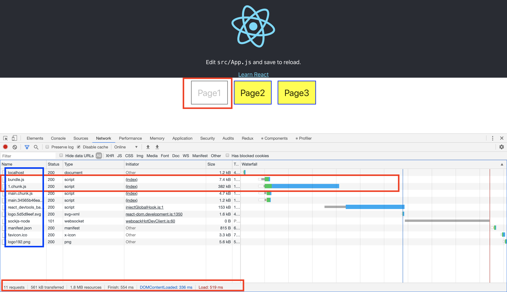

# Web development tools (Part 10)

- #### Click here: [BACK TO NAVIGASTION](https://github.com/DonghaoWu/WebDev-tools-demo/blob/master/README.md)

## `Section: Performance`(Performance-Part2.1)

### `Summary`: In this documentation, we improve website performance by code-splitting.

### `Check Dependencies & Tools:`

- React-Router
- React Loadable

------------------------------------------------------------

#### `本章背景：`
- :star:本章介绍了3种常见的 React code splitting 的方法，参考性比较强。
- code splitting 的概念是使 JS file 读取需要读取的优先。
- 当加载一个网站时如果一次过加载 bundle.js，相当于加载很多 js file，而 js file 里面的 fetch 或者其他代码会拖慢整个进程，如果有些网站，主要浏览区域和时长都是主页，那么其他副业的可以先不加载。
- 这个概念就是从整合返回到分散，从以前的分散 html 整合到 webpack 的 bundle.js，然后从 bundle.js 发展到按需分散加载(比如按需分配 component 所在的 js file)。
- 次要的 js 文件可以等到应用时才下载并加载。

<p align="center">

</p>

------------------------------------------------------------

### <span id="10.0">`Brief Contents & codes position`</span>

- #### Click here: [BACK TO NAVIGASTION](https://github.com/DonghaoWu/WebDev-tools-demo/blob/master/README.md)

- [10.1 Optimize target project.](#10.1)
- [10.2 Solution1: Import file when is needed and put it into state.](#10.2)
- [10.3 Solution2: Using high order function to generate async Component.](#10.3)
- [10.4 Solution3: React new feature - React.lazy](#10.4)

------------------------------------------------------------

### <span id="10.1">`Step1: Optimize target project`</span>

- #### Click here: [BACK TO CONTENT](#10.0)

  - :star: Build a custom react router with all pages loaded in advanced.
  - __`Location: ./Performance2.1/code-splitting/src/edition1/Page1.js`__

  ```js
  import React from 'react'
  import logo from '../logo.svg';

  function Page1({ onRouteChange }) {
      return (
          <div className="App">
              <header className="App-header">
                  
                  <p>
                      Edit <code>src/App.js</code> and save to reload.
          </p>
                  <a
                      className="App-link"
                      href="https://reactjs.org"
                      target="_blank"
                      rel="noopener noreferrer"
                  >
                      Learn React
          </a>
              </header>
              <button className='disable'>Page1</button>
              <button onClick={() => onRouteChange('page2')}>Page2</button>
              <button onClick={() => onRouteChange('page3')}>Page3</button>
          </div>
      )
  }

  export default Page1;
  ```

  - __`Location: ./Performance2.1/code-splitting/src/edition1/Page2.js`__

  ```js
  import React from 'react';
  import logo from '../logo.svg';

  function Page2({ onRouteChange }) {
      return (
          <div className="App">
              <header className="App-header">
                  
                  <p>
                      Edit <code>src/App.js</code> and save to reload.
          </p>
                  <a
                      className="App-link"
                      href="https://reactjs.org"
                      target="_blank"
                      rel="noopener noreferrer"
                  >
                      Learn React
          </a>
              </header>
              <button onClick={() => onRouteChange('page1')}>Page1</button>
              <button className='disable'>Page2</button>
              <button onClick={() => onRouteChange('page3')}>Page3</button>
          </div>
      )
  }

  export default Page2;
  ```

  - __`Location: ./Performance2.1/code-splitting/src/edition1/Page3.js`__

  ```js
  import React from 'react';
  import logo from '../logo.svg';

  function Page3({ onRouteChange }) {
      return (
          <div className="App">
              <header className="App-header">
                  
                  <p>
                      Edit <code>src/App.js</code> and save to reload.
          </p>
                  <a
                      className="App-link"
                      href="https://reactjs.org"
                      target="_blank"
                      rel="noopener noreferrer"
                  >
                      Learn React
          </a>
              </header>
              <button onClick={() => onRouteChange('page1')}>Page1</button>
              <button onClick={() => onRouteChange('page2')}>Page2</button>
              <button className='disable'>Page3</button>
          </div>
      )
  }

  export default Page3;
  ```

  - __`Location: ./Performance2.1/code-splitting/editon1/App.js`__

  ```js
  import React, { Component } from 'react'
  import './App.css';

  import Page1 from './Components/Page1';
  import Page2 from './Components/Page2';
  import Page3 from './Components/Page3';

  export class App extends Component {
    constructor() {
      super();
      this.state = {
        route: 'page1',
      }
    }

    onRouteChange = (route) => {
      this.setState({ route: route })
    }

    render() {
      const { route } = this.state;
      if (route === 'page1') {
        return <Page1 onRouteChange={this.onRouteChange} />
      }
      else if (route === 'page2') {
        return <Page2 onRouteChange={this.onRouteChange} />
      }
      else if (route === 'page3') {
        return <Page3 onRouteChange={this.onRouteChange} />
      }
    }
  }

  export default App;
  ```

  - __`Result`__:

  <p align="center">
  
  </p>

#### `Comment:`
1. All js file have been loaded in bundle.js

### <span id="10.2">`Step2: Solution1: Import file when is needed and put it into state.`</span>

- #### Click here: [BACK TO CONTENT](#10.0)

  - :star: 点击页面的时候才加载对应页面文件。

  - __`Location: ./Performance2.1/code-splitting/editon2/App.js`__

  ```js
  import React, { Component } from 'react'
  import './App.css';

  import Page1 from './Components/Page1';

  export class App extends Component {
    constructor() {
      super();
      this.state = {
        route: 'page1',
        component: null,
      }
    }

    onRouteChange = (route) => {
      if (route === 'page1') {
        this.setState({ route: route })
      } else if (route === 'page2') {
        import('./Components/Page2').then((Page2) => {
          this.setState({ route: route, component: Page2.default })
        })
      } else if (route === 'page3') {
        import('./Components/Page3').then((Page3) => {
          this.setState({ route: route, component: Page3.default })
        })
      }
    }

    render() {
      const { route } = this.state;
      if (route === 'page1') {
        return <Page1 onRouteChange={this.onRouteChange} />
      }
      else {
        return <this.state.component onRouteChange={this.onRouteChange} />
      }
    }
  }

  export default App;
  ```

  - __`Result`__:

  <p align="center">
  
  </p>

----------------------------------------------------------------------------

  <p align="center">
  
  </p>

----------------------------------------------------------------------------

  <p align="center">
  
  </p>

----------------------------------------------------------------------------

#### `Comment:`
1. 在上面的方案中，Page1 是必须加载的 Home page，必须跟主页一起下载，Page2 和 Page3 在设计过程中设计者认为是次要的，所以用到的时候才加载。
2. `这个方案相当于把 js file 转变成为 state 的一部分，是一个新颖的做法。`
3. 这样子做可以加快主页的加载，暂时没有发现屏闪（5/16 更新）。
4. 关键语句：

  ```js
    constructor() {
      super();
      this.state = {
        route: 'page1',
        component: null,
      }
    }
  //...
        import('./Components/Page2').then((Page2) => {
          this.setState({ route: route, component: Page2.default })
        })
  //...
        return <this.state.component onRouteChange={this.onRouteChange} />
  ```
----------------------------------------------------------------------------


### <span id="10.3">`Step3: Solution2: Using high order function to generate async Component.`</span>

- #### Click here: [BACK TO CONTENT](#10.0)

  - __`Location: ./Performance2.1/code-splitting/edition2/AsyncComponent.js`__

  ```js
  import React, { Component } from 'react';

  export default function asyncComponent(importComponent) {
      class AsyncComponent extends Component {
          constructor() {
              super();
              this.state = {
                  component: null,
              }
          }

          async componentDidMount() {
              const component = await importComponent();
              this.setState({
                  component: component.default,
              })
          }

          render() {
              const Component = this.state.component;
              return Component ? <Component {...this.props} /> : null
          }
      }
      return AsyncComponent;
  }
  ```

  - __`Location: ./Performance2.1/code-splitting/edtion2/App.js`__

  ```js
  import React, { Component } from 'react'
  import './App.css';

  import Page1 from './Components/Page1';
  import asyncComponent from './Components/AsyncComponent';

  export class App extends Component {
    constructor() {
      super();
      this.state = {
        route: 'page1',
      }
    }

    onRouteChange = (route) => {
      this.setState({ route: route })
    }

    render() {
      const { route } = this.state;
      if (route === 'page1') {
        return <Page1 onRouteChange={this.onRouteChange} />
      }
      else if (route === 'page2') {
        const AsyncPage2 = asyncComponent(() => import('./Components/Page2'));
        return <AsyncPage2 onRouteChange={this.onRouteChange} />
      }
      else if (route === 'page3') {
        const AsyncPage3 = asyncComponent(() => import('./Components/Page3'));
        return <AsyncPage3 onRouteChange={this.onRouteChange} />
      }
    }
  }

  export default App;
  ```

  - __`Result`__:

  <p align="center">
  
  </p>

  ----------------------------------------------------------------------------

  <p align="center">
  
  </p>

  ----------------------------------------------------------------------------

  <p align="center">
  
  </p>

  ----------------------------------------------------------------------------

#### `Comment:`
1. 这个方案会带来屏闪，也只屏闪一次。
2. 5月16日记录：目前来看，方案二是对方案一的函数功能打包。
3. 难点语句 - `可镶嵌组件`

    ```js
    //返回一个可接受 props 的组件。

    return Component ? <Component {...this.props} /> : null
    // 应用

    <AsyncPage3 onRouteChange={this.onRouteChange} />
    ```

4. :star: 7/8/2020 更新，这里建立一个 AsyncComponent，然后接受从 App 传下来的参数，根据这个参数下载 component 文件，并把文件中的 .default 部分作为 state 的一部分，最后的 this.state.component 就是需要返回的 component，这个方法思路也是按需下载，格式比较新颖，从下载的文件中提取 component 然后作为返回结果返回一个 react 组件。

5. `这个方案比较正规也比较常见，实现的是 js 文件的按需下载。`
6. 文件 `AsyncComponent.js` 的重用性很高，实用性强。
7. 详细查看 [React High-Order Components](https://reactjs.org/docs/higher-order-components.html).

### <span id="10.4">`Step4: Solution3: React new feature - React.lazy.`</span>

- #### Click here: [BACK TO CONTENT](#10.0)

#### `注意：这个方案需要至少 react 版本：16.10.2`

  - __`Location: ./Performance2.1/code-splitting/edtion3/App.js`__

  ```js
  import React, { Component, Suspense } from 'react'
  import './App.css';

  import Page1 from './Components/Page1';
  const LazyPage2 = React.lazy(() => import('./Components/Page2'));
  const LazyPage3 = React.lazy(() => import('./Components/Page3'));

  export class App extends Component {
    constructor() {
      super();
      this.state = {
        route: 'page1',
      }
    }

    onRouteChange = (route) => {
      this.setState({ route: route })
    }

    render() {
      const { route } = this.state;
      if (route === 'page1') {
        return <Page1 onRouteChange={this.onRouteChange} />
      }
      else if (route === 'page2') {
        return (
          <Suspense fallback={<div>Loading...</div>}>
            <LazyPage2 onRouteChange={this.onRouteChange} />
          </Suspense>)
      }
      else if (route === 'page3') {
        return (
          <Suspense fallback={<div>Loading...</div>}>
            <LazyPage3 onRouteChange={this.onRouteChange} />
          </Suspense>)
      }
    }
  }

  export default App;
  ```
  - __`Result`__:

  <p align="center">
  
  </p>

----------------------------------------------------------------------------

<p align="center">

</p>

----------------------------------------------------------------------------

<p align="center">

</p>

----------------------------------------------------------------------------

#### `Comment:`
1. 这个方案会带来屏闪，也只屏闪一次。
2. 详细查看 [React Code-Splitting](https://reactjs.org/docs/code-splitting.html).

------------------------------------------------------------

- #### Click here: [BACK TO CONTENT](#10.0)
- #### Click here: [BACK TO NAVIGASTION](https://github.com/DonghaoWu/WebDev-tools-demo/blob/master/README.md)


