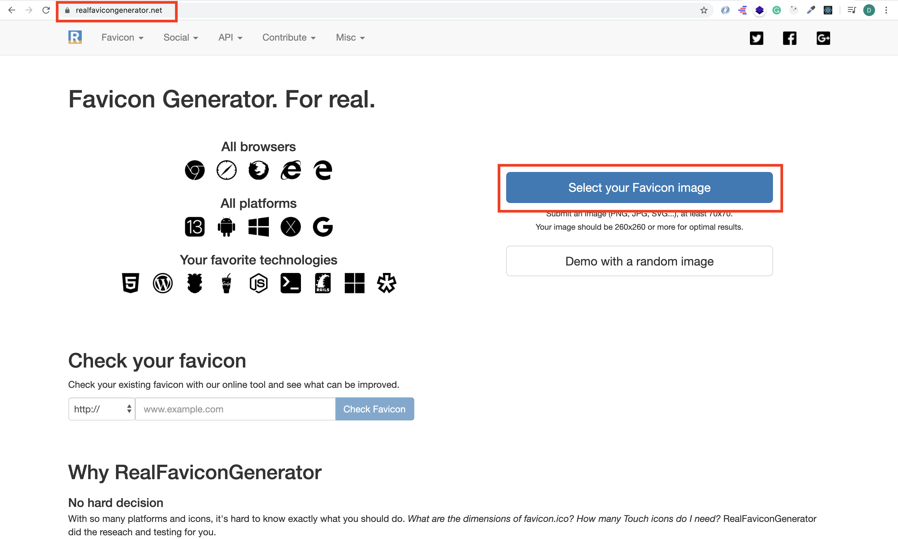
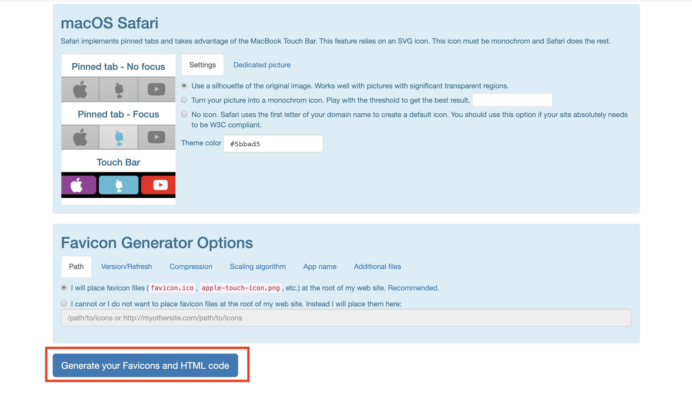
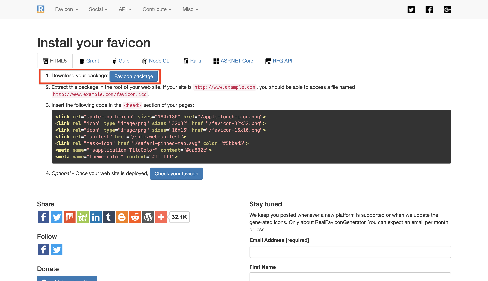
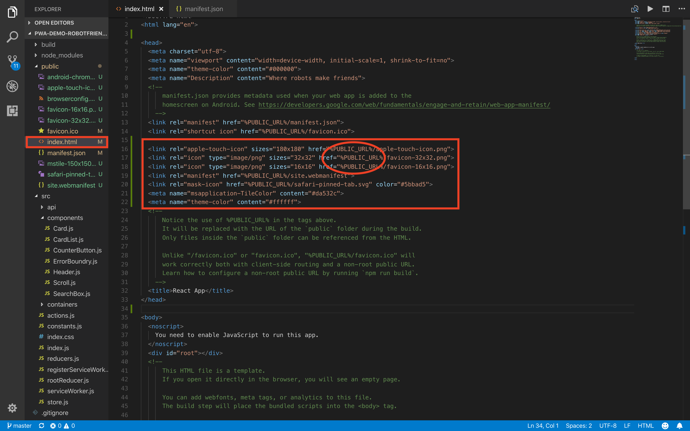
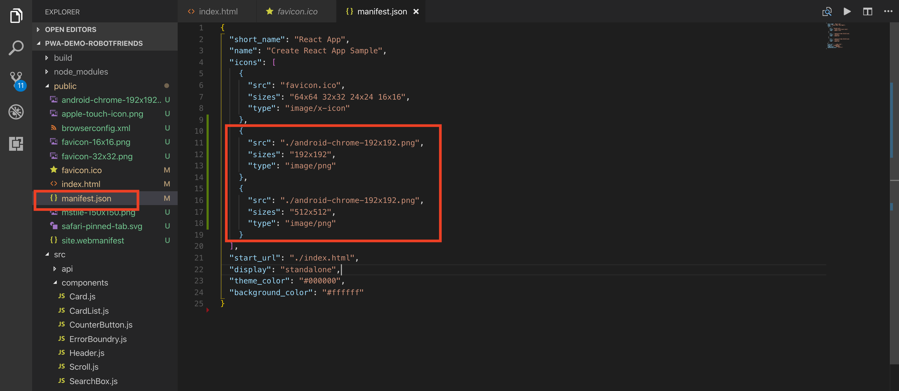
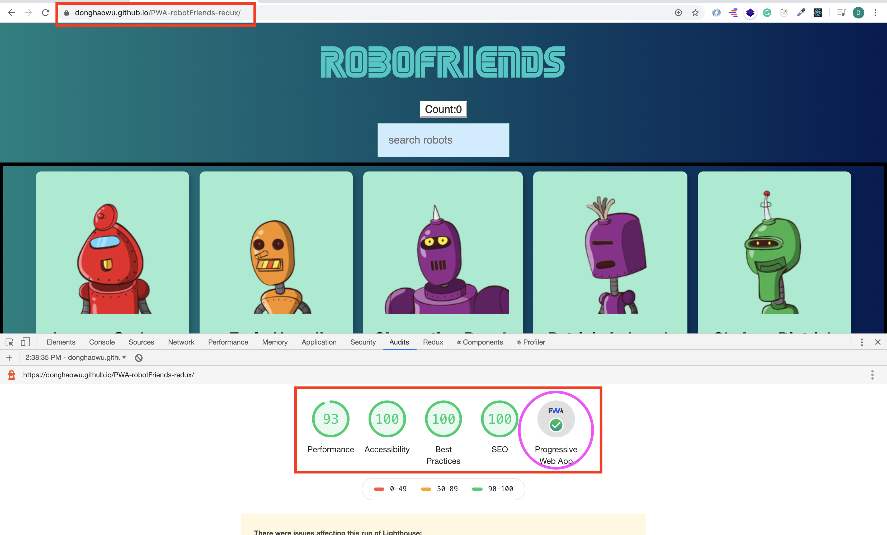

# Web development tools (Part 12)

- #### Click here: [BACK TO NAVIGASTION](https://github.com/DonghaoWu/WebDev-tools-demo/blob/master/README.md)

## `Section: Performance`(Performance-Part2.3)

### `Summary`: In this documentation, we improve website performance by making a progressive web application.

### Github Repo : [RobotFriends](https://github.com/DonghaoWu/PWA-robotFriends-redux)
### Deployed : [RobotFriends - Deployed](https://donghaowu.github.io/PWA-robotFriends-redux/)

### `Check Dependencies & Tools:`

- [Lighthouse](https://web.dev/)
- [Favicon generator](https://realfavicongenerator.net/)

------------------------------------------------------------

#### `本章背景：`
- Progress web application 的概念是想把 web application 具备 mobile application 的特征。

- 将一个 web app 转化成 PWA 需要注意的3个方面。

<p align="center">

</p>

------------------------------------------------------------

### <span id="12.0">`Brief Contents & codes position`</span>

- #### Click here: [BACK TO NAVIGASTION](https://github.com/DonghaoWu/WebDev-tools-demo/blob/master/README.md)

- [12.1 HTTPS.](#12.1)
- [12.2 App manifest.](#12.2)
- [12.3 Service worker.](#12.3)
- [12.4 Deploy & update](#12.4)
- [12.5 PWA part 1](#12.5)
- [12.6 PWA part 2](#12.6)

------------------------------------------------------------


### <span id="12.1">`Step1: HTTPS.`</span>

- #### Click here: [BACK TO CONTENT](#12.0)

- Why `Https`:
    - secure and encryption

- What support https?
    - github support https
    - [let's encrypt](https://letsencrypt.org/)
    - [cloudflare](https://www.cloudflare.com/)

----------------------------------------------------------------------------

#### `Comment:`
1. 


### <span id="12.2">`Step2: App manifest.`</span>

- #### Click here: [BACK TO CONTENT](#12.0)

- Why `App manifest`:
    - web app icon
    - include a viewport tag in .public/index.html
    ```html
        <meta name="viewport" content="width=device-width, initial-scale=1, shrink-to-fit=no">
    ```
    - ./public/manifest.json, set up the icon,so a user can add an icon in a phone.(比如说一个移动端用户可以在收藏一个 web app 之后在桌面看到一个新的 icon。)
    - 在加载时，在移动端可以看到加载背景和 icon 。

----------------------------------------------------------------------------

#### `Comment:`
1. 


### <span id="12.3">`Step3: Service Worker.`</span>

- #### Click here: [BACK TO CONTENT](#12.0)

- Why `Service Worker`:
    - background worker, offline experierce.
    - ./src/registerServiceWorker.js 或者 ./src/serviceWorker.js
    - ./build/service-worker.js
    - another worker
    - application tag -> service worker
    - Web API: Cache API, in browser
    - Cache API: Application tag -> Cache -> Cache Storage

- __`Result`__:

<p align="center">

</p>

----------------------------------------------------------------------------

#### `Comment:`
1. 


### <span id="12.4">`Step4: Deploy & update.`</span>

- #### Click here: [BACK TO CONTENT](#12.0)

1. Install gh-pages

```bash
$ npm install gh-pages
```

2. Add new scripts into `package.json`:

<p align="center">

</p>

----------------------------------------------------------------------------

```js
"homepage":"https://...github.io/<repoName>",

"predeploy":"npm run build",
"deploy": "gh-pages -d build",
```

3. Run command:

```bash
$ npm run deploy
```

4. Github setting:

<p align="center">

</p>

----------------------------------------------------------------------------

<p align="center">

</p>

----------------------------------------------------------------------------

5. Check the website:

<p align="center">

</p>

----------------------------------------------------------------------------

6. Check the service worker:

<p align="center">

</p>

----------------------------------------------------------------------------

7. Test the website in lighthouse:

<p align="center">

</p>

----------------------------------------------------------------------------

<p align="center">

</p>

----------------------------------------------------------------------------

8. 关于新版的 serviceWorker.js 与 旧版 registerServiceWorker.js 的更新：

    1. 如果要在旧版本 react 中使用 `serviceWorker.js`，需要先删除 `registerServiceWorker.js`，复制黏贴 `serviceWorker.js` 到`registerServiceWorker.js`所在的文件位置。

    2. 在 `./src/index.js`中修改：

    ```diff
    - import registerServiceWorker from './registerServiceWorker';
    - registerServiceWorker();

    + import * as serviceWorker from './serviceWorker';
    + serviceWorker.unregister();
    ```

    3. 记得在 Deploy 之前修改：

    ```diff
    - serviceWorker.unregister();
    + serviceWorker.register();
    ```

#### `Comment:`
1. 

### <span id="12.5">`Step5: PWA part 1.`</span>

- #### Click here: [BACK TO CONTENT](#12.0)

1. `HTTPS:`github deploy build in https.

<p align="center">

</p>

----------------------------------------------------------------------------

2. Accessibilities:

    __`Location: ./robotFriends-redux/src/components/SearchBox.js`__
    ```js
    import React from 'react';

    const SearchBox = ({ searchfield, searchChange }) => {
    console.log('SearchBox');
    return (
        <div className='pa2'>
        <input
            aria-label='Search Robots'
            className='pa3 ba b--green bg-lightest-blue'
            type='search'
            placeholder='search robots'
            onChange={searchChange}
        />
        </div>
    );
    }

    export default SearchBox;
    ```

    ```diff
    + aria-label='Search Robots'
    ```

    3. SEO:

    __`Location: ./robotFriends-redux/public/index.html`__

    ```html
    <!DOCTYPE html>
    <html lang="en">
    <head>
        <meta charset="utf-8">
        <meta name="viewport" content="width=device-width, initial-scale=1, shrink-to-fit=no">
        <meta name="theme-color" content="#000000">
        <meta name="Description" content="Where robots make friends">
        <link rel="manifest" href="%PUBLIC_URL%/manifest.json">
        <link rel="shortcut icon" href="%PUBLIC_URL%/favicon.ico">
        <title>React App</title>
    </head>

    <body>
        <noscript>
        You need to enable JavaScript to run this app.
        </noscript>
        <div id="root"></div>
    </body>

    </html>
    ```

    ```diff
    + <meta name="Description" content="Where robots make friends">
    ```

    5. Deploy again:

    ```bash
    $ npm run deploy
    ```

    6. Test the Website:

    <p align="center">
    
    </p>

    ----------------------------------------------------------------------------

    #### `Comment:`
    1. 


### <span id="12.6">`Step5: PWA part 2.`</span>

- #### Click here: [BACK TO CONTENT](#12.0)

1. Generate a favicon.

- [Favicon generator](https://realfavicongenerator.net/)

<p align="center">

</p>

----------------------------------------------------------------------------

<p align="center">

</p>

----------------------------------------------------------------------------

2. Download the package and unzip it, paste the images to `./public` folder.

<p align="center">

</p>

----------------------------------------------------------------------------

3. Add code in `./public/index.html`

<p align="center">

</p>

----------------------------------------------------------------------------

<p align="center">

</p>

----------------------------------------------------------------------------

```html
  <link rel="apple-touch-icon" sizes="180x180" href="%PUBLIC_URL%/apple-touch-icon.png">
  <link rel="icon" type="image/png" sizes="32x32" href="%PUBLIC_URL%/favicon-32x32.png">
  <link rel="icon" type="image/png" sizes="16x16" href="%PUBLIC_URL%/favicon-16x16.png">
  <link rel="manifest" href="%PUBLIC_URL%/site.webmanifest">
  <link rel="mask-icon" href="%PUBLIC_URL%/safari-pinned-tab.svg" color="#5bbad5">
  <meta name="msapplication-TileColor" content="#da532c">
  <meta name="theme-color" content="#ffffff">
```

4. Add code in `./public/manifest.json`

<p align="center">

</p>

----------------------------------------------------------------------------

```json
{
  "short_name": "React App",
  "name": "Create React App Sample",
  "icons": [
    {
      "src": "favicon.ico",
      "sizes": "64x64 32x32 24x24 16x16",
      "type": "image/x-icon"
    },
    {
      "src": "./android-chrome-192x192.png",
      "sizes": "192x192",
      "type": "image/png"
    },
    {
      "src": "./android-chrome-192x192.png",
      "sizes": "512x512",
      "type": "image/png"
    }
  ],
  "start_url": "./index.html",
  "display": "standalone",
  "theme_color": "#000000",
  "background_color": "#ffffff"
}
```

5. Deploy again.

```bash
$ npm run deploy
```

6. Test it in Lighthouse.

<p align="center">

</p>

----------------------------------------------------------------------------


#### `Comment:`
1. 

- #### Click here: [BACK TO CONTENT](#12.0)
- #### Click here: [BACK TO NAVIGASTION](https://github.com/DonghaoWu/WebDev-tools-demo/blob/master/README.md)


