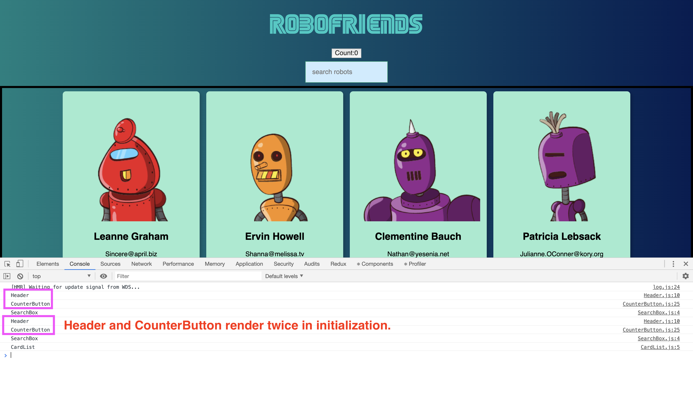
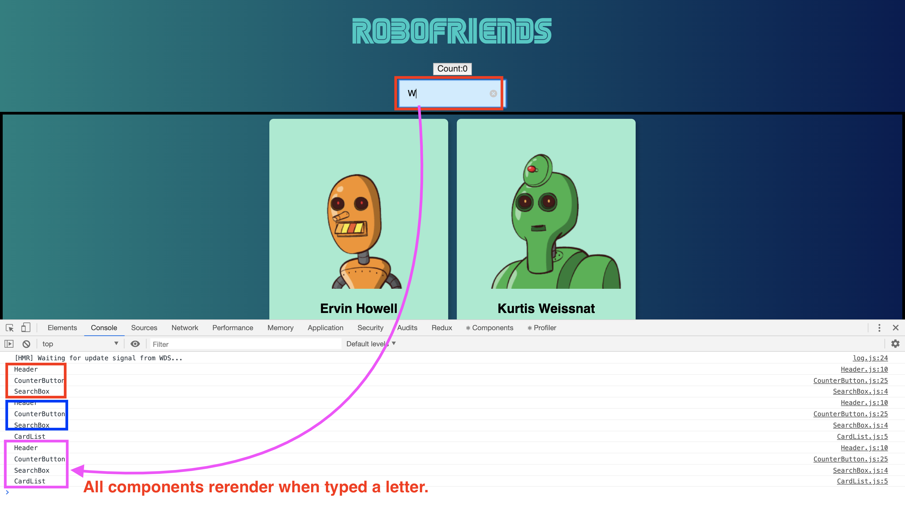
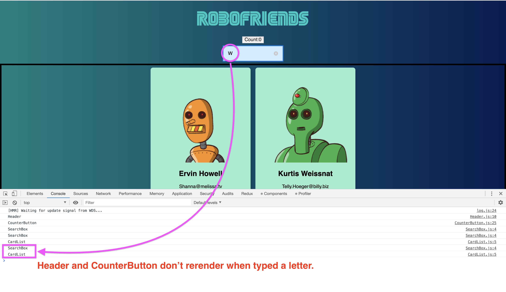
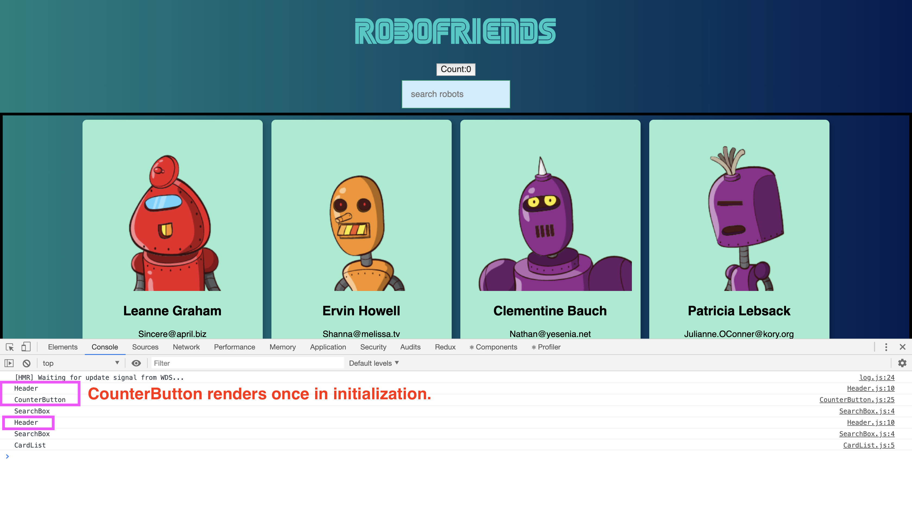
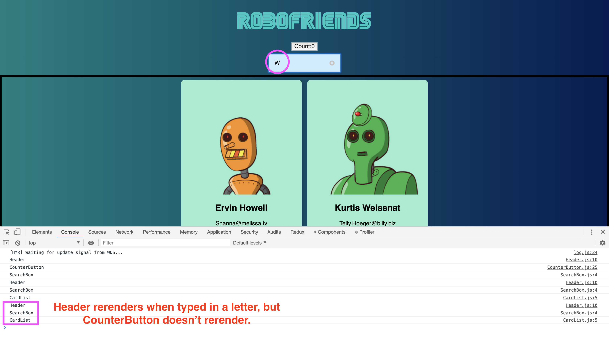

# Web development tools (Part 11)

- #### Click here: [BACK TO NAVIGASTION](https://github.com/DonghaoWu/WebDev-tools-demo/blob/master/README.md)

## `Section: Performance`(Performance-Part2.2)

### `Summary`: In this documentation, we improve website performance by optimizing React performance.

### `Check Dependencies & Tools:`

- Chrome extension: React Developer Tools
- localhost:3000/?react_perf + Inspect + Performance tag

------------------------------------------------------------

#### `本章背景：`
- React 的工作原理是 state 或者 props 变化就全部重加载 `rerender`，但是有时候的实际使用情况是有些部件不需要跟着重加载，这时候就需要一些优化或设定提高 React 的效率。

- Avoid unnecessary DOM manipulation.

- 本章里面主要分析 `shouldComponentUpdate` 应用在不同父子组件的嵌套关系来实现一些组件是否应该 rerender 。

- `shouldComponentUpdate` 的作用是在特定条件下阻断 rerender 在当前组件和该组件的子组件上执行。

------------------------------------------------------------

### <span id="11.0">`Brief Contents & codes position`</span>

- #### Click here: [BACK TO NAVIGASTION](https://github.com/DonghaoWu/WebDev-tools-demo/blob/master/README.md)

- [11.1 Create a Header component.](#11.1)
- [11.2 Create a CounterButton component.](#11.2)
- [11.3 Add 'shouldComponentUpdate' into Header.](#11.3)
- [11.4 Delete 'shouldComponentUpdate' in Header & add 'shouldComponentUpdate' into CounterButton.](#11.4)

------------------------------------------------------------

### <span id="11.1">`Step1: Create a Header component`</span>

- #### Click here: [BACK TO CONTENT](#11.0)

- __`Location: ./Performance2.2/edition2/App.js`__

```js
import React, { Component } from 'react';
import { connect } from 'react-redux';
import { setSearchField, requestRobots } from '../actions';

import CardList from '../components/CardList';
import SearchBox from '../components/SearchBox';
import Scroll from '../components/Scroll';
import ErrorBoundry from '../components/ErrorBoundry';
import Header from '../components/Header';

import './App.css';

class App extends Component {
  componentDidMount() {
    this.props.onRequestRobots();
  }

  render() {
    const { robots, searchField, onSearchChange, isPending } = this.props;
    const filteredRobots = robots.filter(robot => {
      return robot.name.toLowerCase().includes(searchField.toLowerCase());
    })
    return (
      <div className='tc'>
        <Header />
        <SearchBox searchChange={onSearchChange} />
        <Scroll>
          {isPending ? <h1>Loading</h1> :
            <ErrorBoundry>
              <CardList robots={filteredRobots} />
            </ErrorBoundry>
          }
        </Scroll>
      </div>
    );
  }
}

// parameter state comes from index.js provider store state(rootReducers)
const mapStateToProps = (state) => {
  return {
    searchField: state.searchRobotsReducer.searchField,
    robots: state.requestRobotsReducer.robots,
    isPending: state.requestRobotsReducer.isPending
  }
}

// dispatch the DOM changes to call an action. note mapStateToProps returns object, mapDispatchToProps returns function
// the function returns an object then uses connect to change the data from redecers.
const mapDispatchToProps = (dispatch) => {
  return {
    onSearchChange: (event) => dispatch(setSearchField(event.target.value)),
    onRequestRobots: () => dispatch(requestRobots())
  }
}

// action done from mapDispatchToProps will channge state from mapStateToProps
export default connect(mapStateToProps, mapDispatchToProps)(App)
```

- __`Location: ./Performance2.2/edition2/Header.js`__

```js
import React, { Component } from 'react';
import CounterButton from './CounterButton'

class Header extends Component {
    render() {
        console.log('Header');
        return (
            <div>
                <h1 className='f1'>RoboFriends</h1>
                <CounterButton />
            </div>
        )
    }
}

export default Header;
```

----------------------------------------------------------------------------

#### `Comment:`
1. 


### <span id="11.2">`Step2: Create a CounterButton component.`</span>

- #### Click here: [BACK TO CONTENT](#11.0)

- __`Location: ./Performance2.2/edition2/CounterButton.js`__

```js
import React, { Component } from 'react';

class CounterButton extends Component {
    constructor() {
        super();
        this.state = {
            count: 0,
        }
    }

    handleClick = () => {
        this.setState(state => {
            return { count: state.count + 1 }
        });
    }

    render() {
        console.log('CounterButton');
        return (
            <button color={this.props.color} onClick={this.handleClick}>
                Count:{this.state.count}
            </button>
        )
    }
}

export default CounterButton;
```
----------------------------------------------------------------------------

- __`Result`__:

<p align="center">

</p>

----------------------------------------------------------------------------

<p align="center">

</p>

----------------------------------------------------------------------------

#### `Comment:`
1. 这里有一个小知识点，setState 是一个 async 动作，所以建议：

```diff
-    handleClick = () => {
-        this.setState({ count: this.state.count + 1 });
-    }

//    setState is an async action, it may have some side effect.

+    handleClick = () => {
+        this.setState(state => {
+            return { count: state.count + 1 }
+        });
+    }
```

### <span id="11.3">`Step3: Add 'shouldComponentUpdate' into Header.`</span>

- #### Click here: [BACK TO CONTENT](#11.0)

- __`Location: ./Performance2.2/edition2/Header.js`__

```js
import React, { Component } from 'react';
import CounterButton from './CounterButton'

class Header extends Component {
    shouldComponentUpdate(nextProps, nextState) {
        return false;
    }

    render() {
        console.log('Header');
        return (
            <div>
                <h1 className='f1'>RoboFriends</h1>
                <CounterButton />
            </div>
        )
    }
}

export default Header;
```

- __`Result`__:

<p align="center">

</p>

----------------------------------------------------------------------------

<p align="center">

</p>

----------------------------------------------------------------------------

#### `Comment:`
1. 


### <span id="11.4">`Step4: Delete 'shouldComponentUpdate' in Header & add 'shouldComponentUpdate' into CounterButton.`</span>

- #### Click here: [BACK TO CONTENT](#11.0)

- __`Location: ./Performance2.2/edition2/Header.js`__

```js
import React, { Component } from 'react';
import CounterButton from './CounterButton'

class Header extends Component {
    // shouldComponentUpdate(nextProps, nextState) {
    //     return false;
    // }

    render() {
        console.log('Header');
        return (
            <div>
                <h1 className='f1'>RoboFriends</h1>
                <CounterButton />
            </div>
        )
    }
}

export default Header;
```

- __`Location: ./Performance2.2/edition2/CounterButton.js`__

```js
import React, { Component } from 'react';

class CounterButton extends Component {
    constructor() {
        super();
        this.state = {
            count: 0,
        }
    }

    shouldComponentUpdate(nextProps, nextState) {
        if (this.state.count !== nextState.count) {
            return true;
        }
        return false;
    }

    handleClick = () => {
        this.setState(state => {
            return { count: state.count + 1 }
        });
    }

    render() {
        console.log('CounterButton');
        return (
            <button color={this.props.color} onClick={this.handleClick}>
                Count:{this.state.count}
            </button>
        )
    }
}

export default CounterButton;
```

- __`Result`__:

<p align="center">

</p>

----------------------------------------------------------------------------

<p align="center">

</p>

----------------------------------------------------------------------------


#### `Comment:`
1. 

- #### Click here: [BACK TO CONTENT](#11.0)
- #### Click here: [BACK TO NAVIGASTION](https://github.com/DonghaoWu/WebDev-tools-demo/blob/master/README.md)


