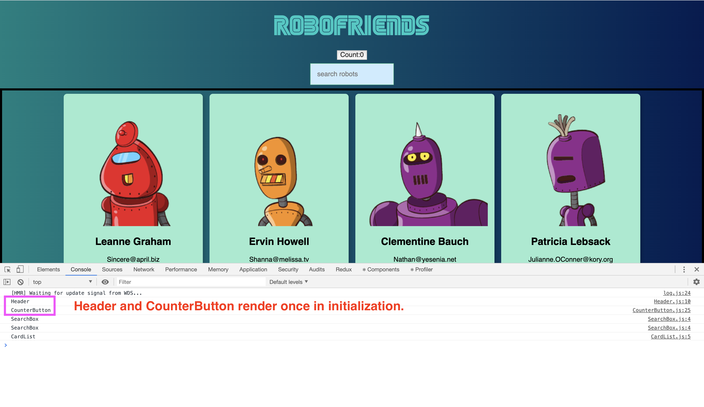

# Web development tools (Part 11)

- #### Click here: [BACK TO NAVIGASTION](https://github.com/DonghaoWu/WebDev-tools-demo/blob/master/README.md)

## `Section: Performance`(Performance-Part2.2)

### `Summary`: In this documentation, we improve website performance by optimizing React performance.

### `Check Dependencies & Tools:`

- 

------------------------------------------------------------

#### `本章背景：`
- React 的工作原理是 state 或者 props 变化就全部重加载 `rerender`，但是有时候的实际使用情况是有些部件不需要跟着重加载，这时候就需要一些优化或设定提高 React 的效率。

<p align="center">

</p>

------------------------------------------------------------

### <span id="11.0">`Brief Contents & codes position`</span>

- #### Click here: [BACK TO NAVIGASTION](https://github.com/DonghaoWu/WebDev-tools-demo/blob/master/README.md)

- [11.1 Optimize target project.](#11.1)
- [11.2 Solution1: Import file when is needed and put it into state.](#11.2)
- [11.3 Solution2: Using high order function to generate async Component.](#11.3)
- [11.4 Solution3: React new feature - React.lazy](#11.4)

------------------------------------------------------------

### <span id="11.1">`Step1: Optimize target project`</span>

- #### Click here: [BACK TO CONTENT](#11.0)

- __`Location: ./example1/code-splitting/src/edition1/Page1.js`__

```js
import React from 'react'
import logo from '../logo.svg';

function Page1({ onRouteChange }) {
    return (
        <div className="App">
            <header className="App-header">
                
                <p>
                    Edit <code>src/App.js</code> and save to reload.
        </p>
                <a
                    className="App-link"
                    href="https://reactjs.org"
                    target="_blank"
                    rel="noopener noreferrer"
                >
                    Learn React
        </a>
            </header>
            <button className='disable'>Page1</button>
            <button onClick={() => onRouteChange('page2')}>Page2</button>
            <button onClick={() => onRouteChange('page3')}>Page3</button>
        </div>
    )
}

export default Page1;
```

- __`Location: ./example1/code-splitting/src/edition1/Page2.js`__

```js
import React from 'react';
import logo from '../logo.svg';

function Page2({ onRouteChange }) {
    return (
        <div className="App">
            <header className="App-header">
                
                <p>
                    Edit <code>src/App.js</code> and save to reload.
        </p>
                <a
                    className="App-link"
                    href="https://reactjs.org"
                    target="_blank"
                    rel="noopener noreferrer"
                >
                    Learn React
        </a>
            </header>
            <button onClick={() => onRouteChange('page1')}>Page1</button>
            <button className='disable'>Page2</button>
            <button onClick={() => onRouteChange('page3')}>Page3</button>
        </div>
    )
}

export default Page2;
```

- __`Location: ./example1/code-splitting/src/edition1/Page3.js`__

```js
import React from 'react';
import logo from '../logo.svg';

function Page3({ onRouteChange }) {
    return (
        <div className="App">
            <header className="App-header">
                
                <p>
                    Edit <code>src/App.js</code> and save to reload.
        </p>
                <a
                    className="App-link"
                    href="https://reactjs.org"
                    target="_blank"
                    rel="noopener noreferrer"
                >
                    Learn React
        </a>
            </header>
            <button onClick={() => onRouteChange('page1')}>Page1</button>
            <button onClick={() => onRouteChange('page2')}>Page2</button>
            <button className='disable'>Page3</button>
        </div>
    )
}

export default Page3;
```

- __`Location: ./example1/code-splitting/editon1/App.js`__

```js
import React, { Component } from 'react'
import './App.css';

import Page1 from './Components/Page1';
import Page2 from './Components/Page2';
import Page3 from './Components/Page3';

export class App extends Component {
  constructor() {
    super();
    this.state = {
      route: 'page1',
    }
  }

  onRouteChange = (route) => {
    this.setState({ route: route })
  }

  render() {
    const { route } = this.state;
    if (route === 'page1') {
      return <Page1 onRouteChange={this.onRouteChange} />
    }
    else if (route === 'page2') {
      return <Page2 onRouteChange={this.onRouteChange} />
    }
    else if (route === 'page3') {
      return <Page3 onRouteChange={this.onRouteChange} />
    }
  }
}

export default App;
```

- result:

<p align="center">

</p>

#### `Comment:`
1. All js file have been loaded in bundle.js

### <span id="11.2">`Step2: Solution1: Import file when is needed and put it into state.`</span>

- #### Click here: [BACK TO CONTENT](#11.0)

- __`Location: ./example1/code-splitting/editon2/App.js`__

```js
import React, { Component } from 'react'
import './App.css';

import Page1 from './Components/Page1';

export class App extends Component {
  constructor() {
    super();
    this.state = {
      route: 'page1',
      component: null,
    }
  }

  onRouteChange = (route) => {
    if (route === 'page1') {
      this.setState({ route: route })
    } else if (route === 'page2') {
      import('./Components/Page2').then((Page2) => {
        this.setState({ route: route, component: Page2.default })
      })
    } else if (route === 'page3') {
      import('./Components/Page3').then((Page3) => {
        this.setState({ route: route, component: Page3.default })
      })
    }
  }

  render() {
    const { route } = this.state;
    if (route === 'page1') {
      return <Page1 onRouteChange={this.onRouteChange} />
    }
    else {
      return <this.state.component onRouteChange={this.onRouteChange} />
    }
  }
}

export default App;
```

- result:

<p align="center">

</p>

----------------------------------------------------------------------------

<p align="center">

</p>

----------------------------------------------------------------------------

<p align="center">

</p>

----------------------------------------------------------------------------

#### `Comment:`
1. 在上面的方案中，Page1 是必须加载的 Home page，必须跟主页一起下载，Page2 和 Page3 在设计过程中设计者认为是次要的，所以用到的时候才加载。
2. `这个方案相当于把 js file 转变成为 state 的一部分，是一个新颖的做法。`
3. 这样子做可以加快主页的加载，暂时没有发现屏闪（5/16 更新）。
4. 关键语句：

```js
  constructor() {
    super();
    this.state = {
      route: 'page1',
      component: null,
    }
  }
//...
      import('./Components/Page2').then((Page2) => {
        this.setState({ route: route, component: Page2.default })
      })
//...
      return <this.state.component onRouteChange={this.onRouteChange} />
```
----------------------------------------------------------------------------


### <span id="11.3">`Step3: Solution2: Using high order function to generate async Component.`</span>

- #### Click here: [BACK TO CONTENT](#11.0)

- __`Location: ./example1/code-splitting/edition2/AsyncComponent.js`__

```js
import React, { Component } from 'react';

export default function asyncComponent(importComponent) {
    class AsyncComponent extends Component {
        constructor() {
            super();
            this.state = {
                component: null,
            }
        }

        async componentDidMount() {
            const component = await importComponent();
            this.setState({
                component: component.default,
            })
        }

        render() {
            const Component = this.state.component;
            return Component ? <Component {...this.props} /> : null
        }
    }
    return AsyncComponent;
}
```

- __`Location: ./example1/code-splitting/edtion2/App.js`__

```js
import React, { Component } from 'react'
import './App.css';

import Page1 from './Components/Page1';
import asyncComponent from './Components/AsyncComponent';

export class App extends Component {
  constructor() {
    super();
    this.state = {
      route: 'page1',
    }
  }

  onRouteChange = (route) => {
    this.setState({ route: route })
  }

  render() {
    const { route } = this.state;
    if (route === 'page1') {
      return <Page1 onRouteChange={this.onRouteChange} />
    }
    else if (route === 'page2') {
      const AsyncPage2 = asyncComponent(() => import('./Components/Page2'));
      return <AsyncPage2 onRouteChange={this.onRouteChange} />
    }
    else if (route === 'page3') {
      const AsyncPage3 = asyncComponent(() => import('./Components/Page3'));
      return <AsyncPage3 onRouteChange={this.onRouteChange} />
    }
  }
}

export default App;
```

- result:

<p align="center">

</p>

----------------------------------------------------------------------------

<p align="center">

</p>

----------------------------------------------------------------------------

<p align="center">

</p>

----------------------------------------------------------------------------

#### `Comment:`
1. 这个方案会带来屏闪，也只屏闪一次。
2. 5月16日记录：目前来看，方案二是对方案一的函数功能打包。
3. 难点语句 - `可镶嵌组件`

```js
//返回一个可接受 props 的组件。
return Component ? <Component {...this.props} /> : null
// 应用
<AsyncPage3 onRouteChange={this.onRouteChange} />
```

4. `这个方案比较正规也比较常见，实现的是 js 文件的按需下载。`
5. 文件 `AsyncComponent.js` 的重用性很高，实用性强。
6. 详细查看 [React High-Order Components](https://reactjs.org/docs/higher-order-components.html).

### <span id="11.4">`Step4: Solution3: React new feature - React.lazy.`</span>

- #### Click here: [BACK TO CONTENT](#11.0)

#### `注意：这个方案需要至少 react 版本：16.11.2`

- __`Location: ./example1/code-splitting/edtion3/App.js`__

```js
import React, { Component, Suspense } from 'react'
import './App.css';

import Page1 from './Components/Page1';
const LazyPage2 = React.lazy(() => import('./Components/Page2'));
const LazyPage3 = React.lazy(() => import('./Components/Page3'));

export class App extends Component {
  constructor() {
    super();
    this.state = {
      route: 'page1',
    }
  }

  onRouteChange = (route) => {
    this.setState({ route: route })
  }

  render() {
    const { route } = this.state;
    if (route === 'page1') {
      return <Page1 onRouteChange={this.onRouteChange} />
    }
    else if (route === 'page2') {
      return (
        <Suspense fallback={<div>Loading...</div>}>
          <LazyPage2 onRouteChange={this.onRouteChange} />
        </Suspense>)
    }
    else if (route === 'page3') {
      return (
        <Suspense fallback={<div>Loading...</div>}>
          <LazyPage3 onRouteChange={this.onRouteChange} />
        </Suspense>)
    }
  }
}

export default App;
```
- result:

<p align="center">

</p>

----------------------------------------------------------------------------

<p align="center">

</p>

----------------------------------------------------------------------------

<p align="center">

</p>

----------------------------------------------------------------------------

#### `Comment:`
1. 这个方案会带来屏闪，也只屏闪一次。
2. 详细查看 [React Code-Splitting](https://reactjs.org/docs/code-splitting.html).

------------------------------------------------------------

- #### Click here: [BACK TO CONTENT](#11.0)
- #### Click here: [BACK TO NAVIGASTION](https://github.com/DonghaoWu/WebDev-tools-demo/blob/master/README.md)


