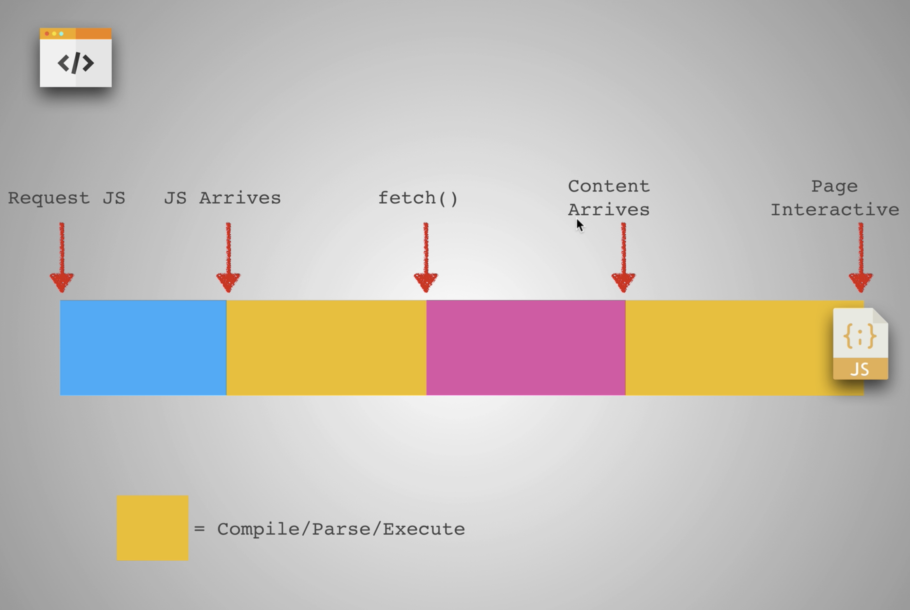
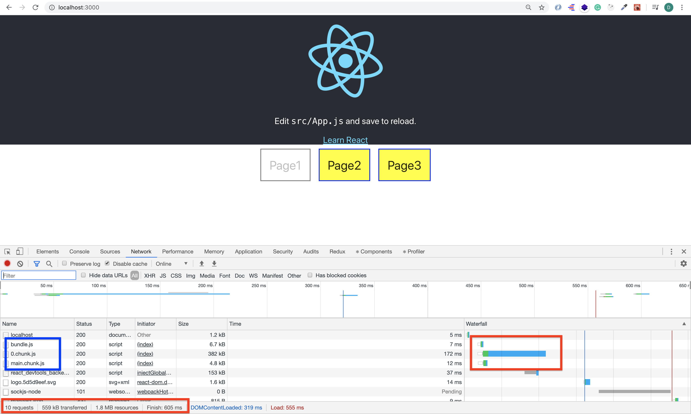

# Web development tools (Part 10)

- #### Click here: [BACK TO NAVIGASTION](https://github.com/DonghaoWu/WebDev-tools-demo/blob/master/README.md)

## `Section: Performance`(Performance-Part2.1)

### `Summary`: In this documentation, we improve website performance by code-splitting.

### `Check Dependencies:`

- None

------------------------------------------------------------

#### `本章背景：`
- code splitting 的概念是使 JS file 读取需要读取的优先。
- 当加载一个网站时如果一次过加载 bundle.js，相当于加载很多 js file，而 js file 里面的 fetch 或者其他代码会拖慢整个进程，如果有些网站，主要浏览区域和时长都是主页，那么其他副业的加载可以先不加载。
- 这个概念就是从整合返回到分散，从以前的分散 html 整合到 webpack 的 bundle.js，然后从 bundle.js 发展到按需分散加载(比如按需分配 component 所在的 js file)。

<p align="center">

</p>

------------------------------------------------------------

### <span id="10.0">`Brief Contents & codes position`</span>

- #### Click here: [BACK TO NAVIGASTION](https://github.com/DonghaoWu/WebDev-tools-demo/blob/master/README.md)

- [10.1 Optimize target project.](#10.1)
- [10.2 Solution1: .](#10.2)
- [10.3 Solution2:](#10.3)
- [10.4 Solution3:](#10.4)
- [10.5 Solution4:](#10.5)

------------------------------------------------------------

### <span id="10.1">`Step1: Optimize target project`</span>

- #### Click here: [BACK TO CONTENT](#10.0)

- `Location: ./example1/code-splitting/src/Components/Page1.js`

```js
import React from 'react'
import logo from '../logo.svg';

function Page1({ onRouteChange }) {
    return (
        <div className="App">
            <header className="App-header">
                
                <p>
                    Edit <code>src/App.js</code> and save to reload.
        </p>
                <a
                    className="App-link"
                    href="https://reactjs.org"
                    target="_blank"
                    rel="noopener noreferrer"
                >
                    Learn React
        </a>
            </header>
            <button className='disable'>Page1</button>
            <button onClick={() => onRouteChange('page2')}>Page2</button>
            <button onClick={() => onRouteChange('page3')}>Page3</button>
        </div>
    )
}

export default Page1;
```

`Location: ./example1/code-splitting/src/Components/Page2.js`

```js
import React from 'react';
import logo from '../logo.svg';

function Page2({ onRouteChange }) {
    return (
        <div className="App">
            <header className="App-header">
                
                <p>
                    Edit <code>src/App.js</code> and save to reload.
        </p>
                <a
                    className="App-link"
                    href="https://reactjs.org"
                    target="_blank"
                    rel="noopener noreferrer"
                >
                    Learn React
        </a>
            </header>
            <button onClick={() => onRouteChange('page1')}>Page1</button>
            <button className='disable'>Page2</button>
            <button onClick={() => onRouteChange('page3')}>Page3</button>
        </div>
    )
}

export default Page2;
```

- `Location: ./example1/code-splitting/src/Components/Page3.js`

```js
import React from 'react';
import logo from '../logo.svg';

function Page3({ onRouteChange }) {
    return (
        <div className="App">
            <header className="App-header">
                
                <p>
                    Edit <code>src/App.js</code> and save to reload.
        </p>
                <a
                    className="App-link"
                    href="https://reactjs.org"
                    target="_blank"
                    rel="noopener noreferrer"
                >
                    Learn React
        </a>
            </header>
            <button onClick={() => onRouteChange('page1')}>Page1</button>
            <button onClick={() => onRouteChange('page2')}>Page2</button>
            <button className='disable'>Page3</button>
        </div>
    )
}

export default Page3;
```

- `Location: ./example1/code-splitting/src/App.js`

```js
import React, { Component } from 'react'
import './App.css';

import Page1 from './Components/Page1';
import Page2 from './Components/Page2';
import Page3 from './Components/Page3';

export class App extends Component {
  constructor() {
    super();
    this.state = {
      route: 'page1',
    }
  }

  onRouteChange = (route) => {
    this.setState({ route: route })
  }

  render() {
    const { route } = this.state;
    if (route === 'page1') {
      return <Page1 onRouteChange={this.onRouteChange} />
    }
    else if (route === 'page2') {
      return <Page2 onRouteChange={this.onRouteChange} />
    }
    else if (route === 'page3') {
      return <Page3 onRouteChange={this.onRouteChange} />
    }
  }
}

export default App;
```

- result:

<p align="center">

</p>

#### `Comment:`
1. 

### <span id="10.2">`Step2: Solution1.`</span>

- #### Click here: [BACK TO CONTENT](#10.0)


#### `Comment:`
1. 

----------------------------------------------------------------------------


### <span id="10.3">`Step3: Solution2.`</span>

- #### Click here: [BACK TO CONTENT](#10.0)


#### `Comment:`
1. 

### <span id="10.4">`Step4: Solution3.`</span>

- #### Click here: [BACK TO CONTENT](#10.0)


#### `Comment:`
1.


### <span id="10.5">`Step5 Solution4.`</span>

- #### Click here: [BACK TO CONTENT](#10.0)


#### `Comment:`
1.


### <span id="10.6">`Step6: Solution5.`</span>

- #### Click here: [BACK TO CONTENT](#10.0)


#### `Comment:`
1.


------------------------------------------------------------

- #### Click here: [BACK TO CONTENT](#10.0)
- #### Click here: [BACK TO NAVIGASTION](https://github.com/DonghaoWu/WebDev-tools-demo/blob/master/README.md)


