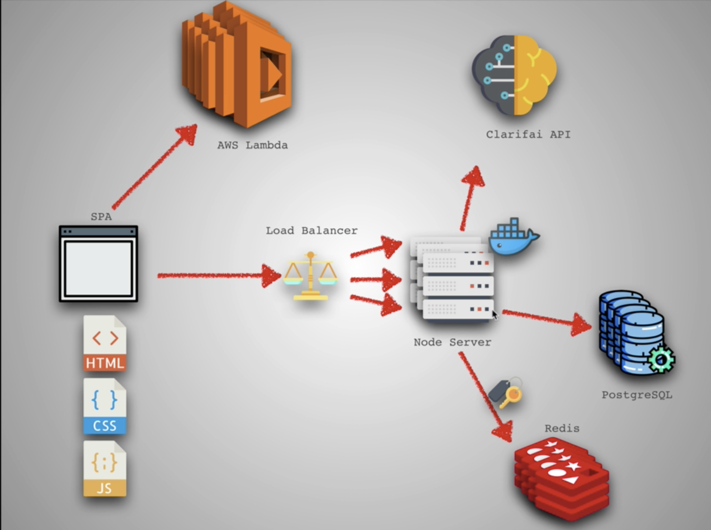
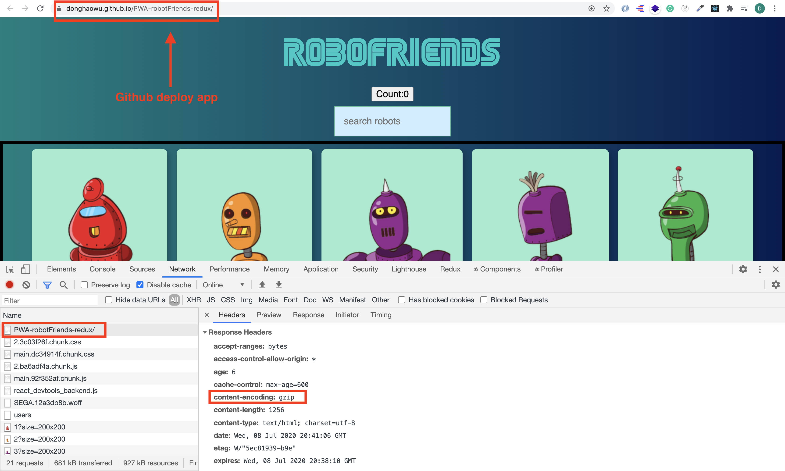
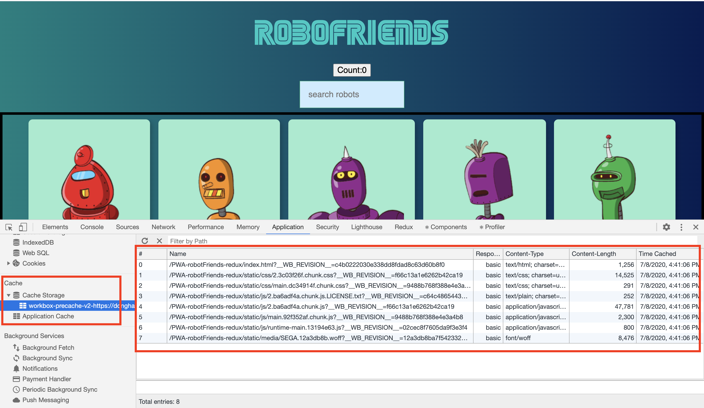
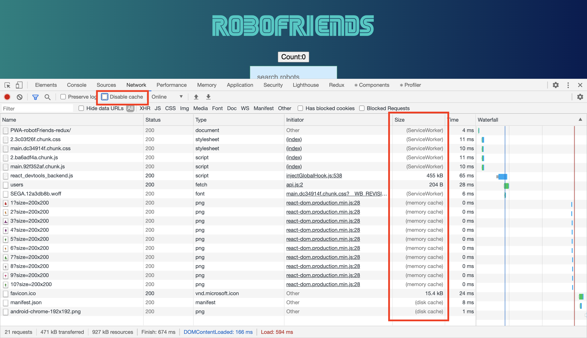
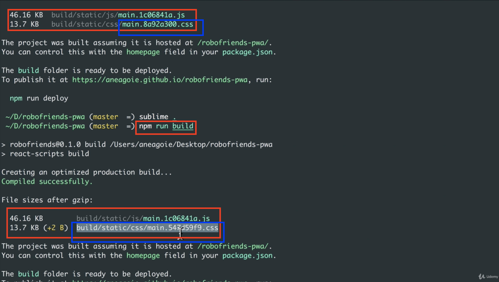
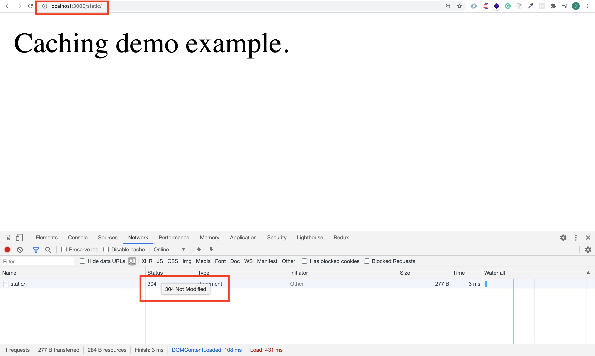
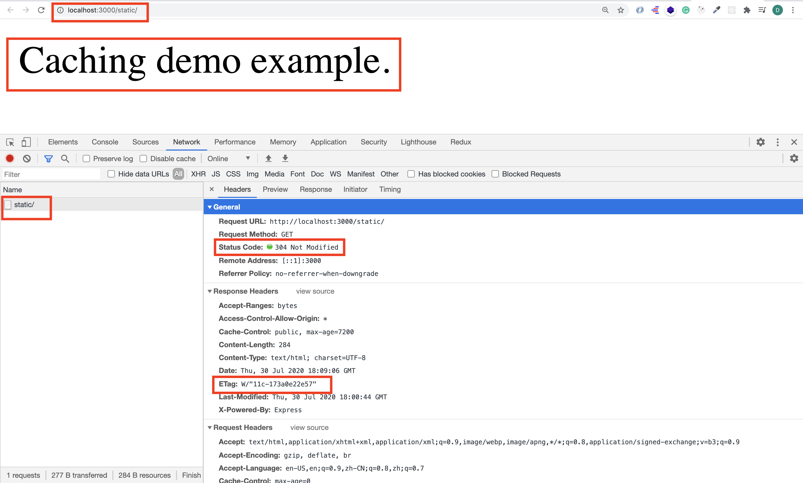
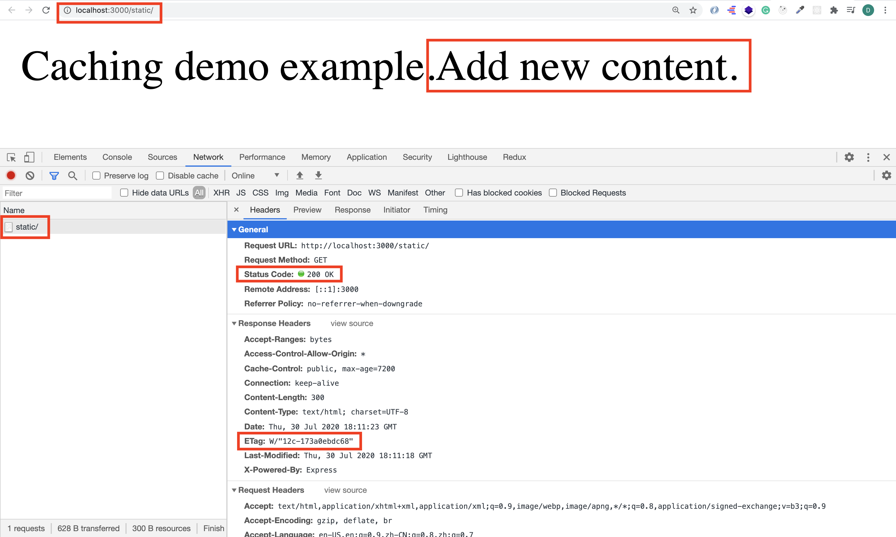
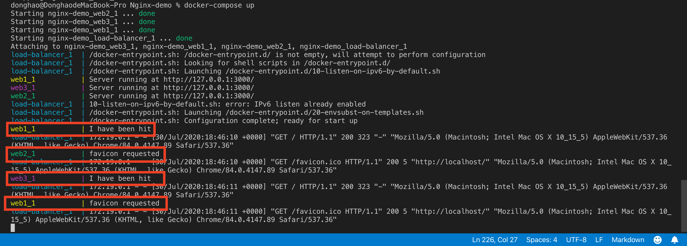
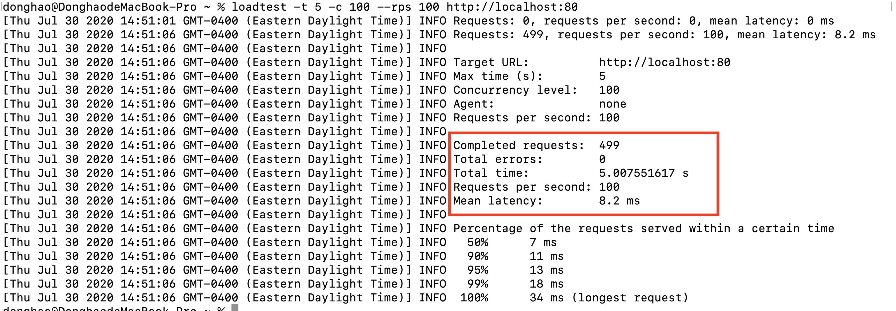

# Web development tools (Part 277)

- #### Click here: [BACK TO NAVIGASTION](https://github.com/DonghaoWu/WebDev-tools-demo/blob/master/README.md)

## `Section: Performance`(Performance-Part3)

### `Summary`: In this documentation, we improve website performance in backend.

### `Check Dependencies & Tools:`

- 

------------------------------------------------------------

#### `本章背景：`

- 本章用到的全部资料：
    - [Cachng](https://www.freecodecamp.org/news/the-hidden-components-of-web-caching-970854fe2c49/)
    - [Cache Headers](https://web.dev/http-cache/)
    - [Caching and Performance](https://devcenter.heroku.com/articles/increasing-application-performance-with-http-cache-headers)

    - [Nginx doc](https://nginx.org/en/docs/)
    - [How to Configure NGINX](https://www.linode.com/docs/web-servers/nginx/how-to-configure-nginx/)

<p align="center">

</p>

------------------------------------------------------------

<p align="center">

</p>

------------------------------------------------------------

### <span id="27.0">`Brief Contents & codes position`</span>

- #### Click here: [BACK TO NAVIGASTION](https://github.com/DonghaoWu/WebDev-tools-demo/blob/master/README.md)

- [27.1 CDNs.](#27.1)
- [27.2 GZIP.](#27.2)
- [27.3 Database scaling.](#27.3)
- [27.4 Caching.](#27.4)
- [27.5 Load Balancing.](#27.5)

------------------------------------------------------------

### <span id="27.1">`Step1: CDNs.`</span>

- #### Click here: [BACK TO CONTENT](#27.0)

  1. Cloudfare, CloudFront(AWS), Content Delivery Network(MS)

    - Improve latency.
    - Deliver static files.

  -------------------------------------------------------------

#### `Comment:`
1. 

### <span id="27.2">`Step2: GZIP.`</span>

- #### Click here: [BACK TO CONTENT](#27.0)

    1. Install.
    ```bash
    $ npm i compression
    ```
  
    2. Apply.
    __`Location: ./demo-apps/GZIP/GZIP-server.js`__

    ```js
    const compression = require('compression');
    const express = require('express');
    const app = express();
    app.use(compression());
    ```

    3. Github pages make it automatically, you cancheck here.

<p align="center">

</p>

------------------------------------------------------------

#### `Comment:`
1. 其他应用还有：brotli
   
### <span id="27.3">`Step3. Database scaling.`</span>

- #### Click here: [BACK TO CONTENT](#27.0)

```diff
+ Indentify inefficient Queries
+ Increase Memory
+ Vertical Scaling (Redis, Memchached)
+ Sharding
+ More Databases
+ Database type
```

#### `Comment:`
1. 

### <span id="27.4">`Step4. Caching.`</span>

- #### Click here: [BACK TO CONTENT](#27.0)

<p align="center">

</p>

------------------------------------------------------------

<p align="center">

</p>

------------------------------------------------------------

<p align="center">

</p>

------------------------------------------------------------

1. Identify files changing:

<p align="center">

</p>

- 在每次 build 命令中会生成不同的文件后缀名，如果修改了文件，就会生成新的后缀名，从而 Caching 会根据文件名的不同更新缓存。

------------------------------------------------------------

2. Caching manually:

    __`Location: ./demo-apps/Caching/server.js`__

    ```js
    const express = require('express');
    const cors = require('cors');
    const path = require('path');

    const app = express();
    app.use(cors());

    // style 1

    app.use('/static', express.static(path.join(__dirname, 'public'), { 'maxage': '2h' }));

    // style 2

    app.get('/hi', (req, res) => {
        res.header('Cache-Control', 'public, max-age=8600');
        res.header('Content-Type', 'text/html');
        res.send(new Buffer('<h2>Test String</h2>'));
    })

    app.listen(3000, () => console.log('Example app listening on port 3000.'))
    ```

------------------------------------------------------------

- 通过 ETag 的不同判断是否需要更新缓存。

<p align="center">

</p>

------------------------------------------------------------

<p align="center">

</p>

------------------------------------------------------------

<p align="center">

</p>

------------------------------------------------------------

#### `Comment:`
1. redis 也可以用来当作 Database 的缓存。

### <span id="27.5">`Step5. Load Balancing.`</span>

- #### Click here: [BACK TO CONTENT](#27.0)

1. Nginx

    __`Location: ./demo-apps/Nginx/nginx/nginx.conf`__

```conf
worker_processes 1;

events { worker_connections 1024; }

http {
  upstream myapp1 {
    server web1:3000;
    server web2:3000;
    server web3:3000;
  }

  server {
    listen 80;
    location / {
      proxy_pass http://myapp1;
    }
    location ~* \.(css|js|gif|jpeg|png)$ {
      expires 168h;
    }
  }
}
```

- Run commands.

```bash
$ docker-compose up --build
```

<p align="center">

</p>

------------------------------------------------------------

- Loadtest

```bash
$ sudo npm install -g loadtest
$ loadtest -t 5 -c 100 --rps 100 http://localhost:80
```

<p align="center">

</p>

- :star: 在 loadtest 结果来看，load balancing 会带来 latency（相对一个 server 没有 load balancing），但 load balancing 给整个服务器系统带来稳定性。

------------------------------------------------------------

#### `Comment:`
1. 相对于使用 Nginx 配置 load balancer，使用 AWS ELB 和 Digital ocean 的 load balancer 很方便。

2. 上面的 Nginx 不是一个典型服务器配置，只是使用一个 container 来模拟 load balancer 运作的状态。


### <span id="27.6">`Step6 Concept questions.`</span>

- #### Click here: [BACK TO CONTENT](#27.0)

  #### `A. `


- #### Click here: [BACK TO CONTENT](#27.0)
- #### Click here: [BACK TO NAVIGASTION](https://github.com/DonghaoWu/WebDev-tools-demo/blob/master/README.md)

