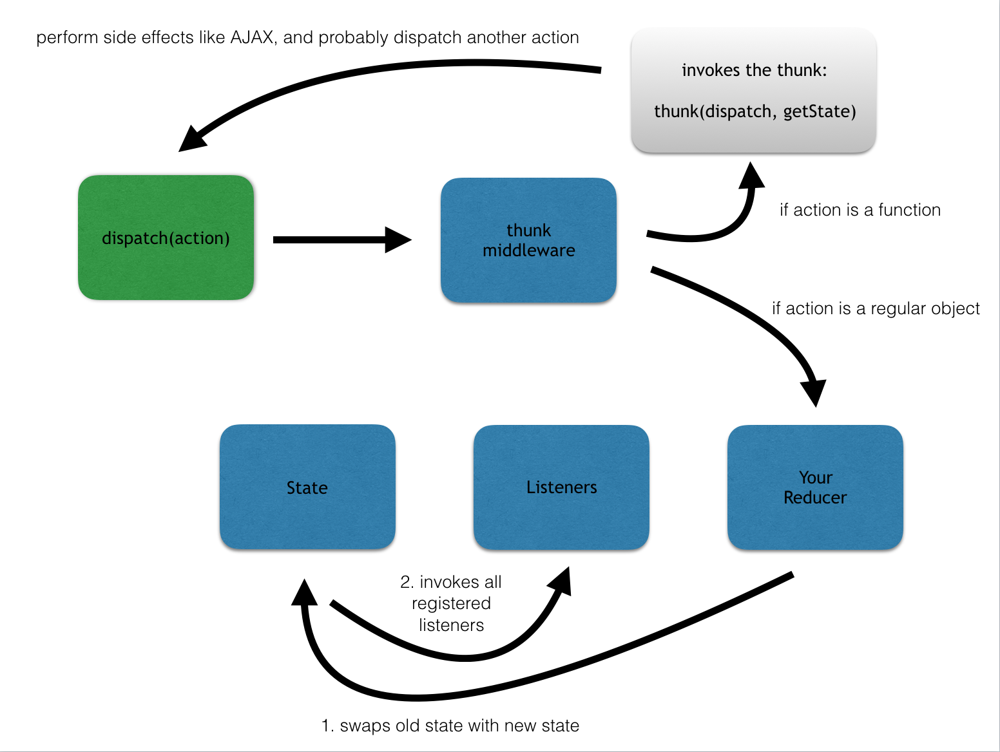

# Web development tools (Part 6)

## `Section: Front-end`(Thunk)

### `Summary`: In this documentation, we learn dispatch & Thunk.

### `Check Dependencies:`

- react
- tachyons
- axios
- redux
- react-redux
- redux-thunk
- redux-logger

------------------------------------------------------------

#### `本章背景：`
- 本章主要介绍如何使用 dispatch & Thunk:
    - 下面我们通过一张图来介绍 thunk 的工作原理：

<p align="center">

</p>

- 本章最重要的几个观点：
  1. `actionCreator`实际上就是一个生成 `object` 的 `fucntion`，`action`实际上就是一个 `object`，这个认识很重要。
  2. 一个很重要的认识是，`thunkMiddleware` 是一个使用在 `redux` 中的中间件，目的是为了将函数打包，简化 `component` 的代码，起锦上添花的作用。所以 `thunkMiddleware` 完全可以不使用，且只使用在 `redux` 中，`react` 用不到。
  3. Within our thunk function, we can perform all the side effects and AJAX we want. When we're done performing side effects, it is very likely that we will end up dispatching another action (or even another thunk), and the process repeats. __`(Important)`__
  4. 大胆的想象，在一个 thunk 里面引用的 `dispatch` 的参数也是一个 `function` ，这就成为了嵌套的 `thunk` 。

### <span id="6.0">`Brief Contents & codes position`</span>
- [6.1 How to use `dispatch`?](#6.1)
- [6.2 How to make async action without thunk middleware?](#6.2)
- [6.3 How to set up thunk middleware?](#6.3)
- [6.4 My understanding.](#6.4)
- [6.5 More material.](#6.5)

------------------------------------------------------------

### <span id="6.1">`Step1: How to use "dispatch"?`</span>

- #### Click here: [BACK TO MENU](#6.0)

- Edition 1:
  1. Set up:

  ```js
  import { createStore } from 'redux';

  const WRITE_MESSAGE = 'WRITE_MESSAGE';

  export const writeMessage = (inputContent) => {
      return {
          type: WRITE_MESSAGE,
          payload: inputContent,
      };
  }

  const initialState = {
      newMessageEntry: '',
  }

  const reducer = (state = initialState, action) => {
    switch (action.type) {
        case WRITE_MESSAGE:
            return { ...state, newMessageEntry: action.payload };
        default:
            return state;
    }
  }

  export default createStore(reducer);
  ```

  2. Execute the action by using `dispatch`

    ```js
    import React, { Component } from 'react';
    import store from '../store';
    import { writeMessage, postMessage } from '../store';
    import axios from 'axios';
    import socket from '../socket'


    export default class NewMessageEntry extends Component {
      constructor() {
        super();
        this.state = store.getState();
      }

      componentDidMount() {
        this.unsubscribe = store.subscribe(() => this.setState(store.getState()));
      }

      componentWillUnmount() {
        this.unsubscribe();
      }

      handleChange = (evt) => {
        store.dispatch(writeMessage(evt.target.value))
      }

      handleSubmit = (evt) => {
        event.preventDefault();
        const content = this.state.newMessageEntry;
        const channelId = this.props.channelId;

        store.dispatch(postMessage(content, channelId, this.state.nameEntry))
      }

      render() {
        return (
          <form id="new-message-form" onSubmit={this.handleSubmit}>
            <div className="input-group input-group-lg">
              <input
                className="form-control"
                type="text"
                name="content"
                placeholder="Say something nice..."
                value={this.state.newMessageEntry}
                onChange={this.handleChange}
              />
              <span className="input-group-btn">
                <button className="btn btn-default" type="submit">Chat!</button>
              </span>
            </div>
          </form>
        );
      }
    }
    ```

#### `Comment:`
1. 核心代码：
```jsx
export const writeMessage = (inputContent) => {
    return {
        type: WRITE_MESSAGE,
        payload: inputContent,
    };
}

handleChange = (evt) => {
    store.dispatch(writeMessage(evt.target.value))
}

// ...
onChange={this.handleChange}
```
2. 解说：
  - 用户输入，引发 `onChange` 对应的函数 `handleChange`;
  - `onChange` 引发时会产生一个变量，可以命名为 `evt` 或 `event`，这个变量自动注入 `handleChange` 需要的第一个参数中，输入的变量值为 `evt.target.value`。

  - 执行：
    ```jsx
    store.dispatch(writeMessage(evt.target.value));
    ```
    先执行：
    ```jsx
    writeMessage(evt.target.value);
    ```
    实际得到：
    ```jsx
    store.dispatch({
      type: WRITE_MESSAGE,
      payload: evt.target.value,
    });
    ```
  
3. dispatch:
  - 在这里，`dispatch` 的参数其实是一个 `object`，所以最原始的方法是不用定义 action，而是写成：

  ```jsx
  handleChange = (evt) => {
    store.dispatch({
      type: WRITE_MESSAGE,
      payload: evt.target.value,
    });
  }
  ```

  - 由以上可知，`actionCreator`实际上就是一个生成 `object` 的 `fucntion`，`action`实际上就是一个 `object`，这个认识很重要。

  - 当 `dispatch` 把 `object` 派送出去之后，`reducer`就自动接受这个`object`，然后改变对应的 `state`。

  - 在没有 `thunkMiddleware` 的情况下，`dispatch` 的作用只是用来传递一个 `object` 到 `reducer`.

### <span id="6.2">`Step2: How to make async action without thunk middleware？`</span>

- #### Click here: [BACK TO MENU](#6.0)

- Edition 2:
  1. Set up:

  ```js
  import { createStore } from 'redux';

  const GOT_MESSAGES_FROM_SERVER = 'GOT_MESSAGES_FROM_SERVER';

  export const gotMessagesFromServer = (messages) => {
      return {
          type: GOT_MESSAGES_FROM_SERVER,
          payload: messages,
      }
  }

  const initialState = {
    messages: []
  }

  const reducer = (state = initialState, action) => {
    switch (action.type) {
        case GOT_MESSAGES_FROM_SERVER:
            return { ...state, messages: [...action.payload] };
        default:
            return state;
    }
  }
  ```
2. Execute the async action by using `dispatch`.

    ```jsx
    import React, { Component } from 'react';
    import Message from './Message';
    import NewMessageEntry from './NewMessageEntry';
    import axios from 'axios';
    import store from '../store';
    import { gotMessagesFromServer } from '../store';

    export default class MessagesList extends Component {

      constructor() {
        super();
        this.state = store.getState();
      }

      componentDidMount() {
        axios.get('/api/messages')
          .then(res => res.data)
          .then(messages => store.dispatch(gotMessagesFromServer(messages)));

        this.unsubscribe = store.subscribe(() => this.setState(store.getState()));
      }

      componentWillUnmount() {
        this.unsubscribe();
      }

      render() {

        const channelId = Number(this.props.match.params.channelId);
        const messages = this.state.messages;
        const filteredMessages = messages.filter(message => message.channelId === channelId);
        return (
          <div>
            <ul className="media-list">
              {filteredMessages.map(message => <Message message={message} key={message.id} />)}
            </ul>
            <NewMessageEntry channelId={channelId} />
          </div>
        );
      }
    }
    ```

#### `Comment:`
1. 核心代码：
```jsx
componentDidMount() {
  axios.get('/api/messages')
    .then(res => res.data)
    .then(messages => store.dispatch(gotMessagesFromServer(messages)));

  this.unsubscribe = store.subscribe(() => this.setState(store.getState()));
}
```

2. 解说：
  - 这里代码的意思是使用一个 promise，当完成 `axios` 的请求后，调用 `dispatch` 对获取的数据作为 `actionCreator` 的一个参数生成一个 `object`，然后用 `dispatch` 把它派发到 `reducer` 中去。

  - `4月18日更新，这里感觉不是使用一个 promise，而是一个异步函数加一个同步函数，同步函数先完成，异步函数后完成，顺序是先连接 state 后改变 state。例如，如果把代码写成这样：`
  ```jsx
  componentDidMount() {
    console.log('1=>');

    axios.get('/api/messages')
      .then(res => res.data)
      .then(messages => {
        console.log('2=>');
        store.dispatch(gotMessagesFromServer(messages))
      });

    console.log('3=>');

    this.unsubscribe = store.subscribe(() => this.setState(store.getState()));

    console.log('4=>');
  }
  ```

  #### 这样在 console 显示的结果是，`1=>3=>4=>2`。

  - 这里说明就算不用 `middleware` ，也可以完成 `async action`，然后至于为什么引入`thunkMiddleware` 是因为想把 `component` 中的函数部分简化成一个名字，然后把具体的函数代码放到一个文件统一管理。

  - 4月18日更新，以上讲法是不完全成立的，`async function` 带来的 `side effect`是不可控的，所以不用`middleware`完成`async action`的观点不成立，解决方案目前想到的是 `thunkMiddleware` 或者 `promise`。（以下例子证明 `thunkMiddleware` 不成立。）

  - 以下代码验证：

    ```jsx
    componentDidMount() {
        console.log('1');
        store.dispatch(fetchMessages());
        console.log('3');
        this.unsubscribe = store.subscribe(() => this.setState(store.getState()));
        console.log('4');
    }
    ```

 - 结果仍然是 `1=>3=>4=>2`，所以这个方法还是没能实现最开始的`顺序执行，1，2，3，4`的设想，解决这个设想需要学习 `async & promise` 的内容。

### <span id="6.3">`Step3: How to set up thunk middleware?`</span>

- #### Click here: [BACK TO MENU](#6.0)

- Import and apply the middleware.
```jsx
import { createStore, applyMiddleware } from 'redux';
import thunkMiddleware from 'redux-thunk';

export default createStore(reducer, applyMiddleware(thunkMiddleware));
```

- Conver the old code.

  - Previous function:
  ```jsx
  componentDidMount() {
    axios.get('/api/messages')
      .then(res => res.data)
      .then(messages => store.dispatch(gotMessagesFromServer(messages)));

    this.unsubscribe = store.subscribe(() => this.setState(store.getState()));
  }
  ```

  - New function (Thunk):
  ```jsx
  import store from '../store';

  const gotNewMessageFromServer = (message) => {
    return {
        type: GOT_NEW_MESSAGE_FROM_SERVER,
        payload: message
    };
  }

  const fetchMessages = () => {
    return (dispatch) => {
        axios.get('/api/messages')
            .then(res => res.data)
            .then(messages => dispatch(gotMessagesFromServer(messages)));
    }
  }

  componentDidMount() {
    store.dispatch(fetchMessages());

    this.unsubscribe = store.subscribe(() => this.setState(store.getState()));
  }
  ```

#### `Comment:`
```diff
- componentDidMount() {
-    axios.get('/api/messages')
-     .then(res => res.data)
-      .then(messages => store.dispatch(gotMessagesFromServer(messages)));
-    this.unsubscribe = store.subscribe(() => this.setState(store.getState()));
- }

+ componentDidMount() {
+    store.dispatch(fetchMessages());
+    this.unsubscribe = store.subscribe(() => this.setState(store.getState()));
+ }
```
1. 主要变化是原来的 `dispatch` 只能以 `object` 为参数，引进 `thunkMiddleware` 之后 `dispatch` 可以以 `function` 为参数了，执行过程是如果 `dispatch` 的参数是 `function` 时，它会马上执行这个 `function` ，而由于这个函数是一个 `async function`，它会一直等着整个 `promise` 完成之后然后再调用 `dispatch` 一个结果（`object`）到 `reducer`。

2. 一个很重要的认识是，`thunkMiddleware` 是一个使用在 `redux` 中的中间件，目的是为了将函数打包，简化 `component` 的代码，起锦上添花的作用。所以 `thunkMiddleware` 完全可以不使用，且只使用在 `redux` 中，`react` 用不到。

3. Thunk 的英文资料整理在 `step5`。

### <span id="6.4">`Step4: My understanding.`</span>

- #### Click here: [BACK TO MENU](#6.0)

1. 既然 `dispatch` 是用来派发 `actionCreator` 生成的对象，那么如果按照这个逻辑，如果我有一个 `async function` 返回一个对象，是不是可以通过直接 `dispatch` 这个对象从而完成任务，而不用使用 `thunk` 来实现？按照上面的想法，我写了这个：

```jsx
export const fetchMessages = () => {
    axios.get('/api/messages')
        .then(res => res.data)
        .then(messages => {
            return {
                action: GOT_MESSAGES_FROM_SERVER,
                payload: messages,
            }
        });
}
```

2. 以上结果是行不通的，具体原因未明。应该是跟 `promise` 是 `async action` 而不能返回 `object` 有关，实际使用中，上面这个 `fetchMessages()` 返回的是 `undefined`。

3. 后续跟进，需要补充 `promise` 和 `async function` 之后，估计可以使用 `promise` 的方法来实现。


#### `Comment:`
1. 

### <span id="6.5">`Step5: More materials.`</span>

- #### Click here: [BACK TO MENU](#6.0)

1. With thunkMiddleware, whenever we use store.dispatch, it will be a three-step process
  1. The store checks to see if the thing we passed to `dispatch` is a regular object or a function. 
    a. If it's a function, the store invokes that function immediately and passes the `dispatch` and `getState` methods to it as arguments. Do not move on to step 2.
    b. If it's a regular object, move on to step 2.
  2. The store invokes our reducer with the action and the previous state, and sets the return value 
    as the new state.
  3. The store invokes all listeners that have been registered with it (via `store.subscribe`).

2. Before, our reducer expected an action to be a plain JavaScript object with some identifying type field. However, thunk middleware will give us a powerful new ability: instead of dispatching an action object, we can dispatch a function! When thunkMiddleware sees that we've dispatched a function instead of a regular object, it will say,

  - Hey! This isn't a regular action! It's a function! I can't give this to the reducer, `so instead I'll invoke it and pass the store's dispatch method to it, so that whenever that side effect completes or the async action resolves, they can use it to dispatch a new action with whatever data they get.` (这句很重要，middlware 里面继续处理 async function，外面依然处理同步函数！)

3. `Thunk`: a function that we can pass to "store.dispatch" if we configure our store with "thunkMiddleware". If we dispatch a thunk, the thunk middleware will invoke the function and pass the store's "dispatch" and "getState" methods to it. Thunks are a desirable place to perform side effects (like AJAX requests) because it de-clutters our components, and because `they make it easy to eventually dispatch other actions when some asynchronous behavior resolves.`(这句很重要！)

4. Within our thunk function, we can perform all the side effects and AJAX we want. When we're done performing side effects, it is very likely that we will end up dispatching another action (or even another thunk), and the process repeats.


- #### Click here: [BACK TO MENU](#6.0)