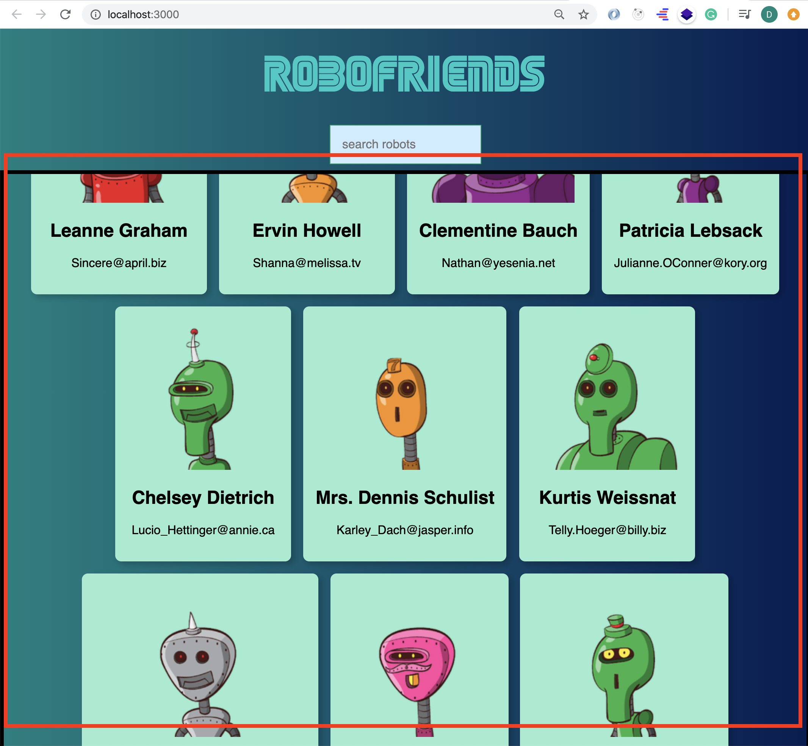

# Web development tools (Part 4)

## `Section: Front-end`(React)

### `Summary`: In this documentation, we learn React.js.

### `Check Dependencies:`

- react
- tachyons
- axios

------------------------------------------------------------

#### `本章背景：`
- 先放一个典型的 react 文件，里面包含本章内容的大部分要点：

__`Location: ./robotfriends/src/App.js`__

```jsx
import React, { Component } from 'react';
import CardList from '../components/CardList';
import SearchBox from '../components/SearchBox';
import Scroll from '../components/Scroll';
import ErrorBoundary from '../components/ErrorBoundary';
import axios from 'axios';
import './App.css';

class App extends Component {
  constructor() {
    super();
    this.state = {
      robots: [],
      searchfield: ''
    }
  }

  componentDidMount = async () => {
    try {
      const response = await axios.get('https://jsonplaceholder.typicode.com/users');
      const robots = response.data;
      this.setState(this.setState({ robots: robots }));
    } catch (error) {
      console.log(error);
    }
    // fetch('https://jsonplaceholder.typicode.com/users')
    //   .then(response => response.json())
    //   .then(users => this.setState({ robots: users }));
  }

  onSearchChange = (event) => {
    this.setState({ searchfield: event.target.value })
  }

  render() {
    const { robots, searchfield } = this.state;
    const filteredRobots = robots.filter(robot => {
      return robot.name.toLowerCase().includes(searchfield.toLowerCase());
    })
    return !robots.length ?
      <h1>Loading</h1> :
      (
        <div className='tc'>
          <h1 className='f1'>RoboFriends</h1>
          <SearchBox searchChange={this.onSearchChange} />
          <Scroll>
            <ErrorBoundary>
              <CardList robots={filteredRobots} />
            </ErrorBoundary>
          </Scroll>
        </div>
      );
  }
}

export default App;
```

```diff

```

### <span id="4.0">`Brief Contents & codes position`</span>
- [4.1 About `create-react-app` command.](#4.1)
- [4.2 Class component & Functional component.](#4.2)
- [4.3 Props & state.](#4.3)
- [4.4 Wrap component & `<Fragment>`.](#4.4)
- [4.5 life-cycle.](#4.5)
- [4.6 React error boundary.](#4.6)
- [4.7 React syntax.](#4.7)
- [4.8 Deploy React app in Github.](#4.8)

------------------------------------------------------------

### <span id="4.1">`Step1: About create-react-app command.`</span>

- #### Click here: [BACK TO MENU](#4.0)

- 旧版操作
```bash
$ sudo npm install -g create-react-app # only run once.

$ create-react-app YOUR-APP-NAME
$ cd YOUR-APP-NAME
$ npm start
```

- 新版操作
```bash
$ npx create-react-app YOUR-APP-NAME
```

- 升级 `create-react-app` 方法：
    1. 手动修改：
        __`Location: ./package.json`__ 里面的`"react-scripts":"2.1.1",`版本号。

    2. 执行命令：

    ```bash
    $ npm install
    ```

- Keep your project up to date and secure, `update all dependencies and fix vulnerabilities`
    
    ```bash
    $ npm audit fix
    $ npm audit
    $ npm audit fix --force

    $ npm update
    ```
- Build a production code.
    
    ```bash
    $ npm run build
    ```

#### `Comment:`
1. 

### <span id="4.2">`Step2: Class component & Functional component.`</span>

- #### Click here: [BACK TO MENU](#4.0)

__`Location: ./robotfriends/src/App.js`__

- Class component
```jsx
import React from 'react';
import logo from './logo.svg';
import './App.css';
 
class App extends React.Component {
  render() {
    return (
      <div className="App">
        <header className="App-header">
          
          <p>
            Edit <code>src/App.js</code> and save to reload.
          </p>
          <a
            className="App-link"
            href="https://reactjs.org"
            target="_blank"
            rel="noopener noreferrer"
          >
            Learn React
          </a>
        </header>
      </div>
    );
  }
}
 
export default App;
```

- Functional component.

```jsx
import React from 'react';
import logo from './logo.svg';
import './App.css';

function App() { // const App = () =>{}
  return (
    <div className="App">
      <header className="App-header">
        
        <p>
          Edit <code>src/App.js</code> and save to reload.
        </p>
        <a
          className="App-link"
          href="https://reactjs.org"
          target="_blank"
          rel="noopener noreferrer"
        >
          Learn React
        </a>
      </header>
    </div>
  );
}

export default App;
```

#### `Comment:`
1. React 相关语法

```jsx
render(){
    // 必须有return
    return ( //return 里面必须用括号包住
        <div>只能有一个 div / element </div> 
    )
}
```

2. class component 里面有 `render(){}`，但是 funcitonal component 里面不需要，直接是 `return()`。


### <span id="4.3">`Step3: Props & state.`</span>

- #### Click here: [BACK TO MENU](#4.0)

- 从 parent component 向 child component 传递数据。

```jsx
ReactDOM.render(<Hello greeting={'Hello'} />, document.getElementById('root'))
```

- 在 child component 接收数据。

```jsx
    { this.props.greeting } // class component

    { props.greeting } // functional component
```

- 例子：

    - Class component.
    ```jsx
    import React, {Component} from 'react';
    import './Hello.css';

    class HelloClass extends Component{
        render(){
            return(
                <div className='f1 tc'>
                    <h1>Hello</h1>
                    <p>{this.props.greeting}</p>
                </div>
            )
        }
    }

    export default HelloClass;
    ```

    - Functional component.

    ```jsx
    import React from 'react';
    import './Hello.css';

    const HelloFunc = (props)=>{ // const HelloFunc = ({ greeting }) => {}
        return(
            <div className='f1 tc'>
                <h1>Hello</h1>
                <p>{props.greeting}</p>
            </div>
        )
    }

    export default HelloFunc;
    ```

#### `Comment:`
1. 

### <span id="4.4">`Step4: <Fragment> & Wrap component.`</span>

- #### Click here: [BACK TO MENU](#4.0)

A. __为什么要使用 `<Fragment>`？__

1. 如果你想要：

```jsx
    <table>
        <tr>
            <td>Hello</td>
            <td>World</td>
        </tr>
    </table>
```

2. 但按照以前写的方法：

```jsx
    class Table extends React.Component {
        render() {
            return (
                <table>
                    <tr>
                        <Columns />
                    </tr>
                </table>
            );
        }
    }

    class Columns extends React.Component {
        render() {
            return (
                <div>
                    <td>Hello</td>
                    <td>World</td>
                </div>
            );
        }
    }
```

3. 将会得到：
```jsx
    <table>
        <tr>
            <div>
                <td>Hello</td>
                <td>World</td>
            </div>
        </tr>
    </table>
```

4. 这不是我们想要的，所以使用 Fragment 改写：

```jsx
import { Fragment } from React;

class Columns extends React.Component {
    render() {
        return (
            <Fragment>
                <td>Hello</td>
                <td>World</td>
            </Fragment>
        );
    }
}

export default Columns;
```

B. __如何实现`窗中窗`功能 Wrap component？__

__`Location: ./robotfriends/src/containers/App.js`__

```jsx
import Scroll from 'Scroll';

<Scroll>
    <CardList robots={filterdRobots} />
</Scroll>
```

__`Location: ./robotfriends/src/components/Scoll.js`__

```jsx
import React from 'react';

const Scroll = (props) => {
  return (
    <div style={{ overflow: 'scroll', border: '5px solid black', height: '800px' }}>
      {props.children}
    </div>
  );
};

export default Scroll;
```

效果展示：

<p align="center">

</p>

#### `Comment:`
1. 在这里 `props.children` 就相当于被包围的子组件 `CardList`。

### <span id="4.5">`Step5: life-cycle.`</span>

- #### Click here: [BACK TO MENU](#4.0)

__`Location: ./robotfriends/src/containers/App.js`__

```jsx
componentDidMount() {
    fetch('https://jsonplaceholder.typicode.com/users')
        .then(response => response.json())
        .then(users => { this.setState({ robots: users }) });
}
```

- 或者引用 axios 代替 fetch

```jsx
componentDidMount = async () => {
    try {
        const response = await axios.get('https://jsonplaceholder.typicode.com/users');
        const robots = response.data;
        this.setState(this.setState({ robots: robots }));
    } catch (error) {
        console.log(error);
    }
}
```

#### `Comment:`
1. 

### <span id="4.6">`Step6: React error boundary.`</span>

- #### Click here: [BACK TO MENU](#4.0)

__`Location: ./robotfriends/src/components/ErrorBoundary.js`__

```jsx
import React, { Component } from 'react';

class ErrorBoundary extends Component {
    constructor(props) {
        super(props);
        this.state = {
            hasError: false,
        }
    }

    componentDidCatch(error, info) {
        this.setState({ hasError: true })
    }

    render() {
        if (this.state.hasError) {
            return <h1>Something is wrong.</h1>
        }
        return this.props.children;
    }
}

export default ErrorBoundary;
```

- 使用方法：
__`Location: ./robotfriends/src/containers/App.js`__

```jsx
<Scroll>
    <ErrorBoundary>
        <CardList robots={filteredRobots} />
    </ErrorBoundary>
</Scroll>
```

- 测试方法：

__`Location: ./robotfriends/src/components/CardList.js`__

```jsx
import React from 'react';
import Card from './Card';

const CardList = ({ robots }) => {
  if (true) throw new Error('This is a test from CardList component.');
  return (
    <div>
      {
        robots.map((user, i) => {
          return (
            <Card
              key={i}
              id={robots[i].id}
              name={robots[i].name}
              email={robots[i].email}
            />
          );
        })
      }
    </div>
  );
}

export default CardList;
```

效果展示：

<p align="center">

</p>

#### `Comment:`
1. react error boundary，类似于后端的 error handling。
2. 这里叠加了一个 children wrap component 的操作。
3. 这个只会在 production 模式中看到详细出错的地方。
4. componentDidCatch() 是一个新的 method，主要是捕捉错误。


### <span id="4.7">`Step7: React syntax.`</span>

- #### Click here: [BACK TO MENU](#4.0)

1. 必须要写 `import React from 'react';`才能使用 JSX 语句。

2. 不是 export default 情况，JSX 中填入 JS 变量都需要使用 `{}`，也叫做 distructuring。

3. file structure
    - components folder: pure functions
    - containers folder: state functions

4. 使用 className 而不是 class。

5. json() is a promise.

6. fetch() is a window method.

7. Every time the state change, call render() method again.

8. ternary `? :`.

9. 多个 component 显示。

```jsx
import { robots } from './robots';

ReactDOM.render(
    <div>
        <Hello />
        <Hello />
        <Hello />
        <Hello />
    </div>,
    document.getElementById('root'))
```

10. 使用 API 获得图片。

```jsx

```

11. Distructuring。

```jsx
import React from 'react';
import './Hello.css';

const HelloFunc = ({ greeting }) => {
    return (
        <div className='f1 tc'>
            <h1>Hello</h1>
            <p>{greeting}</p>
        </div>
    )
}

export default HelloFunc;
```

12. Using map method to render an array :

```jsx
import React from 'react';
import Card from './Card';

const CardList = ({ robots }) => {
    const cardsArray = robots.map((user, i) => {
        return <Card
                key={i}
                id={robots[i].id}
                name={robots[i].name}
                email={robots[i].email}
        />
    })
    return (
        <div>
            {cardsArray}
        </div>
    )
}
```

13. Defind a bind function,及向下传递一个函数，这个函数的操作会影响在父组件的 state 的值。`在这里要说明的是，在类中使用箭头定义法就不用在 constructor 中使用 bind 操作。`

```jsx
class App extends Component {
    constructor() {
        super();
        this.state = {
            robots: robots,
            searchField: '',
        }
    }

    onSearchChange = (event) => {
        this.setState({ searchField: event.target.value })
    }

    render() {
        const filterdRobots = this.state.robots.filter(robot => {
            return robot.name.toLowerCase().includes(this.state.searchField.toLowerCase())
        })
        return (
            <div>
                <h1>Robots Friends</h1>
                <SearchBox onSearchChange={this.onSearchChange} />
                <CardList robots={filterdRobots} />
            </div>
        )
    }
}
```

14. 在子组件引用父组件的函数：

__`Location: ./robotfriends/src/components/SearchBox.js`__

```jsx
import React from 'react';

const SearchBox = ({ searchChange }) => {
  return (
    <div className='pa2'>
      <input
        className='pa3 ba b--green bg-lightest-blue'
        type='search'
        placeholder='search robots'
        onChange={searchChange}
      />
    </div>
  );
}

export default SearchBox;
```

#### `Comment:`
1. 

### <span id="4.8">`Step8: Deploy React app in Github.`</span>

- #### Click here: [BACK TO MENU](#4.0)

- Link: [https://create-react-app.dev/docs/deployment/](https://create-react-app.dev/docs/deployment/)

### `Step9 Concept questions.`

#### `A. How does react life-cycle work?`

<p align="center">

</p>

- #### Click here: [BACK TO MENU](#4.0)