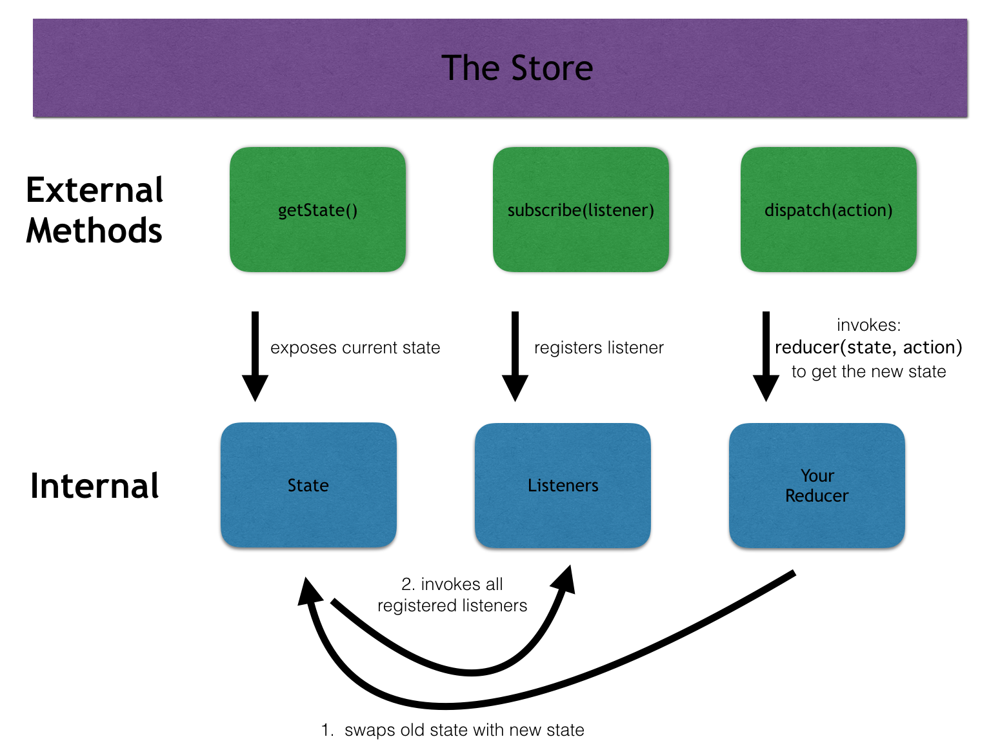

# Web development tools (Part 5)

- #### Click here: [BACK TO NAVIGASTION](https://github.com/DonghaoWu/WebDev-tools-demo/blob/master/README.md)

## `Section: Front-end`(Redux)

### `Summary`: In this documentation, we learn Redux.js.

### `Check Dependencies & Tools:`

- react
- tachyons
- axios

```diff
+ redux
+ react-redux
+ redux-thunk
+ redux-logger
```

------------------------------------------------------------

#### `本章背景：`
- 本章主要介绍如何使用 redux：

- redux 的 八大要素：
    - store
    - rootReducer
    - Provider
    - constants.js 或者 type.js
    - actions
    - reducers
    - connect
    - dispatch

------------------------------------------------------------

### <span id="5.0">`Brief Contents & codes position`</span>

- #### Click here: [BACK TO NAVIGASTION](https://github.com/DonghaoWu/WebDev-tools-demo/blob/master/README.md)

- [5.1 Install the dependencies.](#5.1)
- [5.2 Set up store, combineReducers and apply middleware.](#5.2)
- [5.3 Set up types, actions, initial state, reducers.](#5.3)
- [5.4 Connect state and method to components and use the props and methods.](#5.4)
- [5.5 Create redux async fucntion.](#5.5)

------------------------------------------------------------

### <span id="5.1">`Step1: Install the dependencies.`</span>

- #### Click here: [BACK TO CONTENT](#5.0)

  ```bash
  $ npm i redux
  $ npm i react-redux
  $ npm i redux-logger
  $ npm i redux-thunk
  ```

#### `Comment:`
1. 

### <span id="5.2">`Step2: Set up store, combineReducers and apply middleware.`</span>

- #### Click here: [BACK TO CONTENT](#5.0)

  1. store and redux middleware.

  __`Location: ./demo-apps/robotFriends-Redux/src/store.js`__

  ```jsx
  import { applyMiddleware, createStore } from 'redux';
  import thunkMiddleware from 'redux-thunk';
  import { createLogger } from 'redux-logger';
  import rootReducer from './rootReducer';

  const logger = createLogger()

  const store = createStore(rootReducer, applyMiddleware(thunkMiddleware, logger))

  export default store;
  ```

  2. rootReducer

  __`Location: ./demo-apps/robotFriends-Redux/src/rootReducer.js`__

  ```jsx
  import { requestRobotsReducer, searchRobotsReducer } from './reducers';
  import { combineReducers } from 'redux';

  const rootReducer = combineReducers({ requestRobotsReducer, searchRobotsReducer });

  export default rootReducer;
  ```

  3. Apply redux to application.

  __`Location: ./demo-apps/robotFriends-Redux/src/index.js`__

  ```jsx
  import React from 'react';
  import ReactDOM from 'react-dom';
  import 'tachyons';
  import App from './containers/App';
  import registerServiceWorker from './registerServiceWorker';
  import { Provider } from 'react-redux';
  import store from './store'
  import './index.css';

  ReactDOM.render(
    <Provider store={store}>
      <App />
    </Provider>,
    document.getElementById('root')
  );
  registerServiceWorker();
  ```

#### `Comment:`
1. 

### <span id="5.3">`Step3: Set up types, actions, reducers.`</span>

- #### Click here: [BACK TO CONTENT](#5.0)

  1. TYPES

  __`Location: ./demo-apps/robotFriends-Redux/src/constants.js`__

  ```jsx
  export const CHANGE_SEARCHFIELD = 'CHANGE_SEARCHFIELD';

  export const REQUEST_ROBOTS_PENDING = 'REQUEST_ROBOTS_PENDING';
  export const REQUEST_ROBOTS_SUCCESS = 'REQUEST_ROBOTS_SUCCESS';
  export const REQUEST_ROBOTS_FAILED = 'REQUEST_ROBOTS_FAILED';
  ```

  2. ACTIONS

  __`Location: ./demo-apps/robotFriends-Redux/src/actions.js`__

  ```jsx
  import { apiCall } from './api/api'
  import {
    CHANGE_SEARCHFIELD,
    REQUEST_ROBOTS_PENDING,
    REQUEST_ROBOTS_SUCCESS,
    REQUEST_ROBOTS_FAILED
  } from './constants'


  export const setSearchField = (text) => ({ type: CHANGE_SEARCHFIELD, payload: text })

  export const requestRobots = () => (dispatch) => {
    dispatch({ type: REQUEST_ROBOTS_PENDING })
    apiCall('https://jsonplaceholder.typicode.com/users')
      .then(data => dispatch({ type: REQUEST_ROBOTS_SUCCESS, payload: data }))
      .catch(error => dispatch({ type: REQUEST_ROBOTS_FAILED, payload: error }))
  }
  ```

  3. REDUCERS

  __`Location: ./demo-apps/robotFriends-Redux/src/actions.js`__

  ```jsx
  import {
    CHANGE_SEARCHFIELD,
    REQUEST_ROBOTS_PENDING,
    REQUEST_ROBOTS_SUCCESS,
    REQUEST_ROBOTS_FAILED
  } from './constants';

  const initialStateSearch = {
    searchField: ''
  }

  export const searchRobotsReducer = (state = initialStateSearch, action = {}) => {
    switch (action.type) {
      case CHANGE_SEARCHFIELD:
        return { ...state, searchField: action.payload }
      default:
        return state
    }
  }

  const initialStateRobots = {
    robots: [],
    isPending: true,
    error: '',
  }

  export const requestRobotsReducer = (state = initialStateRobots, action = {}) => {
    switch (action.type) {
      case REQUEST_ROBOTS_PENDING:
        return { ...state, isPending: true }
      case REQUEST_ROBOTS_SUCCESS:
        return { ...state, robots: action.payload, isPending: false }
      case REQUEST_ROBOTS_FAILED:
        return { ...state, error: action.payload }
      default:
        return state
    }
  }
  ```

#### `Comment:`
1. 在这里需要说明一个事情，第一个函数 `setSearchField` 实际是一个返回 `Object` 的函数，所以在后面调用的时候直接使用 `dispatch` 就可以将 `Object` 派发到对应的 `reducer` 中。这里的函数相当于是一个 `同步函数`。可以认为普通 `dispatch` 是用来派发 `Object` 的。

2. 第二个函数 `requestRobots` 是一个异步函数，使用的 `dispatch` 需要预先加载 middleware ，后面会有详细分析。

### <span id="5.4">`Step4: Connect state and method to components and use the props and methods.`</span>

- #### Click here: [BACK TO CONTENT](#5.0)

- 主要代码：
```jsx
import { connect } from 'react-redux';
import { setSearchField, requestRobots } from '../actions';

class App extends Component {
  // ...
  
  componentDidMount() {
    this.props.onRequestRobots();
  }

  render() {
    const { robots, searchField, onSearchChange, isPending } = this.props;
    // ...
  }
}

const mapStateToProps = (state) => {
  return {
    searchField: state.searchRobotsReducer.searchField,
    robots: state.requestRobotsReducer.robots,
    isPending: state.requestRobotsReducer.isPending
  }
}

const mapDispatchToProps = (dispatch) => {
  return {
    onSearchChange: (event) => dispatch(setSearchField(event.target.value)),
    onRequestRobots: () => dispatch(requestRobots())
  }
}

export default connect(mapStateToProps, mapDispatchToProps)(App)
```

#### `Comment:`
1. 之前有种写法：

    ```jsx
    export default connect(mapStateToProps, { setSearchField, requestRobots})(App);
    ```
    - 在这里出现了错误，具体原因后面分析。

2. 连接 component 的几大要素：

    - action functions
    - mapStateToProps
    - mapDispatchToProps
    - connect


### <span id="5.5">`Step5: Create redux async fucntion.`</span>

- #### Click here: [BACK TO CONTENT](#5.0)

- 下面具体来分析 `dispatch` 的使用。

- 例子一：dispatch 同步函数的结果 :arrow_right: `object`。

  ```jsx
  // 定义一个同步函数，作为一个 action ，返回一个 object。
  const setSearchField = (text) => ({ type: CHANGE_SEARCHFIELD, payload: text });

  // onSearchChange 是一个函数，它的运作顺序是接收变量，执行 setSearchField 后返回一个 object，最后调用 dispatch 进行派发 object。
  const mapDispatchToProps = (dispatch) => {
    return {
            onSearchChange: (event) => dispatch(setSearchField(event.target.value))
    }
  }

  // 父组件的函数向下传递
  <SearchBox searchChange={this.props.onSearchChange} />

  // 在这里有点特殊，当用户输入时，onChange 触发，同时 searchChange 触发，同时自动捕捉输入时产生的 event 变量并自动放到 searchChange 中作为变量。
  const SearchBox = ({ searchfield, searchChange }) => {
    return (
      <div className='pa2'>
        <input
          className='pa3 ba b--green bg-lightest-blue'
          type='search'
          placeholder='search robots'
          onChange={searchChange}
        />
      </div>
    );
  }
  ```

#### `Comment:`
1. 运行顺序：
    - 用户输入
    - onChange(event)
    - searchChange(event)
    - onSearchChange(event)
    - setSearchField(event.target.value) 获得一个 `object`
    - dispatch({ object })
    - reducer: searchRobotsReducer

- 例子二：dispatch 函数 :arrow_right: 特指异步函数。

  ```jsx
  // 定义一个函数，作为一个 action ，返回一个 function。
  export const requestRobots = () => {
    return fucntion(dispatch){
      dispatch({ type: REQUEST_ROBOTS_PENDING })
      fetch('https://jsonplaceholder.typicode.com/users')
        .then(data => dispatch({ type: REQUEST_ROBOTS_SUCCESS, payload: data }))
        .catch(error => dispatch({ type: REQUEST_ROBOTS_FAILED, payload: error }))
    }
  }

  // onRequestRobots 返回一个函数，例子一 dispatch 的参数是一个 object，由一个同步函数返回的 object，例子二 dispatch 的参数是一个 function，由一个同步函数返回的 异步函数。
  //这是第一个最大的不同，当返回的是一个 object 时是不用到 thunkMiddleware 的，只有参数是函数的时候，才需要用到这个中间件。
  const mapDispatchToProps = (dispatch) => {
    return {
      onRequestRobots: () => dispatch(requestRobots())
    }
  }

  componentDidMount() {
      this.props.onRequestRobots();
  }
  ```

#### `Comment:`
1. 运行顺序：
    - componentDidMount();
    - onReduestRobots(); 
    - requestRobots(); 获得一个函数。
    - dispatch 一个函数。相当于：

    ```jsx
        dispatch(function (dispatch) {
            dispatch({ type: REQUEST_ROBOTS_PENDING })
            fetch('https://jsonplaceholder.typicode.com/users')
                .then(data => dispatch({ type: REQUEST_ROBOTS_SUCCESS, payload: data }))
                .catch(error => dispatch({ type: REQUEST_ROBOTS_FAILED, payload: error }))
            }
        )
    ```

    - 这是一个奇怪的组合。
    - 在 thunkMiddleware 和 dispatch 的共同作用下，结果是运行从 requestRobots 返回的函数，而这个返回的函数也是以 dispatch 作为参数，且在最后使用 `dispatch`去派发 `object`。
    - 之前的疑问是既然 `dispatch` 最后都是一个 object，那么为什么不能使用 `dispatch` 直接对接异步函数返回的 `object`，正如例子一一样操作。这个问题困扰了我很久，这涉及到同步函数跟异步函数的区别，同步函数可以直接得到结果并使用在同步环境中，异步函数是另外开一条线程，可以确定开始时间，但不能确定完成时间，这也是异步情况需要移步函数处理。所以这种情况下，既然不能直接 dispatch 异步函数的结果，就只能运行这个异步函数，等待这个函数完成时在最后 dispatch 这个结果 :arrow_right: `object`。

    - 详细可以参考`  [Part6 - Dispatch-Thunk](https://github.com/DonghaoWu/WebDev-tools-demo/blob/master/React%2BRedux%2Bwebpack/Dispatch-Thunk.md) )

    - `redux-thunk`主要的功能就是可以让我们 dispatch 一个函数，但也保留可以是普通的 `Object`。

### <span id="5.6">`Step6: More materials.`</span>

- #### Click here: [BACK TO CONTENT](#5.0)

1. GLOSSARY OF TERMS
    1. Action: an object that has `at least a "type" field`, and any other fields needed to calculate the change to the state

    2. Action Creator: a function that `returns an action`. We write these to help us stay DRY

    3. Action Type: `a string constant` describing something that will cause the UI to update

    4. Middleware: functions that we can use to configure the store. `These add functionality to the store when we dispatch actions.` We don't know how to write our own yet (though it's not hard), so for now we get middleware from various npm packages

    5. Reducer: a function that we write for each app, which accepts `the previous state from the Redux store as its first argument, and an action as its second argument.` It should return a new state object with the changes described by the action. The reducer should be a pure function - `there should be no side effects, and it should not mutate the previous state.`

    6. Store: an object created by the "createStore" function from Redux. It accepts a reducer that we write, and any number of optional middleware. `It maintains a "state" object internally, which we have access to via "store.getState". When we pass an action to "store.dispatch", the store swaps out its current state with the result of invoking the reducer with the action and the current state. We can also register listeners via "store.subscribe", which the store will invoke after the state has changed.`

-------------------------------------------------------------
<p align="center">

</p>

- #### Click here: [BACK TO CONTENT](#5.0)
- #### Click here: [BACK TO NAVIGASTION](https://github.com/DonghaoWu/WebDev-tools-demo/blob/master/README.md)