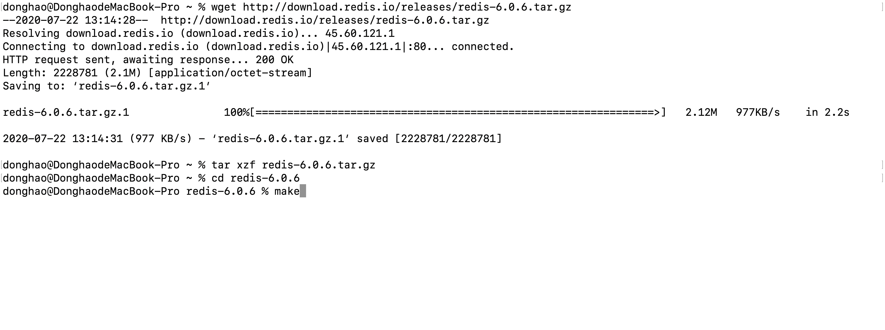
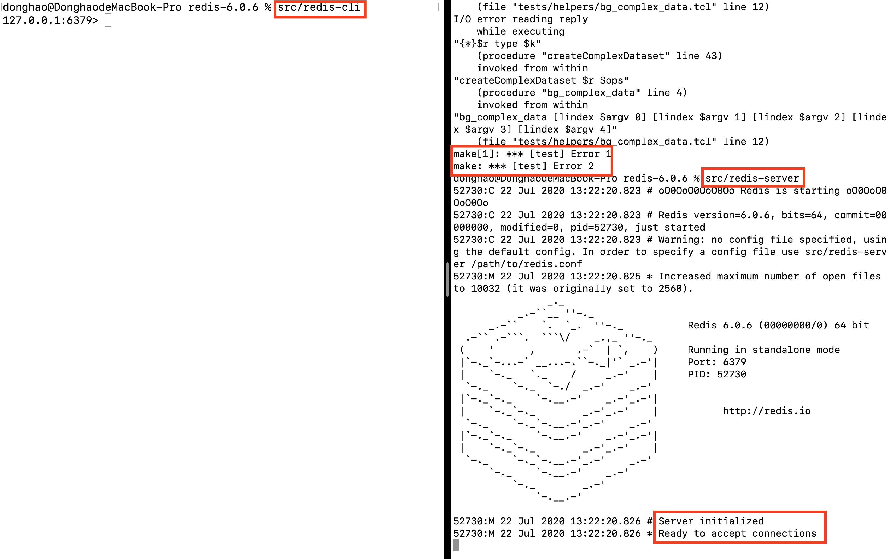
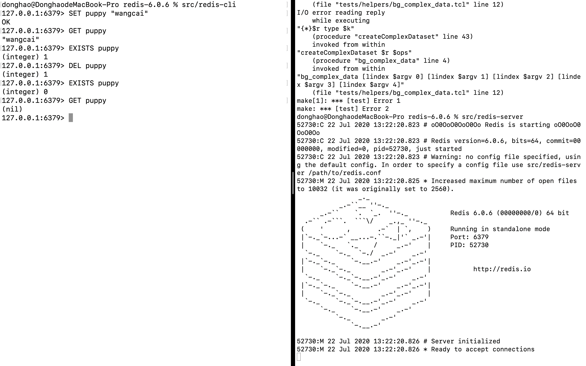
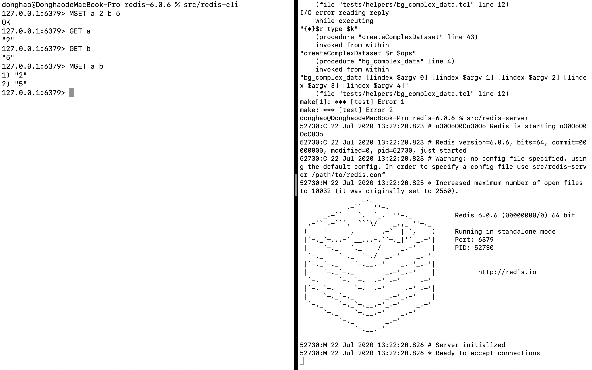
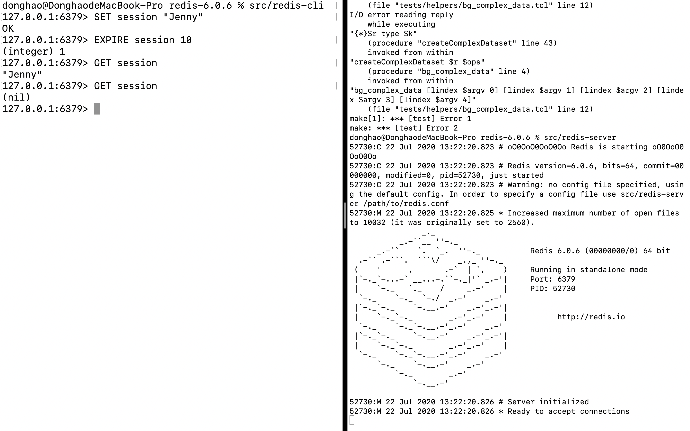
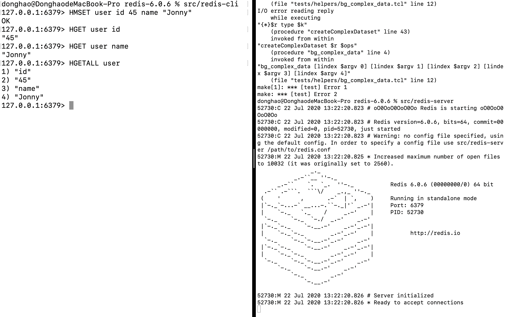
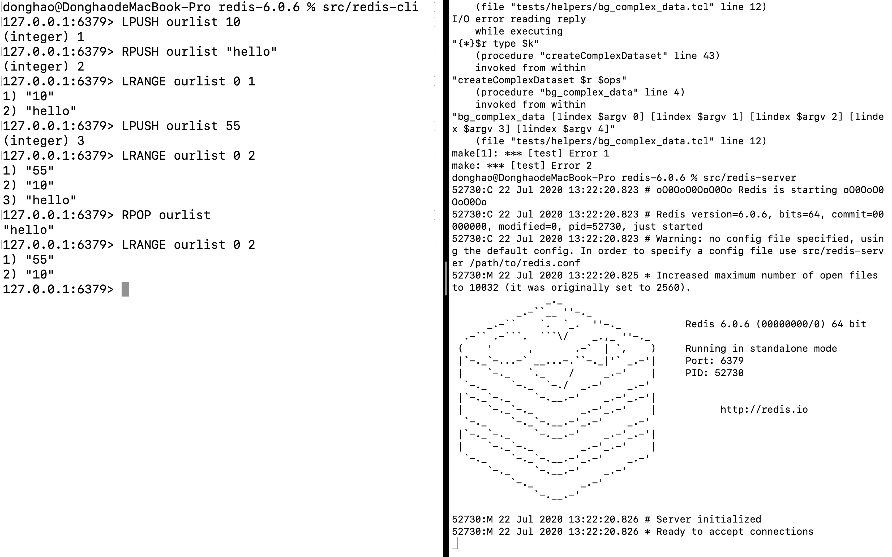
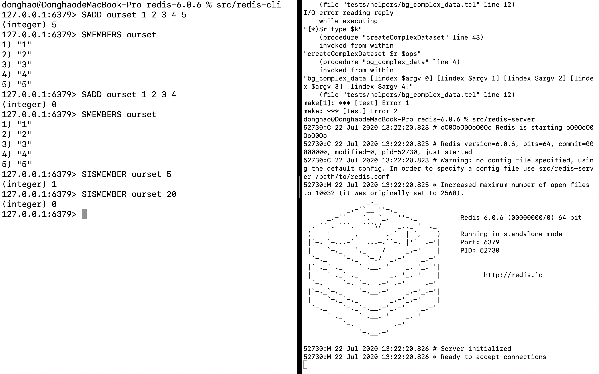
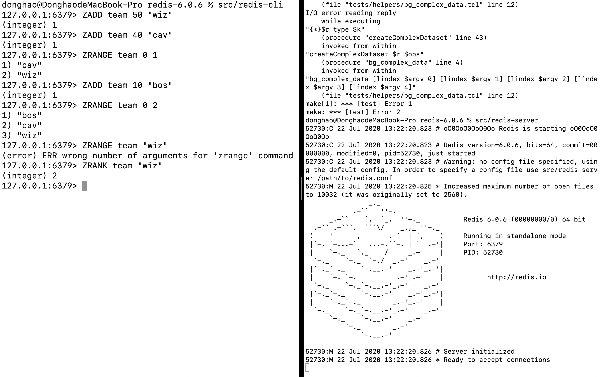

# Web development tools (Part 23)

- #### Click here: [BACK TO NAVIGASTION](https://github.com/DonghaoWu/WebDev-tools-demo/blob/master/README.md)

## `Section: redis commands.`(Basic)

### `Summary`: In this documentation, we learn redis.

### `Check Dependencies & Tools:`

- 
------------------------------------------------------------

#### `本章背景: `
- 本章主要讲的是 redis 的主要简单命令。

------------------------------------------------------------

### <span id="23.0">`Brief Contents & codes position`</span>

- #### Click here: [BACK TO NAVIGASTION](https://github.com/DonghaoWu/WebDev-tools-demo/blob/master/README.md)

- [23.1 Installation.](#23.1)
- [23.2 redis types.](#23.2)

------------------------------------------------------------

### <span id="23.1">`Step1: Installation.`</span>

- #### Click here: [BACK TO CONTENT](#23.0)

1. 资料:__[redis download]__(https://redis.io/download) 

2. Bash download:

```bash
$ wget http://download.redis.io/releases/redis-6.0.6.tar.gz
$ tar xzf redis-6.0.6.tar.gz
$ cd redis-6.0.6
$ make
```

3. Run Redis with:

```bash
$ src/redis-server
```

4. You can interact with Redis using the built-in client:

```bash
$ src/redis-cli
```

#### `Comment:`
1. 展示：

<p align="center">

</p>

------------------------------------------------------------
<p align="center">

</p>

------------------------------------------------------------
<p align="center">

</p>

------------------------------------------------------------


### <span id="23.2">`Step2: redis types.`</span>

- #### Click here: [BACK TO CONTENT](#23.0)

1. String

- single string

```bash
127.0.0.1:6379> SET puppy "wangcai"

127.0.0.1:6379> GET puppy

127.0.0.1:6379> EXISTS puppy

127.0.0.1:6379> DEL puppy

127.0.0.1:6379> EXISTS puppy

127.0.0.1:6379> GET puppy
```

<p align="center">

</p>

------------------------------------------------------------

- Multiple strings

```bash
127.0.0.1:6379> MSET a 2 b 5

127.0.0.1:6379> GET a

127.0.0.1:6379> GET b

127.0.0.1:6379> MGET a b
```

<p align="center">

</p>

------------------------------------------------------------

- Expire key value

```bash
127.0.0.1:6379> SET session "Jenny"

127.0.0.1:6379> EXPIRE session 10

127.0.0.1:6379> GET session

127.0.0.1:6379> GET session
```

<p align="center">

</p>

------------------------------------------------------------


2. Hash

```bash
127.0.0.1:6379> HMSET user id 45 name "Jonny"

127.0.0.1:6379> HGET user id

127.0.0.1:6379> HGET user name

127.0.0.1:6379> HGETALL user
```

<p align="center">

</p>

------------------------------------------------------------

3. Lists

```bash
127.0.0.1:6379> LPUSH ourlist 10

127.0.0.1:6379> RPUSH ourlist "hello"

127.0.0.1:6379> LRANGE ourlist 0 1

127.0.0.1:6379> LPUSH ourlist 55

127.0.0.1:6379> LRANGE ourlist 0 2

127.0.0.1:6379> RPOP ourlist

127.0.0.1:6379> LRANGE ourlist 0 2
```

<p align="center">

</p>

------------------------------------------------------------

4. Sets

```bash
127.0.0.1:6379> SADD ourset 1 2 3 4 5

127.0.0.1:6379> SMEMBERS ourset

127.0.0.1:6379> SADD ourset 1 2 3 4

127.0.0.1:6379> SMEMBERS ourset

127.0.0.1:6379> SISMEMBER ourset 5

127.0.0.1:6379> SISMEMBER ourset 20
```

<p align="center">

</p>

------------------------------------------------------------

5. Sorted sets

```bash
127.0.0.1:6379> ZADD team 50 "wiz"

127.0.0.1:6379> ZADD team 40 "cav"

127.0.0.1:6379> ZRANGE team 0 1

127.0.0.1:6379> ZADD team 10 "bos"

127.0.0.1:6379> ZRANGE team 0 2

127.0.0.1:6379> ZRANK team "wiz"
```

<p align="center">

</p>

------------------------------------------------------------


#### `Comment:`
1. 


### <span id="23.6">`Step6: 后续补充更新.`</span>

- #### Click here: [BACK TO CONTENT](#23.0)

#### `Comment:`

------------------------------------------------------------

- #### Click here: [BACK TO CONTENT](#23.0)
- #### Click here: [BACK TO NAVIGASTION](https://github.com/DonghaoWu/WebDev-tools-demo/blob/master/README.md)