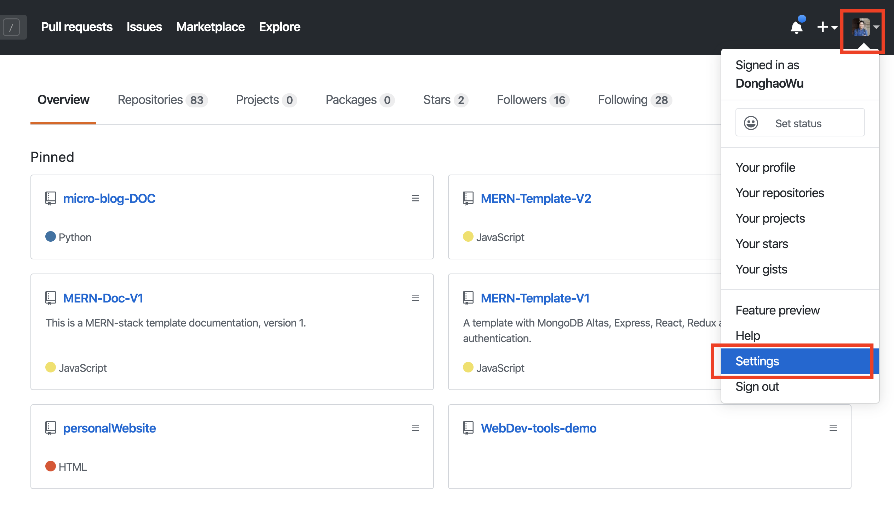
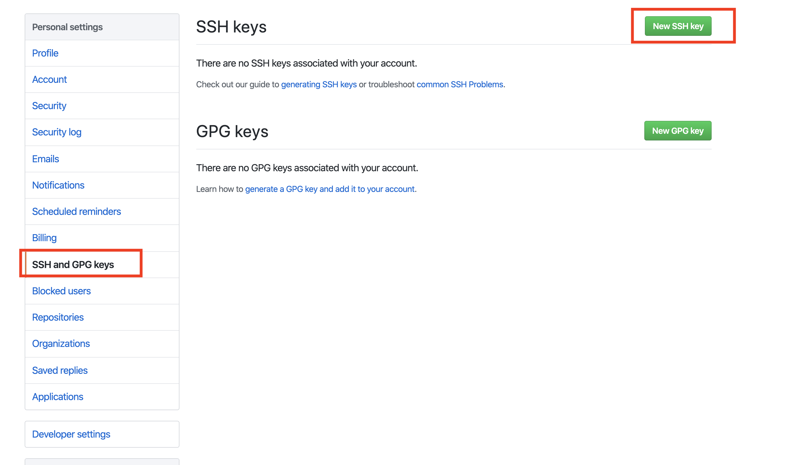
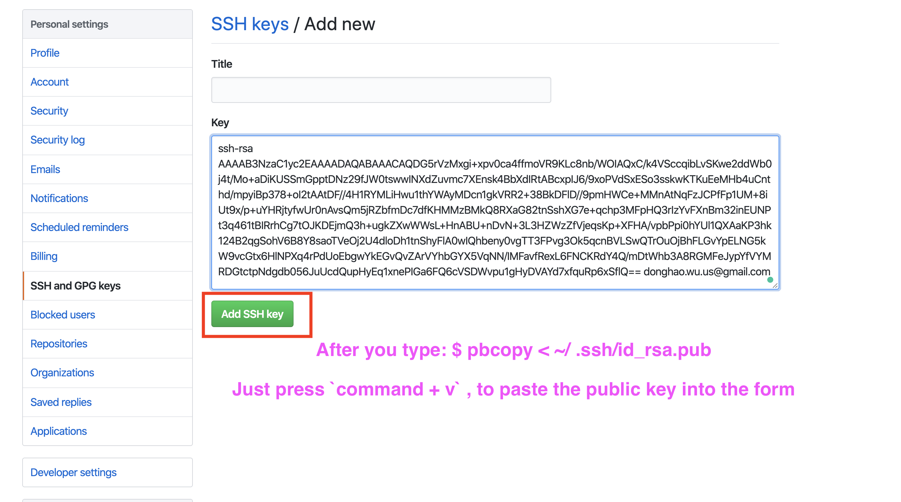
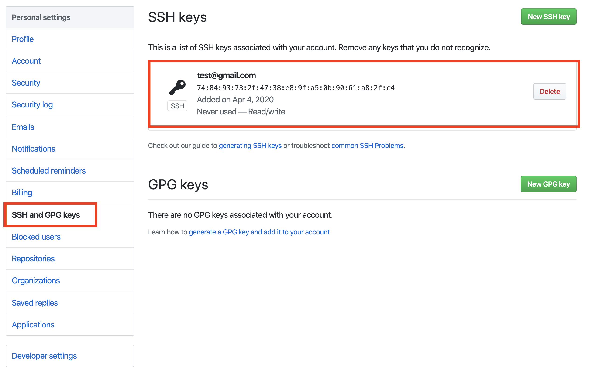
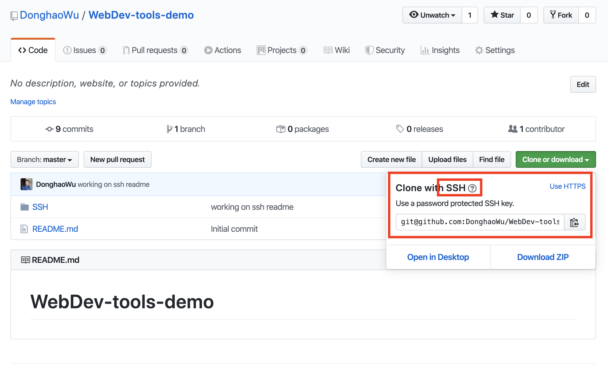

# Web development tools (Part 1)

## `Section: Github`(SSH)

### `Summary`: In this documentation, we set up SSH on github account.

### `Check Dependencies:`

- 

### `本章背景：`
- 从 git 上下载 repo 现在有两种方式，为 https 和 ssh， https 的方式比较方便下载，但在上传（git pull & git fetch）的时候需要输入密码和用户名，这个可以通过 `GitHub HTTPS Caching` 实现。

- 另外一种 ssh 方式，如果没有设置好 key pairs 的设置是无法进行所有跟 Git 的互动，但一旦完成了 `GitHub SSH keys`，相当于远程账户把本地电脑归入白名单。相对而言，SSH的方式更安全更值得推荐。

- 目前而言，首要目的是安全，次要目标是为了免输入密码和用户名。

### `Brief Contents & codes position`
- 1.1 How to connect remote server?
- 1.2 Why is Git always asking for my password?
- 1.3 Extra: Using SSH to connect remote server.

### `Step1: How to connect remote server?`

A. __`Connect command.`__

```bash
(local) $ ssh root@167.99.146.57  # ip address is from remote server 

(remote) $ ls # now you can control the remote server.
(remote) $ mkdir test
(remote) $ ls
```

B. __`Install git in remote server.`__

```bash
(remote) $ sudo apt-get install git
(remote) $ git clone `ssh-url`  # failed, have not configured ssh public key
(remote) $ git clone `https-url` # success, but it will always ask you for username and password if you don't finish configure on the remote server.
```

C. __`Copy some local files and paste them on remote server.`__

```bash
(local) $ cd ..
(local) $ mkdir test_folder
(local) $ cd test_folder 
(local) $ rsync -av . root@167.99.146.57:~/test_folder # (在本地复制文件夹 test_folder 到远程server)

(local) $ ssh root@167.99.146.57
(remote)$ ls # Check if it is successful
```

#### `Comment:`
1. 

### `Step2: Why is Git always asking for my password?.`

- If Git prompts you for a username and password every time you try to interact with GitHub, you're probably using the HTTPS clone URL for your repository.

- Using an HTTPS remote URL has some advantages compared with using SSH. It's easier to set up than SSH, and usually works through strict firewalls and proxies. However, it also prompts you to enter your GitHub credentials every time you pull or push a repository.

- You can avoid being prompted for your password by configuring Git to store it for you. There are two ways to do it.

A. __`Solution 1: GitHub HTTPS Caching.`__

1. Install `osxkeychain`

```bash
(local) $ git credential-osxkeychain  # Check if the helper is already installed

(local) $ curl -s -O https://github-media-downloads.s3.amazonaws.com/osx/git-credential-osxkeychain # Download the helper

(local) $ chmod u+x git-credential-osxkeychain # Fix the permissions on the file so it can be run

(local) $ sudo mv git-credential-osxkeychain "$(dirname $(which git))/git-credential-osxkeychain" # Move the helper to the path where git is installed

(local) $ git config --global credential.helper osxkeychain # Set git to use the osxkeychain credential helper
```

2. Now, any time you do a git push to a GitHub remote configured using an HTTPS link, git will automatically use the password stored in your OS X keychain app.

B. __`Solution 2: GitHub SSH keys.`__

1. Generate key pairs and copy the content of public key.

```bash
(local) $ cd .ssh
(local) $ ls
(local) $ ssh-keygen -t rsa -b 4096 -C "your_email@example.com"
(local) $ pbcopy < ~/ .ssh/id_rsa.pub
(local) $ ssh-add ~/ .ssh/id_rsa
```

2. Paste the public key in github ssh key setting.

<p align="center">

</p>

-----------------------------------------------------------------
<p align="center">

</p>

-----------------------------------------------------------------
<p align="center">

</p>

-----------------------------------------------------------------
<p align="center">

</p>

-----------------------------------------------------------------
<p align="center">

</p>

#### `Comment:`
1. Other ssh comands:
```bash
(local) $ ssh-add -l
(local) $ ssh-add -D
(local) $ ssh-add ~/ .ssh/id_rsa  ## 本地操作 private key 命令
```

### `Step3. Using SSH to connect remote server.`

1. Generate key pairs locally.

```bash
(local) $ cd ～/.ssh
(local) $ ssh-keygen -t rsa -b 4096 -C "your_email@example.com"
(local) $ ls   ## (这时就有两个新的文件： id_rsa 和 id_rsa.pub）
(local) $ pbcopy < ~/ .ssh/id_rsa.pub ## 本地复制一份 public key 的内容
```

2. Paste the content to remote server.

```bash
(local) $ ssh root@167.99.146.57
(remote) $ mkdir .ssh
(remote) $ cd /.ssh
(remote) $ nano authorized_keys 
## 输入这个命令之后，进入编辑文件界面， 在编辑文件界面， 先 command + c 
## 把 public key放到文件里面，然后 command + x 退出编辑界面。
(remote) $ exit ## 退出远程命令 terminal， logout
```

3. Set up the local private key.

```bash
(local) $ ssh-add ~/ .ssh/id_rsa ## 设定本地目前生效的唯一 private key。
```
#### ``


### `Step4 Concept questions.`

#### `A. What is SSH?`

- 

#### `B. What does SSH use for?`
-  

#### `C. What are symmetrical encryption, asymmetrical encryption and hashing?`

- `symmetrical encryption` (secret key) need key change 双方都有同一把key.

- `asymmetrical encryption` 每人有两把 key（pubilc key & private key）
原理： 本地有两把钥匙，设定为红色，目标也有两把钥匙，设定为蓝色。当红色电脑需要传输文件到蓝色电脑时，会首先从蓝色电脑获得蓝色`public key`,
然后用蓝色`public key`加密需要加密的文件，然后传输到蓝色电脑，最后用蓝色`private key`解密。

- 通俗意思是：我不相信任何电脑，任何电脑向我发送文件必须使用我的箱子（public key）装着，然后发过来我才能接受并且解密。`实现了git account（远程） 对 实体电脑（本地）的信任，相当于把本地电脑列入远程电脑的信任白列表`。

- `hashing` 简单理解就是对信息内容进行乱码加密，也就是说就算你能够获得 public key 去伪装目标，信息回来的时候也可以使用 private key 打开，
但是这是打开后的内容是乱码的，而要恢复这些乱码信息需要 另外一个 secret key 去解开， 也就是说这个过程是需要两个 私密 key 才能
解密的，不排除有些算法把这两个 key 融合在一起使用。

#### `D. 把本地 public key 放在 remote server的动作，可以保证每当 remote 传送文件到本地的时候都能通过，那么时候也需要在 remote 生成一个 public key，保证本地可以传送文件到 remote？?`

### `Step5 DEMO.`

```bash

```

1. Login.html
<p align="center">

</p>


