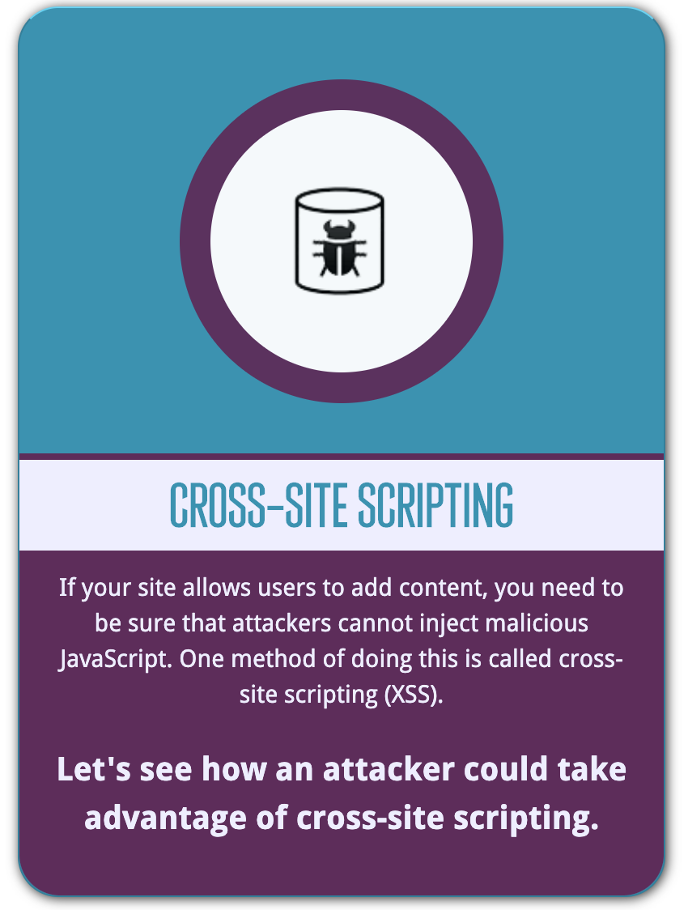
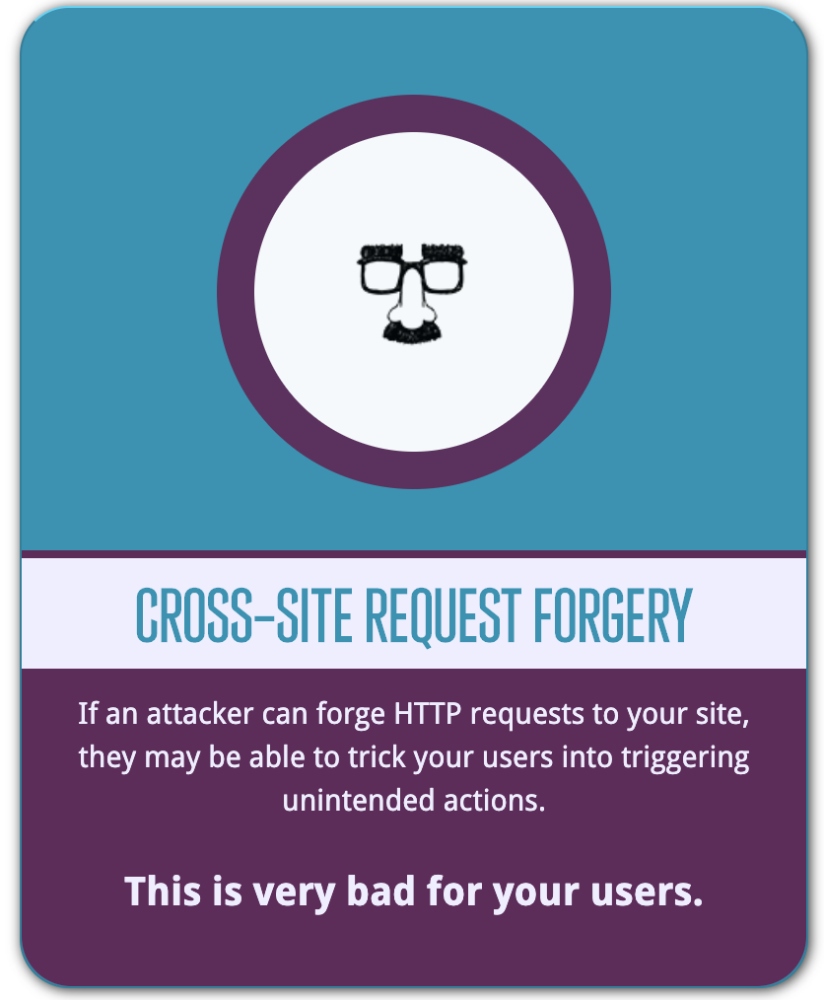

# Web development tools (Part 19)

- #### Click here: [BACK TO NAVIGASTION](https://github.com/DonghaoWu/WebDev-tools-demo/blob/master/README.md)

## `Section: Security` (Basic)

### `Summary`: In this documentation, we learn to application security.

### `Check Dependencies & Tools:`

- body-parser
- express
- helmet
- nodemon
- winston
- morgan
- dotenv
- cors
- bcrypt

------------------------------------------------------------

#### `本章背景：`
- 关于各种 hacker 行为展示：[https://www.hacksplaining.com/lessons](https://www.hacksplaining.com/lessons)

- 关于各种 hacker 常见行为表述：[https://watchyourhack.com/](https://watchyourhack.com/)

------------------------------------------------------------

### <span id="19.0">`Brief Contents & codes position`</span>

- #### Click here: [BACK TO NAVIGASTION](https://github.com/DonghaoWu/WebDev-tools-demo/blob/master/README.md)

- [19.1 Injections.](#19.1)
- [19.2 3rd Party Libraries](#19.2)
- [19.3 Logging. -- morgan & winston](#19.3)
- [19.4 HTTPS everywhere.](#19.4)
- [19.5 XSS & CSRF.](#19.5)
- [19.6 Code Secrets. -- dotenv](#19.6)
- [19.7 Secure Headers. -- helmet](#19.7)
- [19.8 Access Control. -- cors](#19.8)
- [19.9 Data Management. -- bcrypt](#19.9)
- [19.10 Don't trust anyone.](#19.10)
- [19.11 Authentication.](#19.11)


------------------------------------------------------------

### <span id="19.1">`Step1: Injections.`</span>

- #### Click here: [BACK TO CONTENT](#19.0)

1. 行为定义：
    - 最常见的安全问题。
    - SQL injection：
        1. 在要求输入用户名和密码的表格中输入：
        ```bash
        username: example@test.com
        password: ‘ or 1=1--
        ```
        2. 向 SQL database 输入可以删除整个 table：
        ```sql
        ; DROP TABLE tableName; --
        ```
    - 其他 injection：
        1. 在输入端输入一些 script 语句：
        ```html
        <ima src='/' onerror="alert('boom')">
        ```

    - 

2. 详细方案：
    - 关于上面第三种情况：
    ```js
    const userInputInHTML = (input) => {
        const p = document.getElementById("pleaseNo")
        // Bad
        // p.innerHTML = input;

        //Better

        var textnode = document.createTextNode(input);
        p.appendChild(textnode);
    }
    ```

3. 安全策略：
    - Sanitize input: 限定输入的类型；
    - Parametrize Queries: 对输入的文本进行关键字检测，并限制一些符号的使用。
    - Knex.js or other ORMS：一些限定格式的预定义库：比如限定 email 的格式，地址的格式等。

#### `Comment:`
1. 详情了解：[sql-injection exercise -- 推荐](https://www.hacksplaining.com/exercises/sql-injection)

### <span id="19.2">`Step2: 3rd Party Libraries.`</span>

- #### Click here: [BACK TO CONTENT](#19.0)

1. 行为定义：
    - npm 上面的第三方 dependency 有风险。

2. 详细方案 ：

    1. (npm 自带的漏洞修补工具)：
    ```bash
    $ npm i
    $ npm update
    $ npm audit fix
    $ npm audit fix --force
    ```

    2. 其他工具：

    - nsp
    ```bash
    $ npm i -g nsp
    $ npm check # audit package.json
    ```

    - snyk
    ```bash
    $ npm i -g snyk
    $ snyk test # audit package.json
    ```

#### `Comment:`
1. 

### <span id="19.3">`Step3: Logging.`</span>

- #### Click here: [BACK TO CONTENT](#19.0)

1. 行为定义：作为开发者和维护者，有必要对一些网络行为进行登记和监控。

2. 详细方案：
    1. 安装 morgan:
    ```bash
    $ npm install morgan
    ```

    - 使用 morgan:
    __`Location:./demo-apps/security-server-exercise/server.js`__
    ```js
    const morgan = require('morgan');

    app.use(morgan('tiny'));
    ```

    2. 安装 winston:
    ```bash
    $ npm install winston
    ```

    - 使用 winston:
    __`Location:./demo-apps/security-server-exercise/server.js`__
    ```js
    const winston = require('winston');

    // 应用举例：

    winston.log('info', someVal);
    winston.error('this guy is messing with us.')
    ```

3. 安全策略：
    - 注意不要把不必要的提示信息显示给用户，这会带来风险。

#### `Comment:`
1. 

### <span id="19.4">`Step4: HTTPS everywhere.`</span>

- #### Click here: [BACK TO CONTENT](#19.0)

1. 行为定义：SSL/TLS Certificates，传输过程加密。

2. 详细方案：
    - 给自己的网站添加 HTTPS。
    - 

3. 安全策略：
    - 使用 [Let's Encrypt](https://letsencrypt.org/)
    - 使用 [cloudfare](https://www.cloudflare.com/)

#### `Comment:`
1. 把 application 或者 website 部署在上面的地方，可以实现 HTTPS。


### <span id="19.5">`Step5: XSS & CSRF.`</span>

- #### Click here: [BACK TO CONTENT](#19.0)

1. 行为定义：
    - XSS: cross site scripting，比如说在一条评论下面留言 script 语句，那么在其他用户访问这个页面的时候会执行这个语句，详细定义看 comment 资料，比如：
    ```js
    <ima src='/' onerror="alert('1')">
    ```

    <p align="center"></p>

    - CSRF: 修改网页的 URL 使用户点击后作出原不想做的行为。

    <p align="center"></p>

-----------------------------------------------------------------


2. 详细方案：
    - 设定 header 避免 cookie 被盗用
    __`Location:./demo-apps/security-server-exercise/server.js`__

    ```js
    app.get('/', (req, res) => {
        res.cookie('session', '1', { httpOnly: true });
        res.cookie('session', '1', { secure: true });
        res.set({
            'Content-Security-Policy': "script-src 'self' 'https://apis.google.com'"
        })
        res.send('Hello World!');
    })
    ```

3. 安全策略：
    - 避免 CSRF 的其中一个方法是设计 RESTful API。
    - Sanitize input
    - No eval()
    - No document.write()
    - Content Security Policy
    - Secure + HTTPOnly Cookies


#### `Comment:`
1. 第二点修改的意思是只允许往指定的网站发送 cookie。
2. 第二点只是为了展示，npm 有对应的 dependency 进行这个动作。

3. XSS 行为展示练习：[XSS exerice -- 推荐](https://www.hacksplaining.com/exercises/xss-stored)

4. CSRF 行为展示练习：[CSRF exerice -- 推荐](https://www.hacksplaining.com/exercises/csrf)


### <span id="19.6">`Step6: Code Secrets.`</span>

- #### Click here: [BACK TO CONTENT](#19.0)

1. 行为定义：
    - Environmental Variables: 一些敏感的 API key 还有一些配置 token 都不能上传公开。
    - Commit History：不上传 password

2. 详细方案：
    - 安装 dotenv dependency，Create react app 默认自带 dotenv。
    - 生成 `.env` 文件，设定全局变量，例如 API_KEY=example，使用：
    ```js
    process.env.API_KEY
    ```
    - 上传前必须生成 `.gitignore` 文件

3. 安全策略：
    - 另外注意不要在向 github 上传任何关于私密数据，因为都会有上传记录切容易被搜索得到。

#### `Comment:`
1. 

### <span id="19.7">`Step7: Secure Headers.`</span>

- #### Click here: [BACK TO CONTENT](#19.0)

1. 行为定义：对一些请求的安全设定，可以规范和保障很多不安全行为。

2. 详细方案：
    - 安装 dependency
    ```bash
    $ npm i helmet
    ```

    - 使用 dependency
    ```js
    const helmet = require('helmet');

    // add middleware

    app.use(helmet());
    ```

3. 安全策略：


#### `Comment:`
1. helmet documentation:
[npm helmet](https://www.npmjs.com/package/helmet)


### <span id="19.8">`Step8: Access Control.`</span>

- #### Click here: [BACK TO CONTENT](#19.0)

1. 行为定义：
    - 
    - Principal of least privilege


2. 详细方案：
    - 安装 cors
    ```bash
    $ npm i cors
    ```

    - 应用 cors 并添加定制 option。
    ```js
    app.use(cors());
    ```

    ```js
    let whitelist = ['http://example1.com', 'http://example2.com']
    let corsOptions = {
        origin: function (origin, callback) {
            if (whitelist.indexOf(origin) !== -1) {
            callback(null, true)
            } else {
            callback(new Error('Not allowed by CORS'))
            }
        }
    }
    ```

3. 安全策略：
    - 上面的 cors 设置是为了建立白名单，允许一些不同源端口可以使用跨域。


#### `Comment:`
1. 跨域问题的本质原因是：浏览器通过同源策略来防止恶意网站窃取数据。

    那么什么是同源策略呢？同源是指：协议、域名、端口都相同，非同源的资源之间不能相互通信。同源策略是为了保证用户信息的安全，防止恶意的网站窃取数据。

    然而，同源策略的存在也导致不同源之间的合理通信也受到了限制：

    Cookie、LocalStorage 和 IndexDB 无法读取
    DOM 无法获得
    AJAX 请求不能发送
    为了解决浏览器同源策略给我们的限制，各种跨域方案纷纷涌现，这篇文章主要介绍 CORS 这种解决方案。

2. 使用 cors dependency 就可以解决浏览器同源策略给我们的限制。

3. [cors middleware npm](https://www.npmjs.com/package/cors)


### <span id="19.9">`Step9: Data Management.`</span>

- #### Click here: [BACK TO CONTENT](#19.0)

1. 行为定义：
    - 使用第三方加密软件加密改变用户的密码，同时也是用这个 dependency 去解密，整个过程开发者都不会接触到用户的 password。

2. 详细方案：
    - 安装 bcrypt
    ```bash
    $ npm i bcrypt
    ```

    - 应用 bcrypt
    ```js
    const bcrypt = require('bcrypt-nodejs');
    ```

3. 安全策略：

#### `Comment:`
1. 关于密码的设置文章：[How to Store User Passwords and Overcome Security Threats](https://rangle.io/blog/how-to-store-user-passwords-and-overcome-security-threats-in-2017/)

### <span id="19.10">`Step10: Don't trust anyone.`</span>

- #### Click here: [BACK TO CONTENT](#19.0)

1. 行为定义：
    - 在数据传输的各个环节进行保护和预保障。

#### `Comment:`
1. 

### <span id="19.11">`Step11: Authentication.`</span>

- #### Click here: [BACK TO CONTENT](#19.0)

1. 行为定义：关于需要登录的网页应用的授权 token 的安全高效传输。

2. 详细方案：

3. 安全策略：


#### `Comment:`
1. 

- #### Click here: [BACK TO CONTENT](#19.0)
- #### Click here: [BACK TO NAVIGASTION](https://github.com/DonghaoWu/WebDev-tools-demo/blob/master/README.md)