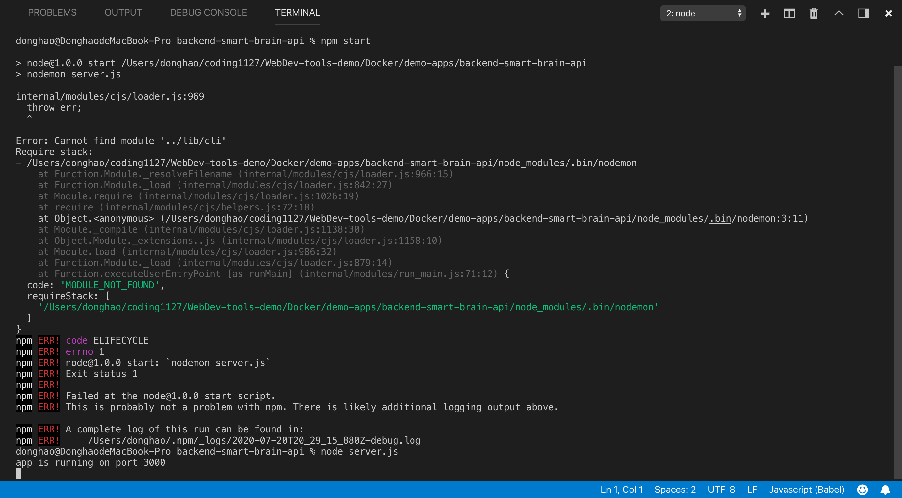

1. 复制别人的 repo 放在自己的 repo 中作为例子：

```bash
$ git clone ... # gitHub link
$ cd ...# directory name
$ rm -fr .git
$ git add .
$ git commit -m'...'
$ git push
```

2. Arrow function 的省略写法：

```js
// 以下两个写法是一样的。
export const apiCall = (link) =>
  fetch(link).then(response => response.json())

export const apiCall = (link) => {
  fetch(link).then(
    response => {
      return response.json();
    })
}

// 还有
let elements = [
  'Hydrogen',
  'Helium',
  'Lithium',
  'Beryllium'
];

elements.map(function(element) { 
  return element.length; 
}); // 返回数组：[8, 6, 7, 9]

// 上面的普通函数可以改写成如下的箭头函数
elements.map((element) => {
  return element.length;
}); // [8, 6, 7, 9]

// 当箭头函数只有一个参数时，可以省略参数的圆括号
elements.map(element => {
 return element.length;
}); // [8, 6, 7, 9]

// 当箭头函数的函数体只有一个 `return` 语句时，可以省略 `return` 关键字和方法体的花括号
elements.map(element => element.length); // [8, 6, 7, 9]
```

3. 一种默认的条件：在写 async testing 时，发现在请求体中 body 键对应的值（通常是一个 object 或者其他类型数据），在接受时就是 data，即 `response.json()` 这个方法直接把 body 值取出来：
```js
export const apiCall = (link) =>
  fetch(link).then(response => response.json())
  .then(data =>{
      dispatch({type:..., payload: data})
  })
```

4. 6/27/2020，目前发现以下两个语句在测试过程中不一样，后面解释:
```js
response => response.json()
```
```js
response =>{
  return response.json()
}
```

5. 对 React 定义函数区域的重新认识，render 内外都可以定义 function，但 render 外定义的是 instance 属性 function，可以传递。 render 内定义的不能传递。如：

- 7/2/2020 修正，如下例子 render 外可以定义函数， render 一般内不定义函数，主要负责调用函数。

```js
import * as React from 'react';
import CardList from '../components/CardList';
import SearchBox from '../components/SearchBox';
import Scroll from '../components/Scroll';
import './App.css';

export interface IRobot {
  name: string;
  id: number;
  email: string;
}

interface IAppProps {
}

interface IAppState {
  robots: Array<IRobot>;
  searchfield: string;
}

class App extends React.Component<IAppProps, IAppState> {
  constructor(props: IAppProps) {
    super(props)
    this.state = {
      robots: [],
      searchfield: ''
    }
  }

  componentDidMount(): void {
    fetch('https://jsonplaceholder.typicode.com/users')
      .then(response => response.json())
      .then(users => { this.setState({ robots: users }) });
  }

  onSearchChange = (event: React.SyntheticEvent<HTMLInputElement>): void => {
    this.setState({ searchfield: event.currentTarget.value })
  }

  render(): JSX.Element {
    const { robots, searchfield } = this.state;
    const filteredRobots = robots.filter(robot => {
      return robot.name.toLowerCase().includes(searchfield.toLowerCase());
    })
    return !robots.length ?
      <h1>Loading</h1> :
      (
        <div className='tc'>
          <h1 className='f1'>RoboFriends</h1>
          <SearchBox searchChange={this.onSearchChange} />
          <Scroll>
            <CardList robots={filteredRobots} />
          </Scroll>
        </div>
      );
  }
}

export default App;
```

6. 关于 nextJS，动态 URL 的参数对应的页面设置比较特别，比如
```diff
+ /robots/id

+ 对应就要在 pages 文件夹下新建一个文件夹，名字是 robots，然后 robots 下新建一个新文件，叫做 [id].js

+ 在 [id].js 中获取参数的方法也不一样，需要 

+ import { useRouter } from 'next/router';
+ const id = useRouter().query.id
```

7. 如果你从本地一个文件夹（假设为 App-A）下面的一个 project（假设为 project-A）复制到另外一个本地文件夹（假设为 App-B），当运行 project-A 的时候（npm start）可能会有以下错误发生而不能运行：

<p align="center">

</p>

- 解决尝试：
  1. 删除文件夹 node_modules，然后重新运行命令 `npm install`
  2. 个人估计这个原因是原始的 project 在 node_modules 在安装的时候有特定的 path 设定，所以直接复制过来的话会有些设定按原路径是无法找到的。
  3. :boom: 需要注意的是，如果不删除 node_modules 而运行 `npm install`，在执行安装的过程中会报错，而且`npm start`照样不会成功。

----------------------------------------------------------------------------

8. JSX 的新写法：

```js
        {
          isProfileOpen ?
          <Modal>
            <Profile isProfileOpen={isProfileOpen} toggleModal={this.toggleModal} user={user} loadUser={this.loadUser} />
          </Modal>
          :
          null
        }
```

- 改成：

```js
        {
          isProfileOpen &&
          <Modal>
            <Profile isProfileOpen={isProfileOpen} toggleModal={this.toggleModal} user={user} loadUser={this.loadUser} />
          </Modal>
        }
```

9. 对于 onClick 的新认识： onClick 后面必须加上一个函数体，而不是一个运行的函数，表示点击行为之后就启动对应函数，如下：


```diff
// 有参数
- onClick={someMethod(ag1,ag2,...)}
+ onClick={()=> someMethod(ag1,ag2,...)}

// 无参数
+ onClick={someMethod}
```

10. res.json(data) 的意思是把 data 转换成 json 并发送出去，不需要 return 或者其他关键词。

- res => res.json() 是将返回数据经 json method 处理之后成为一个 object。

11. .then 一整块是一个 promise，但它里面的内容必须带 return，而return 后面可以带一个运行的 promise，也可以带一个普通 datatype。

12. steps
  - npm install jsonwebtoken
  - change frontend recieve data name
  - npm i redis
  - add redis in backend app
  - set up redis docker docker-compose.yml
  - set up env
  - cd bakcend directory
  - docker-compose exec redis redis-cli
  - when get token back, store it in redis
  - 将一个 function 转变为 promise 是比较新鲜的事情。

  - redis 连接本地, 当然还要使用本地连接 redis 的命令 
  ```js
  const redisClient = redis.createClient({ host: '127.0.0.1' });
  ```

  - redis docker: 
  ```js
  const redisClient = redis.createClient(process.env.REDIS_URI);
  ```

13. work in front end

  - Signin.js store session

  - 查看正在运行的 redis 端口：ps aux | grep redis

  - 'Authorization': `Bearer` + token
  [https://security.stackexchange.com/questions/108662/why-is-bearer-required-before-the-token-in-authorization-header-in-a-http-re](https://security.stackexchange.com/questions/108662/why-is-bearer-required-before-the-token-in-authorization-header-in-a-http-re))

  [https://auth0.com/blog/refresh-tokens-what-are-they-and-when-to-use-them/](https://auth0.com/blog/refresh-tokens-what-are-they-and-when-to-use-them/))
  
  - 在 App.js 的 componentDidMount 中调用 http://localhost:3000/signin

  - 也修改 Signin.js 中的逻辑

  - midlleware：

  - remove session
  ```js
    onRouteChange = (route) => {
    if (route === 'signout') {
      this.setState(initialState);
      window.localStorage.removeItem('token');
    } else if (route === 'home') {
      this.setState({ isSignedIn: true, route: route })
    }
    else this.setState({ route: route });
  }
  ```

  - 在 server.js 中加 middleware，同时在 App.js 中的 headers 中加 authorization。

  - 修正，可以在 middleware 中加入 errorHandler，当发生错误时处理 error。

  - 在 calculateFaceLocations 加入 if

  - 在 displayFaceBox 加入 if

  - 这里提到 取消 session‘ token 的情况下能不能够运行功能。

  - 在加入 author middleware 但没有加入 token 到 headers 的时候，还是可以收到 resp（Profile.js），且能看到更改了名字，但实际上没有，这说明就算不通过 middleware，但是也会有 resp，而这里 front end 的设定是有 resp 就更改前端，这是不稳妥的做法。

  14. 判断回传数据，api 的会传数据成功或者不成功都会回传 resp，这时候需要判断然后再做动作，比如：
  ```js
  if (resp.status === 200 || resp.status === 304) {
      this.props.toggleModal();
      this.props.loadUser({ ...this.props.user, ...data });
  }
  ```
  再比如
  ```js
  if (session.userId && session.success === 'true') {
    this.saveAuthTokenInSession(session.token);
    fetch(`http://localhost:4000/profile/${session.userId}`, {
      method: 'get',
      headers: {
        'Content-type': 'application/json',
        'Authorization': data.token
      }
    })
  ```

  15. 作者对 resp 的多重 if 判断是一个很好的习惯，同时作者在 postgres 里面的 2 个表，还有 redis 里面的数据储存都是能提供少数据就尽量少的做法很好。

  16. 对于切换 docker 里面的 postgre 跟 local postgre 的区别：

  - 连接 docker 的 postgres 需要先关闭本地 postgres server，然后使用 postico 连接，database name 还有账户密码在 `docker-compose.yml` 中。

  - 连接 local 的 postgres 需要先关闭本地 docker container，然后使用 postico 连接，database name 还有账户密码在 `.env` 中。

  17. 新场景，如果在 master 上面不小心编辑了，但又不想删除修改，而是想把改动搬到新的 branch 而不改变 master 该怎么办。

  18. 改变当前 app 对应的 heroku remote，（比如：实现一个本地 repo 建立多个 heroku app）

  ```bash
  $ heroku git:remote -a <new-app-name>
  ```

  19. 查看当前端口占用情况：

  ```bash
  $ lsof -i tcp:3000 # <- port number
  $ kill -9 42898 # <- PID number
  ```
